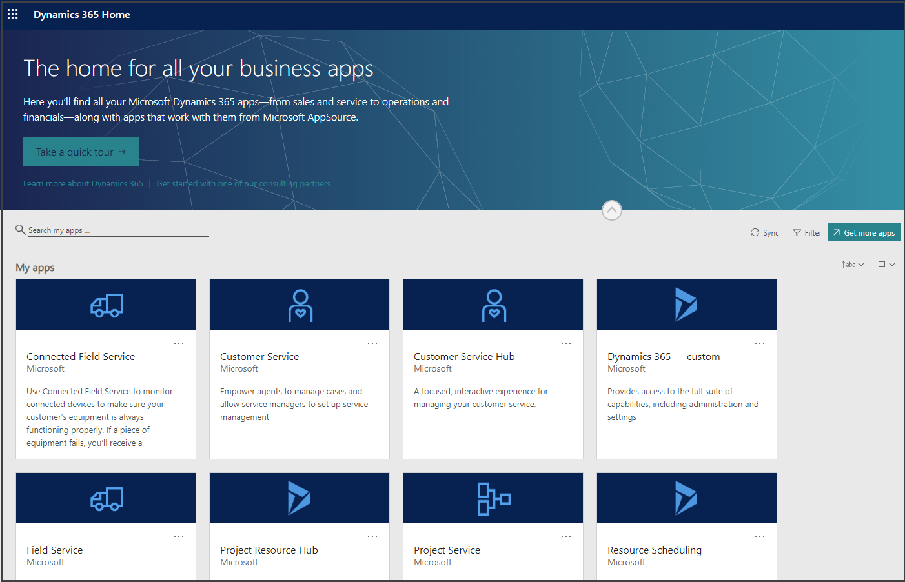
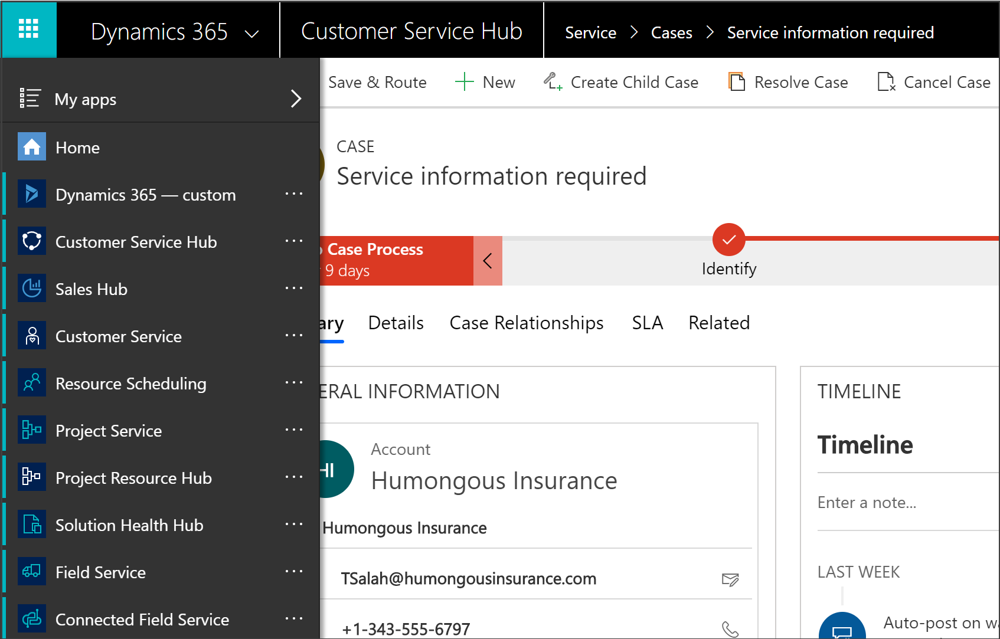
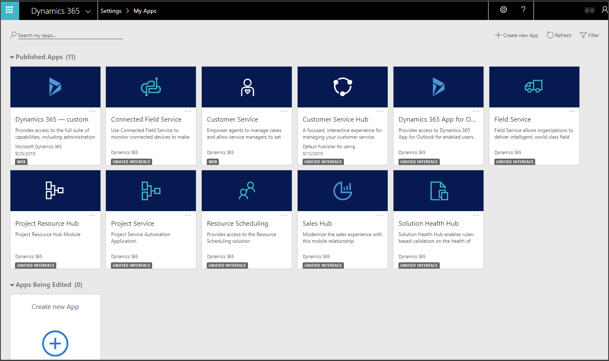
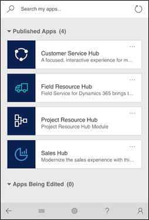

# About Unified Interface for model-driven apps in Power Apps 

The Unified Interface uses responsive web design principles to provide an optimal viewing and interaction experience for any screen size, device, or orientation. It brings all the rich experiences to any client that you are using. Whether you are on a browser, tablet, or phone, you will be able to consume similar experiences.

More information: [Enhanced user experience with the Unified Interface for model-driven apps](https://docs.microsoft.com/powerapps/user/unified-interface) and the blogs [Moving forward with your transition to Unified Interface](https://powerapps.microsoft.com/blog/moving-forward-with-your-transition-to-unified-interface/) and [Performance benefits of unified interface](https://powerapps.microsoft.com/blog/performance-benefits-of-unified-interface/)

## Accessing Unified Interface apps on browsers

Once provisioned, you can access the installed Unified Interface and legacy web apps on browser.

> [!NOTE]
> The legacy web client is deprecated; you should plan to convert your legacy web apps to use the new Unified Interface. More information: [Legacy web client is deprecated](https://docs.microsoft.com/dynamics365/get-started/whats-new/customer-engagement/important-changes-coming#legacy-web-client-is-deprecated)

You can access Unified Interface apps from the following locations on a browser: 

1. In [https://home.dynamics.com/](https://home.dynamics.com/):

   

2. In app navigation:

   

3. In **My Apps** page under **Settings**:

   

## Accessing Unified Interface apps on phone and tablets
Unified interface apps are the only apps supported on phones and tablets. When users sign into their environment, they will only see the Unified Interface apps on their apps landing page. 

|  | |  |
|---------|---------|---------|
|On phone       |    |On tablet      |

## Capabilities not yet on Unified Interface

We released some capabilities of the legacy web client in the Unified Interface that are available in the hybrid experience. You can [enable the hybrid experience](enable-hybrid-experience.md) to get them in the browser client.

There are certain capabilities that continue to be unavailable in the Unified Interface and we are working to provide these in future releases:

-	Custom styling of advanced chart properties (excluding colors and basic formatting)
-	Composite address control
- Composite fullname control
-	Global notifications
-	Admin experiences
-	Editable grids on phones
-	Learning Path

## Read-only entities on Unified Interface

There are certain entities that are currently read-only on Unified Interface. Users will not be able to make changes to these entity records within an Unified Interface app. We are working to make them editable in future releases.

> [!NOTE]
> Some entities are being deprecated. Check out [Important changes (deprecations) coming](https://docs.microsoft.com/dynamics365/get-started/whats-new/customer-engagement/important-changes-coming#contracts-contract-line-items-and-contract-templates-entities-are-deprecated).

The following are entities that are currently read-only in Unified Interface:

- KnowledgeArticleViews
- KnowledgeBaseRecord
- SharePointDocument
- SharePointSite
- SLA
- SLAKPIInstance
- Template
- Contract
- Contract Lines
- Contract Templates
- Case Resolution
- Service

### See also
[Overview of building model-driven apps](https://docs.microsoft.com/powerapps/maker/model-driven-apps/model-driven-app-overview)
