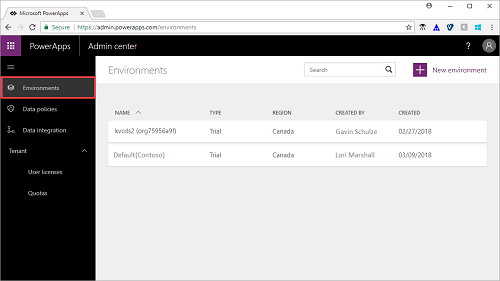
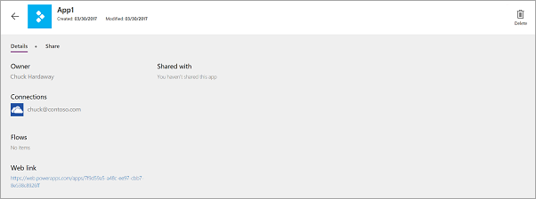

# Manage apps created in your organization 
If you're an Environment Admin, Office 365 Global Admin, or Azure Active Directory Tenant Admin, you can manage the apps created in your organization.

Admins can do the following from the PowerApps Admin center:
* Add or change the users with whom an app is shared
* Delete apps not currently in use
* View the data sources used by an app

## Prerequisites
* Either a PowerApps plan or Power Automate plan. Alternatively, you can sign up for a [free PowerApps trial](https://docs.microsoft.com/powerapps/maker/signup-for-powerapps).
* PowerApps Environment Admin, Office 365 Global Admin, or Azure Active Directory Tenant Admin permissions. For more information, see [Environments administration in PowerApps](environments-administration.md).

## Manage an app
1. Sign in to the Admin center at [https://admin.powerapps.com](https://admin.powerapps.com).
2. In the navigation pane, click or tap **Environments**, and then click or tap the environment that contains the app that you want to manage.

    If you don't see **Environments** in the navigation pane, that indicates you don't have a PowerApps plan, a Power Automate plan, or a PowerApps trial license.

    
3. On the **Resources** tab, click or tap **Apps**, and then click or tap the app that you want to manage.

   

    This takes you to the app **Details** page.

    
4. Do any of the following:

    * Click or tap the trash can icon to delete the app.
    * View data connections, flows, and other details associated with the app.
    * Click or tap **Share** to view or modify the users with whom the app is shared.

## Next steps
Check out other [how-to guides](signup-for-powerapps-admin.md) to learn what else you can do from the PowerApps Admin center.
