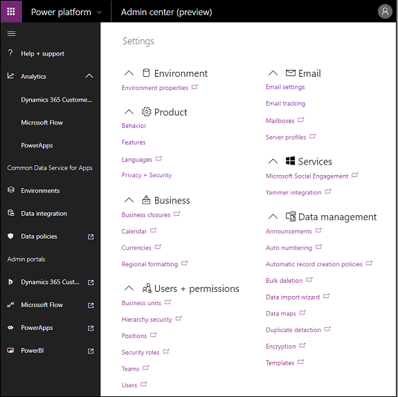
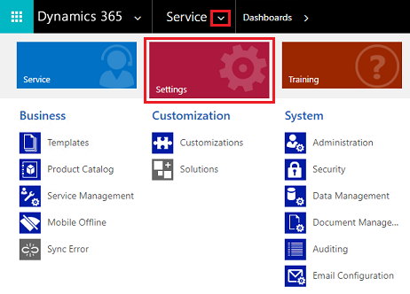

# Manage Common Data Service settings

[!INCLUDE [cc-beta-prerelease-disclaimer](../includes/cc-beta-prerelease-disclaimer.md)]

You can view and manage the settings for your environments by signing in to the [Power Platform Admin center](https://admin.powerplatform.microsoft.com), going to the **Environments** page, selecting an environment, and then selecting **Settings**.

Settings for the selected environment can be managed here.

## Environment settings are moving
Across organization admin settings are gradually moving from the web client to the Power Platform Admin center. Until the move to the Power Platform Admin center is complete, you’ll still be able to manage settings in model-driven apps in Dynamics 365, such as Dynamics 365 Sales and Customer Service, as usual.

Many of these settings...

...are moving here.

Use the links on this page to manage organization-wide settings. App-specific settings will remain in model-driven apps in Dynamics 365 and accessed through the app settings. 

## App settings 

Getting to app feature settings can vary based on the type of app you're using.

### Settings in Unified Interface apps

To open settings for apps that use [Unified Interface](about-unified-interface.md), look in the upper-right corner and select the **Gear** icon (). Then select **Advanced settings**. 

> [!div class="mx-imgBorder"] 
> 

### Settings in legacy web client apps

To open settings for legacy client apps, select the arrow next to the app name, and then select **Settings**. 

> [!div class="mx-imgBorder"] 
> 

