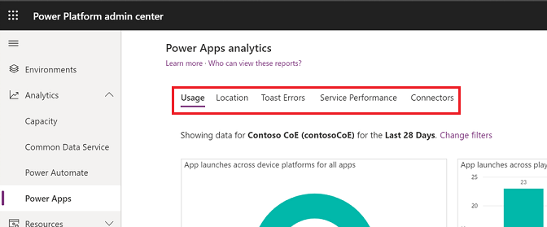
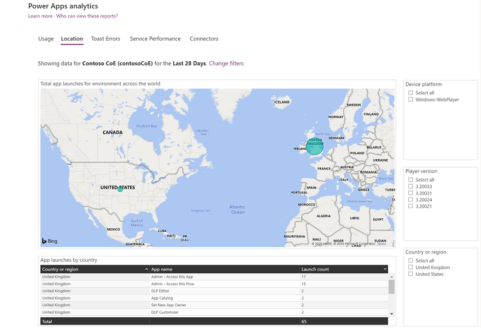
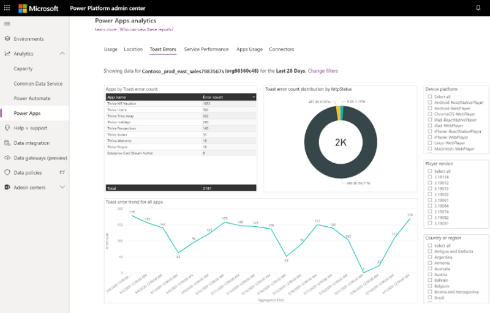
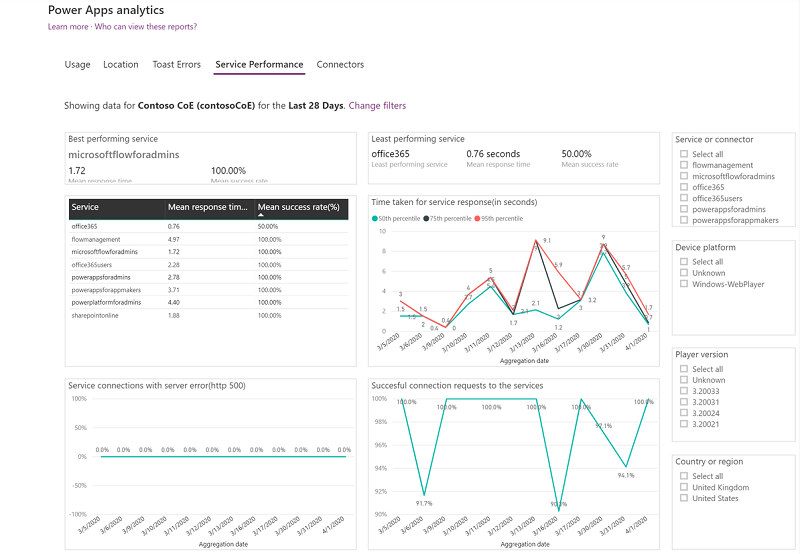
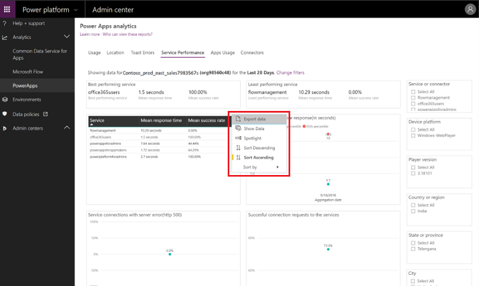
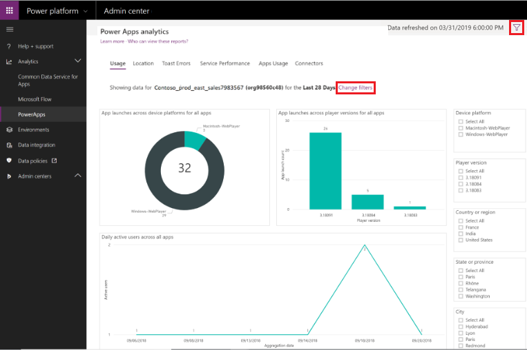
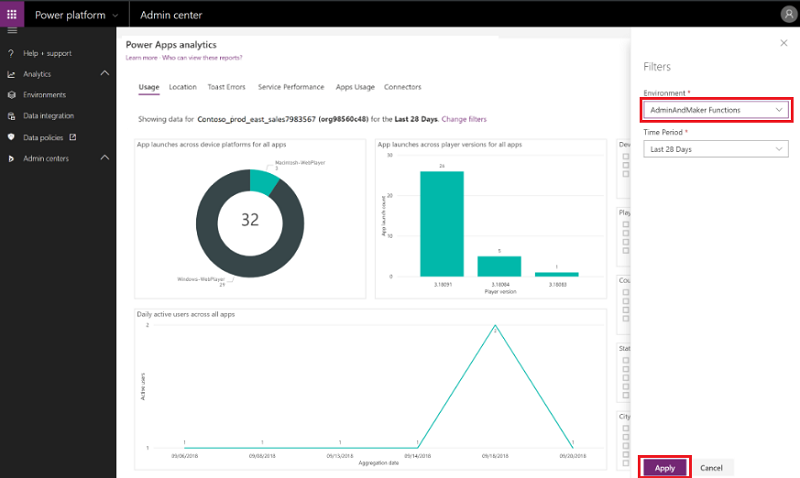

# Admin Analytics for PowerApps

[!INCLUDE [cc-beta-prerelease-disclaimer](../includes/cc-beta-prerelease-disclaimer.md)]

Preview of analytics for the environment admin is available at the Power Platform Admin center. The admin reports provide a view into environment level usage, errors, service performance to drive governance, and change management services to users. To view reports, in the Power Platform Admin center menu expand **Analytics** and then select **PowerApps**.  

> [!div class="mx-imgBorder"] 
> 

## Where is my data stored? 

When a user first creates an environment from a region, the environment is always hosted in that region. The data is stored only in the region that an environment is hosted in. Data is stored for a maximum of 28 days. The data refresh cycle is about 3 hours and the last refresh time in UTC time standard is displayed on the upper-right corner of the page. 

## What are the available reports? 

The preview contains four reports for Power Apps admins. The last viewed environment is selected by default.  

**Usage** report is the default reports seen by the logged in environment admin. It provides total app launches and daily active users across all apps in the environment. Admins can filter the view with attributes like device platform, player version, country, state, and city.

> [!div class="mx-imgBorder"] 
> 

**Location** report provides a map-based view of usage. It gives an insight into regional adoption and usage trends.  

> [!div class="mx-imgBorder"] 
> 

**Error** report provides insights into the toast error trends, types, and counts per app to help drive improvements in app quality. The toast errors are errors displayed to the end users of the app. 

> [!div class="mx-imgBorder"] 
> 

**Service Performance** report provides details of all standard and custom connectors to understand performance bottlenecks and client versus service API issues. An environment admin will get insights into:  

- Connectors used in the environment. 
- Best and least performant service and the API service response times.  
- Success rates for each service to determine areas that need attention. 
- The 50th, 75th, and 90th percentile response times for each service. 
- The number of HTTP 500 error codes of connectors indicating issues around the server not responding to calls from the client. 
- The number of successful connection requests. 

All the service performance KPI’s can be filtered with attributes like a specific service or connector, device platform, player version, and country, state, or city to drill down into the specific API. 

> [!div class="mx-imgBorder"] 
> 

## How can I download the reports? 

The reports are built on Power BI. To download a report, select the ellipsis (…) of the specific KPI and select **Export data**. 

> [!div class="mx-imgBorder"] 
> 

## How do I change environments? 

Select **Change Filter** or the **Filter** button () in the upper-right corner of the page.

> [!div class="mx-imgBorder"] 
> 

Select the environment and time period from the drop-down lists, and then select **Apply** to save the changes. All the Power Apps analytics reports will now use this selection.

> [!div class="mx-imgBorder"] 
> 
