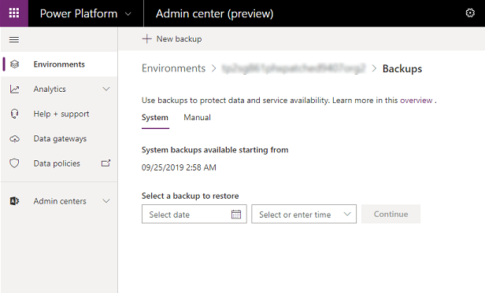
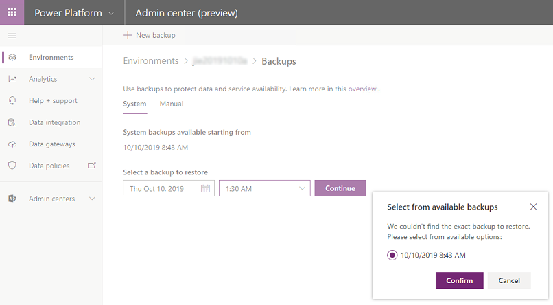
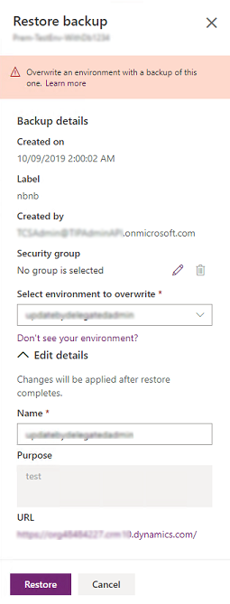
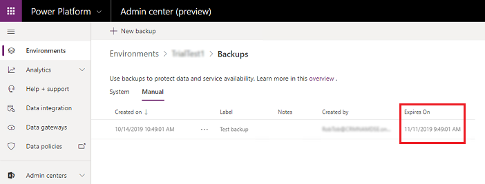

# Backup and restore environments

Protecting your data in model-driven apps in Dynamics 365, such as Dynamics 365 Sales and Customer Service, and providing continuous availability of service is important. You have multiple options for backing up and restoring your environments.   
 
## System backups  
Some backups take place without you having to do anything.  

> [!div class="mx-imgBorder"] 
> 

About **system backups**:  
  
- All your environments are backed up.  
- System backups occur continuously. Since the underlying technology used is Azure SQL, see [Azure Sql automated backups](https://docs.microsoft.com/azure/sql-database/sql-database-automated-backups) for details.
- System backups for production type environments are retained up to 28 days. Other environment type backups are retained up to 7 days.
  
### Restore a system backup  
  
1. Browse to the Power Platform Admin center and sign in using administrator credentials. Consider using the less privileged service admin role instead of the global admin role. See [Use the service admin role to manage your tenant](use-service-admin-role-manage-tenant.md).
  
2. Go to **Environments** > [select an environment] > **Backups** > **Restore or manage**.
  
   > [!div class="mx-imgBorder"] 
   > 

3. Select the **System** tab.  
  
4. Under **Select a backup to restore**, choose a date and time to select a system backup to restore, then select **Continue**. 

5. You'll be provided a list of available backups at or close to the date and time you chose if the selected time is not available. Pick the desired backup, and then select **Confirm**.

> [!div class="mx-imgBorder"] 
> 

6. Select an environment to restore to (overwrite), enter other settings as desired, and then select **Restore**.

> [!div class="mx-imgBorder"] 
> 

> [!NOTE]
> Only sandbox environments can be restored to.

7. Confirm overwrite of the environment. 

## Manual backups
Automated system backups are great, but you'll want to make your own backups before making some significant customization change or applying a version update. You can do this with manual backups.  
  
About **manual backups**:  

- A backup is created for you when we update your environment.  
- You can back up production and sandbox environments. 
- Sandbox backups are retained for up to 7 days. 
- Production backups are retained for up to 28 days. 
- Check your expiration date.  
  
> [!div class="mx-imgBorder"] 
> 
  
- You are not limited in the number of manual backups you can make.
- Manual backups do not count against your storage limits.  

### Create a manual backup
  
1. Browse to the Power Platform Admin center and sign in using administrator credentials.
  
2. Go to **Environments** > [select an environment] > **Backups** > **Create**.
  
   > [!div class="mx-imgBorder"] 
   > 

3. Fill in the information, and then select **Create**.
  
### Restore a manual backup  
You can only restore to sandbox environments. To restore to a production environment, first change it to a sandbox environment, restore to it, and then change it back to a production environment. See [Change the environment type](switch-environment.md). 
  
1. Browse to the Power Platform Admin center and sign in using administrator credentials.
  
2. Go to **Environments** > [select an environment] > **Backups** > **Restore or manage**.
  
3. Select the **Manual** tab.  
  
4. Select a manual backup to restore, then select **Restore**. 

5. Select an environment to restore to (overwrite), and then select **Restore**.

> [!NOTE]
> Only sandbox environments can be restored to.

6. Confirm overwrite of the environment. 

<!--
### Edit a manual backup  
Edit a backup to change its label and your notes about the backup.  
  
1. Browse to the Power Platform Admin center and sign in using administrator credentials.
  
2. Go to **Environments** > [select an environment] > **Backups** > **Restore or manage**.

3. Select the **Manual** tab.

4. Select **Edit**.
  
5. Fill in the information, and then select **Save**.
-->

### Delete a manual backup  
 You can  delete manual backups. You can't delete system backups.  
  
1. Browse to the Power Platform Admin center and sign in using administrator credentials.
  
2. Go to **Environments** > [select an environment] > **Backups** > **Restore or manage**.
  
3. Select the **Manual** tab.

4. Select **Delete**.

5. Confirm deletion of the environment. 
 
## FAQ

### How are system backups taken?
In the current version of the product, system backups occur continuously; this is different from previous versions where backups were once a day. Since the underlying technology used is Azure SQL, please see [Azure SQL automated backups](https://docs.microsoft.com/azure/sql-database/sql-database-automated-backups) for details.

### How are manual/on-demand backups taken?
In the current version of the product, system backups occur continuously; this is different from previous versions where backups were once a day. Since the underlying technology used is Azure SQL, please see [Azure SQL automated backups](https://docs.microsoft.com/azure/sql-database/sql-database-automated-backups) for details.

Since Azure SQL takes backups continuously, there is no need to take additional backups or specify Azure SQL to take additional backups or an on-demand full backup. So our on-demand backup is just a label and a time-stamp that we store in our system and use during restore requests. This is different from previous versions where took a full backup during an on-demand backup. 

### Should I open a support ticket for taking a full backup?
No. In the current version of the product, system backups occur continuously; this is different from previous versions where backups were once a day. Since the underlying technology used is Azure SQL, please see [Azure Sql automated backups](https://docs.microsoft.com/azure/sql-database/sql-database-automated-backups) for details.

Since Azure SQL takes continuous backups and no specific way to take additional on-demand backups, we recommend you use our on-demand backup feature to label your backups. 

### How long are my manual/on-demand backups and system backups retained?
Both manual backups and system backups are retained for 28 days. We currently do not show all the available system backups. We plan to show the full range of available backups in the future.

### Can I extend my backup to be retained beyond the standard number of days?
You can't extend your system backups or manual/on-demand backups. However, if you want to keep the data for longer than the standard retention period, we recommend you copy your environment to an additional environment and do not modify that additional environment. 

### Can I move my data from an online environment to an on-premises version?
Obtaining a copy of your database backup isn't available. If you want to move your online data to Customer Engagement (on-premises), this requires data migration. For smaller datasets, consider [exporting data to Excel](https://docs.microsoft.com/powerapps/user/export-data-excel). For larger datasets, find a third-party data migration solution on [Microsoft AppSource](https://appsource.microsoft.com/).  

### How can I download a copy of my backup?
Obtaining a copy of your database backup isn't available. Moving your online data requires data migration. For smaller datasets, consider [exporting data to Excel](https://docs.microsoft.com/powerapps/user/export-data-excel). For larger datasets, find a third-party data migration solution on [Microsoft AppSource](https://appsource.microsoft.com/).  

### Do we have any database size restriction to take a backup or restoring an organization through user interface (UI) or API?
We do not have any restriction on database size to take a backup or restore an organization through UI or API. So please use the UI or API to do self-service. Open a support ticket if the operation fails.

### Can I restore to a production environment?
In order to prevent accidental overwrites, we don't allow users to restore to a production environment directly. To restore to a production environment, first change it to a sandbox environment. Please see [Change the environment type](switch-environment.md).   

### Why is my organization in administration mode after a restore and how do I disable it?
The newly restored environment is placed in administration mode. To disable administration mode, see [Set administration mode](sandbox-environments.md#set-administration-mode).  

## Troubleshooting

### Don't see your environment to restore to?
Only sandbox environments can be restored to.
