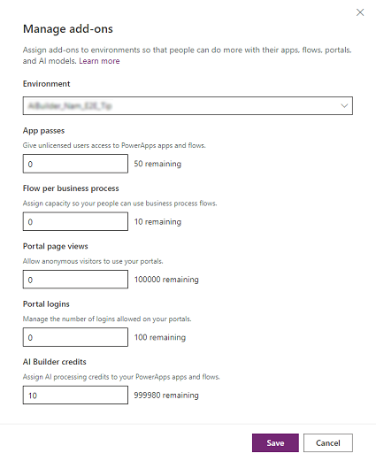
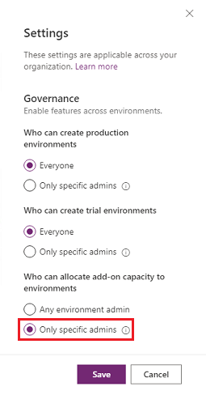

# Preview: Capacity add-ons

[!INCLUDE [cc-beta-prerelease-disclaimer](../includes/cc-beta-prerelease-disclaimer.md)]

If your organization has purchased capacity add-ons, you have to allocate that capacity to any environment where you want to use it. You also have to make sure that your users have access to those environments and have the correct permissions before they can use the products for which you've purchased a capacity add-on.

There are three stages for using capacity add-ons:

1. Purchase: you buy individual capacity add-ons. For purchasing information, see the [PowerApps and Flow Licensing Guide Oct 2019](https://go.microsoft.com/fwlink/?linkid=2085130).
2. Allocate: assign the purchased add-ons to an environment.
3. Consume: once allocated, you can consume the capacity add-ons.

## View capacity add-ons in Power Platform Admin center

If your organization has purchased capacity add-ons, an **Add-ons** tile appears on the **Capacity** screen in the [Power Platform Admin center](https://admin.powerplatform.microsoft.com/). Sign into the Admin center, and select **Analytics > Capacity** in the left-side navigation pane.

The **Add-ons** tile shows summary information about the capacity add-ons that your organization has.


Each capacity has a usage gauge that shows how many units have been assigned compared to the available capacity. Capacities are measured in different ways depending on the product. For example, App passes are assigned individually, while AI Builder capacity is measured in credits. Refer to the product documentation for more information about metering.

## Allocate or change capacity in an environment

To allocate capacity to an environment:

1. Sign into the [Power Platform Admin center](https://admin.powerplatform.microsoft.com/). 

2. Select **Analytics > Capacity** in the left-side navigation pane.

3. On the **Capacity** screen, do **one** of the following to open the **Manage add-ons** screen:

   - Scroll down to the Add-ons tile, and then select **Manage** on the top-right corner of the Add-ons tile.
   - Select the **Add-ons** tab. Select **Assign to an environment** in the upper-left menu bar.    
   - Select the **Add-ons** tab. Select an environment, and then select **Manage add-ons** in the upper-left menu bar.

4. Select the environment where you want to add capacity from the **Environment** drop-down menu, and then allocate from your available capacity.

   > [!div class="mx-imgBorder"] 
   > 

## Control who can allocate add-on capacity

As an admin, you can restrict who can allocate add-on capacity to environments.

1. Sign in to the Power Platform Admin center at [https://admin.powerplatform.microsoft.com](https://admin.powerplatform.microsoft.com).
2. Select the **Gear** icon () in the upper-right corner of the Power Platform site.
3. Under **Who can allocated add-on capacity to environments**, select **Only specific admins**.

   > [!div class="mx-imgBorder"] 
   > 

The following admins will be able to allocate add-on capacity in the Power Platform Admin center:

- Office 365 Global admins
- Service admins
- Delegated admins
<!--
## Control add-on capacity allocation through PowerShell

Download and install the admin PowerShell cmdlets as described [here](https://www.powershellgallery.com/packages/Microsoft.PowerApps.Administration.PowerShell/2.0.1). For more information about our cmdlets, see [PowerShell support for PowerApps (preview)](powerapps-powershell.md).

Use the following commands to restrict environment creation to Global admin, service admin, and Delegated admin. 

```
$settings = @{ DisableEnvironmentCreationByNonAdminUsers = $true }
Set-TenantSettings $settings
```
-->
## FAQ

### Can I use model-driven apps by consuming app passes? 
Yes. Please use the following steps.

1. Create a group in Azure Active Directory, see [Create a group and add members](https://docs.microsoft.com/azure/active-directory/fundamentals/active-directory-groups-create-azure-portal).
   1. Go to: [https://portal.azure.com](https://portal.azure.com) > **Azure Active Directory** > **Groups** > **+ New Group**

2. Assign the group licenses in portal.azure.com. 
   1. Go to: [https://portal.azure.com](https://portal.azure.com)  > **Azure Active Directory** > **Groups** > search for the group created in Step #1.  
   2. For now, sign up for the [Per app baseline access plan](https://signup.microsoft.com/signup?sku=bf666882-9c9b-4b2e-aa2f-4789b0a52ba2), and then assign the license **PowerApps per app plan baseline access**. See [Assign or remove licenses](https://docs.microsoft.com/azure/active-directory/fundamentals/license-users-groups).  

3. Add users to the group, see [Add or remove group members](https://docs.microsoft.com/azure/active-directory/fundamentals/active-directory-groups-members-azure-portal).  

4. [Generate a canvas app from Common Data Service in PowerApps](https://docs.microsoft.com/powerapps/maker/canvas-apps/data-platform-create-app). 
   1.	Use Common Data Service from an environment you plan to share the model-driven app. 
   2.	Assign the security role to the group that you plan to use to make the model-driven app accessible to end-users.  

5. Share the canvas app with the group created in Step #1. See [Assign a group to a role](https://docs.microsoft.com/azure/active-directory/fundamentals/active-directory-groups-members-azure-portal). 

6. Proceed with sharing the model-driven app, and assign the security role from Step #4b to the users expected to access the app.  

### How do I setup an app to use app passes?
See [PowerApps per app plan](https://docs.microsoft.com/powerapps/maker/canvas-apps/limits-and-config#powerapps-per-app-plan).

### When can I see how many capacity add-ons are consumed? 
Check back later for availability. 
