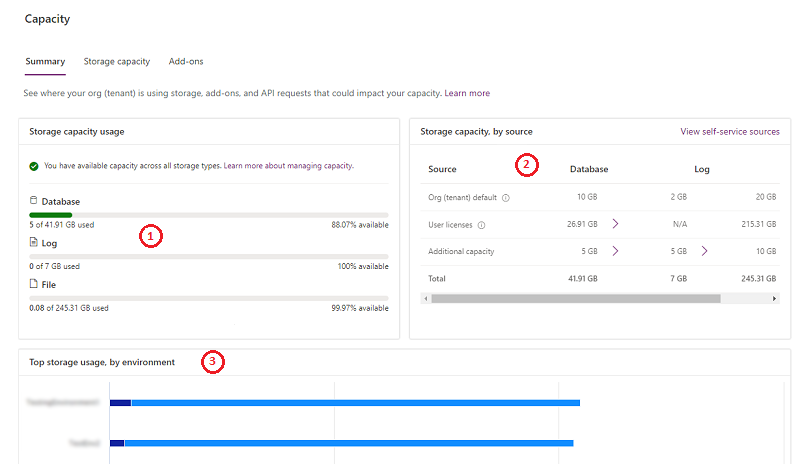

# Preview: Capacity and storage

[!INCLUDE [cc-beta-prerelease-disclaimer](../includes/cc-beta-prerelease-disclaimer.md)]

We're introducing a new business model for Common Data Service storage - an evolution of the Common Data Service storage capacity.

While storage was once viewed in multiple places...

|  |  |
|---------|---------|
|Dynamics 365 Administration Center     |        |
|Common Data Service for Apps analytics     |        |
|Organization Insights Dashboard | |

...the new storage model provides a single place to view your data.

> [!div class="mx-imgBorder"] 
> 

## About the new storage model

We're optimizing data management for database storage, attachments, and audit logs.

Some of the benefits of this change: 

- Scalability with purpose-built storage management solutions
- Ability to enable new business scenarios
- Reduced need to free up storage
- Support for variety of data types
- Additional default and full user entitlements
- Flexibility to create new environments/instances 

## Timeline

Communication and feature deployment are planned as follows.

|  | April 1, 2019 | After April 1, 2019  |
|---------|---------|---------|
|Communication     | A blog will be posted and Admins will receive emails about how to start planning for File and Log storage. | You can purchase File and Log storage. |
|Reporting     | <ul><li>Capacity reporting introduced</li> <li>Existing customers get new types of storage but are not impacted by the change until renewal</li> <li>Data stored in the organization databases is split and counted in three storage types</li> <li>1GB (minimum) per environment reflected in reporting</li></ul> |<ul><li>Reporting to include data from organization databases and new services</li> <li>Recommendations provided for managing storage</li></ul> |
|Notification     |<ul><li>First four weeks email sent to Admins for awareness </li> <li>Email notifications sent at 80% and 100% database limits</li> <li>No email notifications sent on Log and File storage over limits</li></ul> |<ul><li>Customized notifications sent with Microsoft Flow integration</li> <li>Email notifications sent at 80% and 100% database limits on Log and File storage</li></ul>  |
|Provisioning     |No change – still based on current model   |Provisioning changes, minimum 1GB available capacity required to provision |
|Hosting + Application Lifecycle Management    |Relational database  |Relational database, File, and Log storage |

## Capacity page details

This page provides a tenant-level view of where your organization is using storage capacity.

Let's do a walkthrough of what's on the **Capacity** page. To see this page, select **Capacity** > **Overall** tab in the left-side menu.

> [!div class="mx-imgBorder"] 
> 

|  |Description |
|---------|---------|
|(1)   |**Current usage** **Database**: text **File**: text **Log**: text          |
|(2)    |**Capacity types and sources** **Organization base**: text **User licenses**: text **Additional off-the-shelf**: text **Total**: text         |
|(3)    |**What's new** Text         |
|(4)     |**Top capacity usage, by environment** Text         |

### Capacity from licenses

This panel... text 

> [!div class="mx-imgBorder"] 
> 

### Per environment tab

This page provides an environment-level view of where your organization is using storage capacity.

> [!div class="mx-imgBorder"] 
> 

### CDS 2.0 Production environment

Text

> [!div class="mx-imgBorder"] 
> 

The following describes the items on this page.

|Item  |Description  |
|---------|---------|
|**Database usage**     | Text        |
|**File usage**    | Text         |
|**Log usage**     | Text        |
|**Top database capacity use, by table** | Text |
|**Top file capacity by use, by table** | Text |
|**Log usage** | Text    |
|**Top log capacity use, by table** | Text  |

Select **Applied filters** at the the top of the page to filter data for different time spans.

## Things to know about the new storage model

Here are some important considerations about the new storage model.

- Pricing changes: link to marketing doc?
- Additional instances: When 1GB of database capacity is available, no separate license for Production and other instances.
- Increased storage: File and Log capacity frees up database capacity. The 4TB size limit does not apply to File and Log capacity.
- Transition to new platform capacity: No action is required. There is no change to existing forms, views, and other UI elements. Existing APIs are backwards compatible.
- 

