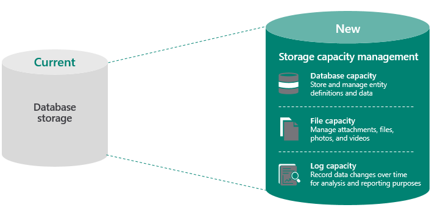
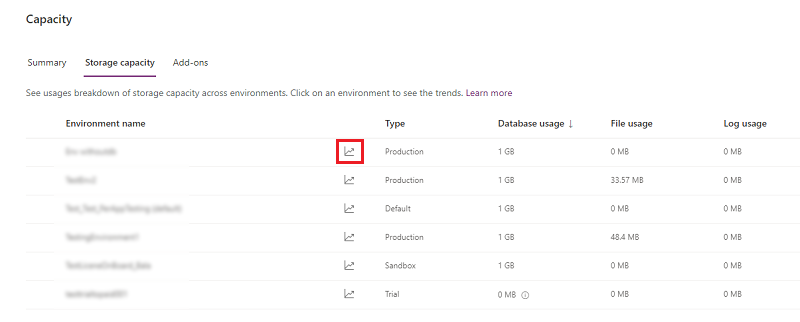

# Preview: Platform storage capacity

[!INCLUDE [cc-beta-prerelease-disclaimer](../includes/cc-beta-prerelease-disclaimer.md)]

The Common Data Service for Apps is a powerful, data service built into Dynamics 365 and PowerApps, that helps organizations store, manage, and secure data that is used by Dynamics 365 and other business applications. Data volume continues to grow exponentially, as businesses advance their digital transformation journey and bring data across their organization together. Modern business applications need to support new business scenarios, manage new data types, and help organizations with the increasing complexity of compliance mandates. To support the growing needs of today’s organizations, data storage solutions need to evolve continuously and provide the right solution to support expanding business needs. 

Effective April 1, 2019, the Common Data Service for Apps will offer platform storage capacity optimized for relational data, attachments, and audit logs. These will be referred to as: 

- Common Data Service for Apps Database Capacity 
- Common Data Service for Apps File Capacity  
- Common Data Service for Apps Log Capacity  

Certain Dynamics 365 for Customer Engagement apps and PowerApps plans provide tenant-wide default entitlement for each of these storage types and additional accrued capacity entitlements per qualifying user subscription license. Organizations can purchase add-on capacity licenses, which are priced per 1 GB of additional database, file, or log capacity. As part of this change, organizations that transition to the new storage capacity licenses will no longer be required to purchase additional production or non-production instances. An additional instance can be created when at least 1 GB of database capacity is available. Note: each instance uses at least 1 GB of database storage. 

## How does this affect me?

Your organization will not be affected until the expiration of your current PowerApps or Dynamics 365 subscription. Organizations that renew their current web direct subscription for Dynamics 365 between April 1, 2019 and December 31, 2019 and also purchase either:  

- additional database storage or  
- additional production or non-production instances  

You can choose to renew using the current offers and licensing policies or transition to the new storage capacity offers and licensing policies.  

[Below not yet revised for above content]

> [!NOTE]
> For introductory information on the new capacity analytics model, see [need link].

Data volume continues to grow exponentially, as businesses advance their digital transformation journey and bring data across their organization together. Modern business applications need to support new business scenarios, manage new data types, and help organizations with the increasing complexity of compliance mandates. To support the growing needs of today’s organizations, data storage solutions need to evolve continuously and provide the right solution to support expanding business needs.

We have updated our capacity analytics reporting to provide important benefits to our customers. Here is a summary of changes in capacity analytics.

- New **Capacity** page is available in Power the Platform Admin center.
-	Admins can visualize the data stored in Database, Files, and Logs. 
-	Entitlement information is added to clearly understand what is the tenant available capacity.  
-	Existing customers get new types of capacity (File and Log) but are not impacted by the change until renewal. 

The new capacity analytics reporting provides a single place to view your capacity data.

> [!div class="mx-imgBorder"] 
> 

In the previous storage model, you viewed information in multiple places.

|  |  |
|---------|---------|
|Dynamics 365 Administration Center     |        |
|Common Data Service for Apps analytics     |        |

## About the new capacity analytics reporting

We're optimizing data management for database storage, attachments, and audit Logs. There are now three types of storage: Database, File, and Log.

Some of the benefits of this change: 

- Scalability with purpose-built storage management solutions
- Ability to enable new business scenarios
- Reduced need to [free storage space](free-storage-space.md)
- Support for variety of data types
- Additional default and full user entitlements
- Flexibility to create new environments/instances 

## Capacity page details

This page provides a tenant-level view of where your organization is using storage capacity.

Let's do a walkthrough of what's on the **Capacity** page. To see this page, select **Analytics** > **Capacity** > **Overall** tab in the left-side menu.

> [!div class="mx-imgBorder"] 
> 

|  |Description |
|---------|---------|
|(1)   |**Current usage** <ul> <li>**File**: The following entities are used:  <ul><li>AuditBase</li> <li>PlugInTraceLogBase</li></ul> <li>**Log**: The following entities are used:  <ul><li>Attachment</li> <li>AttachmentBase</li> <li>AttachmentMIMEAttachement</li></ul></li><li>**Database**: All other entities are counted for your database</li></ul> |
|(2)    |**Capacity types and sources** <li>**Organization base**: The default capacity given at the time of sign-up </li> <li>**User licenses**: Additional capacity added for every User License purchased</li> <li>**Additional storage**: Any additional storage you bought </li> <li>**Total**: Total storage available </li></ul>      |
|(3)    |**What's new** Announcing the new storage model         |
|(4)     |**Top capacity usage, by environment** Top environments that consume the most capacity        |

### Capacity from licenses

This is a further drill down. Refer to point#2 above.

> [!div class="mx-imgBorder"] 
> 

### Per environment tab

This page lists all environments in the tenant and how much capacity they are consuming. 

- Environments that do not count against capacity show as 0GB
  - Trial 
  - Preview
  - Support
  - Developer
- Admins can select environments showing 0GB to go to the **Environment Analytics** page and see the actual consumption.

> [!div class="mx-imgBorder"] 
> 

### Environment capacity analytics

This page provides an environment-level detailed view of where your organization is using storage capacity.

-	Actual Database usage
-	Top Database tables and their growth over time
-	Actual File usage
-	Top Files tables and their growth over time
-	Actual Log usage
-	Top tables and their growth over time

> [!div class="mx-imgBorder"] 
> 

The following describes the items on this page.

|Item  |Description  |
|---------|---------|
|**Database usage**     | Text        |
|**File usage**    | Text         |
|**Log usage**     | Text        |
|**Top database capacity use, by table** | Text |
|**Top File capacity by use, by table** | The following tables are used:  <ul><li>AuditBase</li> <li>PlugInTraceLogBase</li></ul> |
|**Top Log capacity use, by table** | The following tables are used:  <ul><li>Attachment</li> <li>AttachmentBase</li> <li>AttachmentMIMEAttachement</li></ul>  |

Select **Applied filters** at the the top of the page to filter data for different time spans.

## FAQ

### I'm an existing customer with an EA agreement. Should I go buy Log and File capacity?
If you have an existing agreement, you are not impacted with the current change. We have added Log and File capacity to your current entitlement which reduces your Database capacity. Until renewal, you can continue with the current plan.

### I'm an existing customer and my renewal is coming up. Will I be impacted?
At renewal, you are expected to move to the new model and purchase the Database, File, and Log capacity as appropriate. You can use the current report to determine how much you should buy.

### Will the Storage tab in Common Data Service continue to work?
The **Storage** tab will be deprecated as we move to the new updated Capacity Analytics.

### I have a PowerApps environment with Database, will this environment count against capacity?
Yes. All Common Data Service environments are counted.

### How do I buy more capacity?
A) ??

### How can I reduce consumed storage space?
See the following: [Free storage space](free-storage-space.md).

