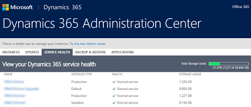
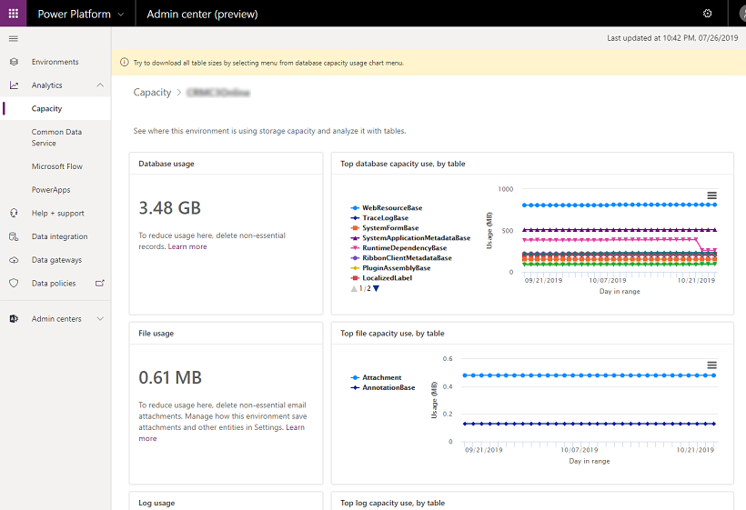

# Preview: Common Data Service storage capacity 

[!INCLUDE [cc-beta-prerelease-disclaimer](../includes/cc-beta-prerelease-disclaimer.md)]

Data volume continues to grow exponentially, as businesses advance their digital transformation journey and bring data across their organization together. Modern business applications need to support new business scenarios, manage new data types, and help organizations with the increasing complexity of compliance mandates. To support the growing needs of today’s organizations, data storage solutions need to evolve continuously and provide the right solution to support expanding business needs.

> [!NOTE]
> For introductory licensing information on the new capacity analytics model, see [Power Apps plans](https://go.microsoft.com/fwlink/p/?linkid=2085130).
>
> Common Data Service storage capacity is not available for Dynamics 365 US Government – GCC and GCC High, DOD, and Microsoft Dynamics 365 online services operated by 21Vianet.

We have updated our capacity analytics reporting to provide important benefits to our customers. Here is a summary of changes in capacity analytics.

- New **Capacity** page is available in the Power Platform Admin center.
-	Admins can visualize the data stored in Database, Files, and Logs. 
-	Entitlement information is added to the report to help customers understand available capacity of the tenant level.
-	Existing customers get entitlements for new types of capacity (File and Log) but are not impacted by the licensing change until renewal.

The new capacity analytics reporting provides a single place to view your capacity data.

> [!div class="mx-imgBorder"] 
> 

## What has changed

In the previous storage model, you viewed information in multiple places.

|  |  |
|---------|---------|
|Dynamics 365 Administration Center     |        |
|Common Data Service analytics     |        |

## About the new capacity analytics reporting

We're optimizing data management for database storage, attachments, and audit Logs. There are now three types of storage: Database, File, and Log.

Some of the benefits of this change: 

- Scalability with purpose-built storage management solutions
- Ability to enable new business scenarios
- Reduced need to [free storage space](free-storage-space.md)
- Support for variety of data types
- Additional default and full user entitlements
- Flexibility to create new environments

## Capacity page details

### Summary tab

This page provides a tenant-level view of where your organization is using storage capacity.

To view the **Summary** page, select **Analytics** > **Capacity** > **Summary** tab.

> [!div class="mx-imgBorder"] 
> 

|  |Description |
|---------|---------|
|(1)   |**Current usage**  <ul><li>**File**: The following entities are used: <ul><li>Attachment</li><li>AnnotationBase</li><li>Any custom or out-of-box (OOB) entity that has fields of datatype File or Image (full size)</li></ul></li><li>**Log**: The following entities are used: <ul><li>AuditBase</li><li>PlugInTraceLogBase</li></ul><li>**Database**: All other entities are counted for your database</li></ul> |
|(2)    |**Capacity types and sources** <ul><li>**Organization base**: The default capacity given at the time of sign-up </li><li>**User licenses**: Additional capacity added for every User License purchased</li><li>**Additional storage**: Any additional storage you bought </li><li>**Total**: Total storage available </li></ul>      |
|(3)    |**What's new**: Used for announcements and notifications  |
|(4)     |**Top capacity usage, by environment**: Top environments that consume the most capacity        |

### Storage capacity tab

This page provides similar information as the **Summary** tab but with an environment-level view of where your organization is using capacity.

To view the **Storage capacity** page, select **Analytics** > **Capacity** > **Storage capacity** tab. See the next section for using the **Details** button () to see environment capacity analytics.

> [!div class="mx-imgBorder"] 
> 

> [!NOTE]
> - The following environments do not count against capacity and show as 0GB:
>   - Trial 
>   - Preview
>   - Support
>   - Developer
> - Admins can select environments showing 0GB to go to the **Environment Analytics** page and see the actual consumption.

### Environment capacity analytics

This page provides an environment-level detailed view of where your organization is using capacity as well as the three capacity types consumption. 

To view environment-level capacity analytics:

1. Select **Analytics** > **Capacity** > **Overall** tab.
2. Select the **Storage capacity** tab.
3. Select an environment.
4. Select the **Details** button ()

> [!div class="mx-imgBorder"] 
> 

Details provided:

-	Actual Database usage
-	Top Database tables and their growth over time
-	Actual File usage
-	Top Files tables and their growth over time
-	Actual Log usage
-	Top tables and their growth over time

<!--
Select **Applied filters** at the the top of the page to filter data for different time spans. 

> [!div class="mx-imgBorder"] 
> 
-->
## FAQ

### I see the new Capacity Report, but I have not purchased the new capacity offers. How do I interpret the report?
As an existing customer, we have added File and Log capacity to your tenant automatically based on your existing licenses. Because you are currently in an agreement under the old offers, you are not impacted. Make sure your Database consumption is per the entitlement. You are not expected to take any action for File and Log. At renewal, you can use this report to get the right amount of capacity for Database, File, and Log.

### I just bought the new capacity-based licenses. How do I provision an environment using this model?
You can provision environments through the Power Platform Admin center. For details, see [Create and manage environments in the Power Platform Admin center](create-environment.md).

### I’m an existing customer and have not purchased the new offers. The capacity report indicates I’m overusing the Database/File/Log, what should I do?
If Database, you should not exceed the available Database capacity. Please consider [freeing storage space](free-storage-space.md) or purchase more storage capacity. 

If File and Log, then there is no immediate action required. At renewal, you can use this report to get the right amount of capacity for Database, File, and Log.

### I’m a new customer and I recently purchased with the new offers. My usage of Database/Log/File is showing red. What should I do?  
Consider buying additional capacity using the [Licensing Guide](https://go.microsoft.com/fwlink/p/?LinkId=866544). Alternatively, you can [free up storage](free-storage-space.md).

### Where can I read more about the new capacity offers?
Download the [Licensing Guide](https://go.microsoft.com/fwlink/p/?LinkId=866544) to learn more.

### I am an existing customer, will I be immediately impacted by this change?
No, there is no immediate change for existing customers as your current term will be honored for the duration of your agreement. 

### I'm an existing customer with an EA agreement. Should I go buy File and Log capacity?
If you have an existing agreement, you are not impacted with the current change. We have added File and Log capacity to your current entitlement which reduces your Database capacity. Until renewal, you can continue with the current plan.

### I'm an existing customer and my renewal is coming up. Will I be impacted?
Customers who renew existing subscriptions can choose to continue to transact using the existing offers for a certain period of time. Please contact your Microsoft partner or Microsoft sales team for details.

### I’m a PowerApps/Power Automate customer and have environments with and without Database. Will they consume storage capacity? 
Currently, only the environments with Database consume capacity; environments without Database do not. However, once the Power Platform Admin center has the ability to create environments, all environments will consume 1GB. 

### Why am I no longer getting storage notifications?
We have disabled email notifications with the move to the new storage model. Review the **[Capacity](https://admin.powerplatform.microsoft.com/analytics/capacity )** page to monitor usage.

### How can I reduce consumed storage space?
See the following: [Free storage space](free-storage-space.md).

### I'm an existing customer. Should I expect my File and Log usage to change?
Log and Files data usage is not expected to be exactly the same size as when the same data is stored using Database due to different storage and indexing technologies. The current set of out-of-box (OOB) entities stored in File and Log might change in the future.

### Capacity report shows the entitlement breakdown by per license, but I have more licenses in my tenant and not all of them are listed in the breakdown, why?
Not all licenses give per user entitlement. For example, the team member license does not give any per user Database/File/Log entitlement. So in this case, the licenses that do not give any per user entitlement will not be listed in the breakdown.

### When is table data expected to show in the report?
Check back for availability. In addition to top tables, we will also show the table trend.

### Which environments are counted in the capacity report?
Default, production, and Sandbox environments are counted for consumption. Trial, Preview, Support, and Developer environments are not counted.

