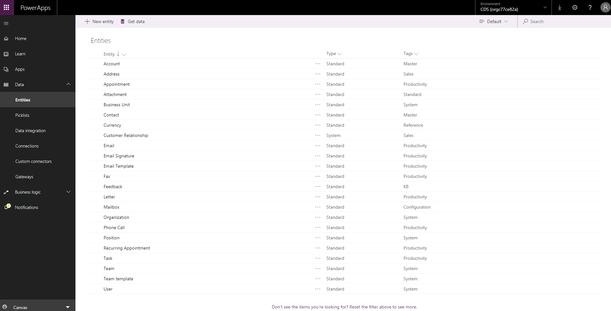
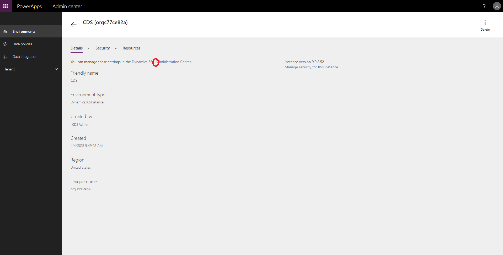
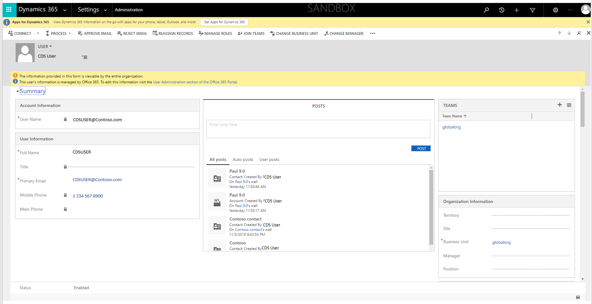
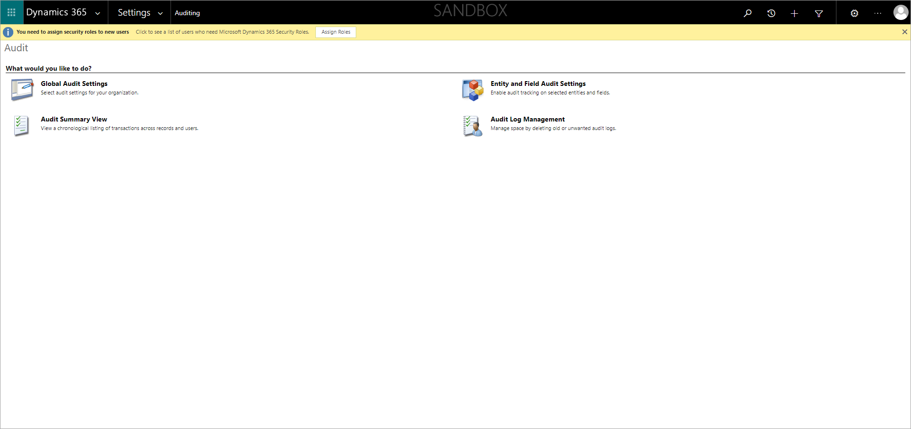
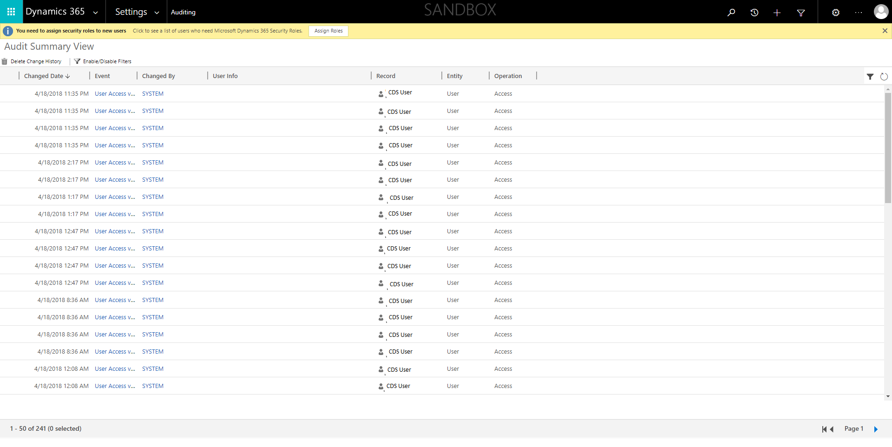
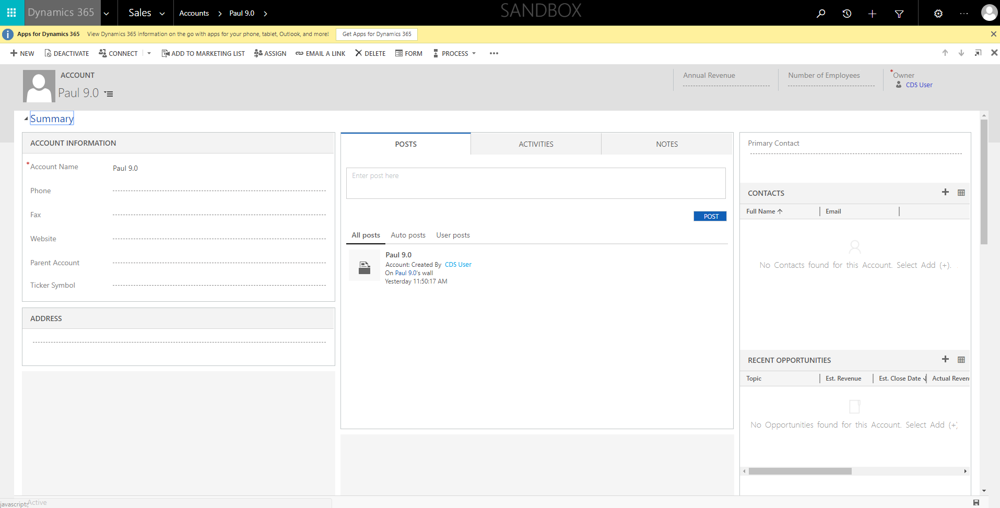
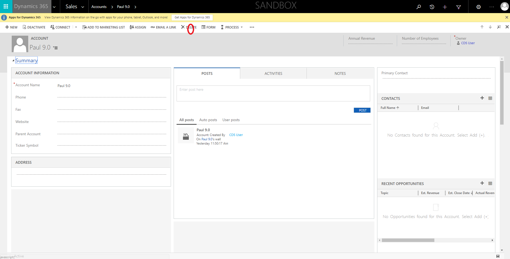

# Responding to Data Subject Rights (DSR) requests for Common Data Service customer data

## Introduction to DSR requests
The European Union (EU) General Data Protection Regulation (GDPR) gives rights to people (known in the regulation as *data subjects*) to manage the personal data that's been collected by an employer or other type of agency or organization (known as the *data controller* or just *controller*). Personal data is defined very broadly under the GDPR as any data that relates to an identified or identifiable natural person. The GDPR gives data subjects the right to do the following, as it pertains to their personal data:

* Obtain copies
* Request corrections
* Restrict processing
* Delete it
* Receive it in electronic format so it can be moved to another controller

A formal request by a data subject to a controller to take an action on his or her personal data is called a Data Subject Rights (DSR) request.

This article describes how Microsoft is preparing for the GDPR, and also provides examples of steps you can take to support GDPR compliance when using PowerApps, Microsoft Flow, and Common Data Service. You'll learn how to use Microsoft products, services, and administrative tools to help controller customers find, access, and act on personal data in the Microsoft cloud in response to DSR requests.

The following actions are covered in this article:

* **Discover** — Use search and discovery tools to more easily find customer data that may be the subject of a DSR request. Once potentially responsive documents are collected, you can perform one or more of the following DSR actions to respond to the request. Alternatively, you may determine that the request doesn't meet your organization’s guidelines for responding to DSR requests.

* **Access** — Retrieve personal data that resides in the Microsoft cloud and, if requested, make a copy of that data available to the data subject.

* **Rectify** — Make changes or implement other requested actions on the personal data, where applicable.

* **Restrict** — Restrict the processing of personal data, either by removing licenses for various online services or turning off the desired services where possible. You can also remove data from the Microsoft cloud and retain it on-premises or at another location.

* **Delete** — Permanently remove personal data that resides in the Microsoft cloud.

* **Export** — Provide an electronic copy (in a machine-readable format) of personal data to the data subject.

## Common Data Service customer data

> [!IMPORTANT]
> Applies to both Common Data Service and the previous version of Common Data Service

Common Data Service and the previous version of Common Data Service have separate processes for interacting with personal data.

You can identify which type of Common Data Service environment you have by logging into [PowerApps](https://web.powerapps.com/?utm_source=padocs&utm_medium=linkinadoc&utm_campaign=referralsfromdoc) and following these steps:

1. In the **Environment** drop-down list, select your environment.
2. In the navigation pane, click or tap **Data**, and then click or tap **Entities**.

    Your environment is Common Data Service if you see the following entities listed:

    

    Your environment is the previous version of Common Data Service if you see the following entities listed:

    

After you determine which type of Common Data Service environment you have, follow the steps in the following sections to identify personal data.

> [!NOTE]
> You may have some environments in Common Data Service and others in the previous version of Common Data Service, so you'll need to repeat the processes outlined below for each environment in your organization.

## User personal data in Common Data Service

### Prerequisites

You must create users in the Microsoft 365 admin center and assign them an appropriate user license and security role before they can access and use Common Data Service.

Standard user personal data (for example, UserName, UserID, Phone, Email, and Address) is kept and maintained in the Microsoft 365 admin center. System administrators can update this personal data only in the Microsoft 365 admin center, and the data is then automatically synced to the Common Data Service system User entity in all environments. System administrators can also create custom attributes to capture additional user personal data within the Common Data Service system User entity, and then manually maintain and manage these attributes.

To avoid interruption to business applications that may be critical to your organization’s operations, a user's records are not automatically removed from the Common Data Service system User entity when that user is deleted from within the Microsoft 365 admin center. The user’s status is set to Disabled in Common Data Service, but a Common Data Service System Administrator must locate and remove the user's personal data from Common Data Service within the application.

Only Office 365 Global Administrators and Common Data Service System Administrators can perform the discover, rectify, export, and delete actions listed below.

### Discover
System Administrators can create multiple Common Data Service environments. These environments can be used for trial, development, or production purposes. Each of these environments has a copy of the system User entity with any custom attributes that may have been added by the system administrator, as well as the user personal data synced from the Microsoft 365 admin center.

System administrators can find a list of all the Common Data Service environments by navigating to the Dynamics 365 Administration Center from the PowerApps Admin center.

From the [PowerApps Admin center](https://admin.powerapps.com/), do the following:

1. In the navigation pane, click or tap **Environments**, and then select an environment from the list.

3.	Click or tap **Dynamics 365 Administration Center**.

    

    A list of all the environments displays.

    

You can find personal data from Common Data Service users within the following resources:

|Resource | Purpose | Website access | Programmatic access
| --- | --- | --- | ---
| Entity record | Known as the system User entity, it stores a user's personal data. | [PowerApps Admin center](https://admin.powerapps.com) | Through the [Web API](https://docs.microsoft.com/dynamics365/customer-engagement/developer/webapi/update-delete-entities-using-web-api#basic-update)
| Audit history | Allows customers to identify resources that users created, accessed, changed, or deleted at an entity level. | [PowerApps Admin center](https://admin.powerapps.com) | Through the [Web API](https://docs.microsoft.com/dynamics365/customer-engagement/developer/webapi/update-delete-entities-using-web-api#basic-update)

#### User
User personal data is stored in the Azure Active Directory and is automatically synced to all Common Data Service environments. System administrators cannot update this personal data directly in Common Data Service while the user is active&mdash;they must update the data from within the Office 365 Administration Center. System administrators can add personal data (for example, custom attributes) directly to Common Data Service, but they must manually manage this data.

To find a user and his or her personal data, go to the [PowerApps Admin center](https://admin.powerapps.com/) and do the following:

1. In the navigation pane, click or tap **Environments**, and then select an environment from the list.

2. Click or tap **Dynamics 365 Administration Center**, select an environment from the list, and then click or tap **Open**.

3. Go to **Settings** > **Security** > **Users**.

4. Enter the name of the user in the **Search** box, and then click or tap **Search**.

5. To view the user's personal data, double-click or double-tap the user's name.

    

#### Audit history
When [audit tracking](https://docs.microsoft.com/dynamics365/customer-engagement/admin/audit-data-user-activity) is enabled for an entity in Common Data Service, a user's personal data is logged in the audit history along with the actions that the user performs.

### Rectify
If a data subject asks you to rectify the personal data that resides in your organization’s data, you and your organization must determine whether it’s appropriate to honor the request. Rectifying data may include editing, redacting, or removing personal data from a document or other type of item.

You can use Azure Active Directory to manage the identities (personal data) of your users within Common Data Service. Enterprise customers can manage DSR rectify requests by using the limited editing features within a given Microsoft service. As a data processor, Microsoft does not offer the ability to correct system-generated logs, because they reflect factual activities and constitute a historical record of events within Microsoft services. See [GDPR: Data Subject Requests (DSRs)](https://servicetrust.microsoft.com/ViewPage/GDPRDSR) for details.

Once a user record is deleted from Azure Active Directory, System Administrators can then remove any remaining personal data related to that user (such as custom attributes) from all the environments.  

### Export

#### System user
You can export a user's personal data stored in the system User entity to Excel from the user list within the administration center.

From the [PowerApps Admin center](https://admin.powerapps.com/), do the following:

1. In the navigation pane, click or tap **Environments**, and then select an environment from the list.

2. Click or tap **Dynamics 365 Administration Center**, select an environment from the list, and then click or tap **Open**.

3. Go to **Settings** > **Security**, and then select **Enabled Users View**.

4. Click **Export to Excel**.

#### Audit history
You can take screenshots of the audit history from within the adminisration center.

From the [PowerApps Admin center](https://admin.powerapps.com/), do the following:

1. In the navigation pane, click or tap **Environments**, and then select an environment from the list.

2. Click or tap **Dynamics 365 Administration Center**, select an environment from the list, and then click or tap **Open**.

3. Go to **Settings** > **Auditing**, and then select **Audit Summary View**.

    

4. Locate the user audit record, and then press Alt+PrtScn to take the screenshot.

    

5. Save the screenshot to a file, which you can then send to the DSR requestor.

### Delete

#### User
To avoid interruption to business applications that may be critical to your organization’s operations, a user's records are not automatically removed from the Common Data Service system User entity when that user is deleted from within the Microsoft 365 admin center. The user’s status is set to Disabled in Common Data Service, but a Common Data Service System Administrator must locate and remove the user's personal data from Common Data Service within the application.

#### Remove a user's personal data from the user's Summary page
When a user record is deleted from the Azure Active Directory, the following message is displayed on the user's Summary page:

*This user’s information is no longer managed by Office 365. You can update this record to respond to DSR requests by removing or replacing all personal data associated with this user.*

From the [PowerApps Admin center](https://admin.powerapps.com/), do the following:

1. In the navigation pane, click or tap **Environments**, and then select an environment from the list.

2. Click or tap **Dynamics 365 Administration Center**, select an environment from the list, and then click or tap **Open**.

3. Go to **Settings** > **Security** > **Users**, and then select **Disabled Users View**.

4. Enter the name of the user in the **Search** box, and then click or tap **Search**.

9. Double-click the user's name in the search results list.

10. On the user's Summary page, remove all personal data, and then click or tap **Save**.

#### Remove a user's personal data by using Excel
From the [PowerApps Admin center](https://admin.powerapps.com/), do the following:

1. In the navigation pane, click or tap **Environments**, and then select an environment from the list.

2. Click or tap **Dynamics 365 Administration Center**, select an environment from the list, and then click or tap **Open**.

3. Go to **Settings** > **Security** > **Users**, and then select **Disabled Users View**.

4. Create and download an Excel template file from the user's personal data. For step-by-step instructions, see [Create a new Excel template](https://docs.microsoft.com/dynamics365/customer-engagement/admin/analyze-your-data-with-excel-templates#create-a-new-excel-template).

8. Open the downloaded Excel template file, remove the user's personal data, and then save the file.

9. Return to the **Disabled Users View** page and click or tap **Import Data**.

10. Select the Excel template file in the **Upload data file** dialog box and make all the necessary changes in the **Map Fields** window.

12. Click or tap **Next**, and then click or tap **Submit**.

#### Remove audit history from the Audit Summary View page
From the [PowerApps Admin center](https://admin.powerapps.com/), do the following:

1. In the navigation pane, click or tap **Environments**, and then select an environment from the list.

2. Click or tap **Dynamics 365 Administration Center**, select an environment from the list, and then click or tap **Open**.

3. Go to **Settings** > **Auditing**, and then select **Audit Summary View**.

4. Locate the user's change history, click or tap the check box next to the row(s), and then click or tap **Delete Change History**.

## Personal data stored in databases of Common Data Service

### Prerequisites
You may be storing personal data from individuals (such as your own customers) within your Common Data Service entities.  

Common Data Service System Administrators are responsible for maintaining an inventory of where personal data is being stored within various entities for each individual so that he or she can locate that data in response to any DSR requests.  

Personal data can then be exported, rectified, or deleted in an entity using the in-product functionality.  

### Discover
When Common Data Service System Administrators receive a DSR request from an individual, they must identify which environments/Common Data Service environments contain personal data for that individual. Personal data is typically stored in key entities (for example, Account, Contact, Lead, Opportunity, etc.), but it’s your responsibility to develop policies and procedures for maintaining an inventory of where you store each individual's personal data so you're prepared to respond to DSR requests.

Using an inventory, Common Data Service System Administrators can configure the search entities and fields and then access the Common Data Service environment to discover personal data. For more information, see [Configure Relevance Search](https://go.microsoft.com/fwlink/?linkid=872506).

From the [PowerApps Admin center](https://admin.powerapps.com/), do the following:

1. In the navigation pane, click or tap **Environments**, and then select an environment from the list.

2. Click or tap **Dynamics 365 Administration Center**, select an environment from the list, click or tap the search button, and then click or tap **Relevance Search**.

    

3. Enter the individual’s personal data in the search box, and then click or tap **Search**.

    

### Rectify
Common Data Service System Administrators can update an individual’s personal data by using the list of results from the  Relevance Search. However, an individual’s personal data may also be stored in other custom entities. Common Data Service System Administrators are responsible for maintaining an inventory of these other custom entities and making the appropriate updates to an individual’s personal data.

From the Relevance Search results, do the following:

1. Click or tap an item that contains the individual's personal data.

2. Update the individual's personal data where appropriate, and then click or tap **Save**.

    

### Export
You can take a screenshot of the data and share it with your DSR requestor.

From the [PowerApps Admin center](https://admin.powerapps.com/), do the following:

1. In the navigation pane, click or tap **Environments**, and then select an environment from the list.

2. Click or tap **Dynamics 365 Administration Center**, select an environment from the list, click or tap the search button, and then click or tap **Relevance Search**.

    

3. Enter the individual’s personal data in the search box, and then click or tap **Search**.

    

4. Double-click the item in the search results list.

5. Press Alt+PrtScn to take the screenshot.

6. Save the screenshot to a file, which you can then send to the DSR requestor.

### Delete
Common Data Service System Administrators can delete an individual’s personal data from records where that data is stored.  The Common Data Service System Administrator can choose to either delete the record where the personal data is stored, or remove the contents of the personal data from the record.  

> [!NOTE]
> Common Data Service administrators can customize an environment to prevent a record from being deleted from an entity. If configured in this way, you'll have to remove the contents of the personal data from the record rather than delete the record itself.

From the Relevance Search results, to the following:

1. Click or tap an item that contains the individual's personal data.

2. In the ribbon, click or tap **Delete**. (Note that **Delete** is disabled if the record cannot be deleted).

    

## Personal data stored in databases of the previous version of Common Data Service

### Prerequisites
You may be storing personal data from individuals (such as your own customers) within your Common Data Service entities.  

Common Data Service System Administrators are responsible for maintaining an inventory of where personal data is being stored within various entities for each individual so that he or she can locate that data in response to any DSR requests.  

Personal data can then be exported, rectified, or deleted in an entity using the in-product functionality.  

### Discover
When Common Data Service System Administrators receives a DSR request from an individual, they must identify which environments/Common Data Service environments contain personal data from that individual. Personal data is typically stored in key entities (for example, Account, Contact, Lead, Opportunity, etc.), but it’s your responsibility to develop policies and procedures for maintaining an inventory of where you store each individual's personal data so you're prepared to respond to DSR requests.

You can find personal data from users of the previous version of Common Data Service within the following resources:

|Resource | Purpose | Website access |	Programmatic access
| --- | --- | --- | ---
|Entity records	| Captures business transactions in the respective business entity. | [PowerApps](https://web.powerapps.com/?utm_source=padocs&utm_medium=linkinadoc&utm_campaign=referralsfromdoc) |  	No

#### Entity records
An individual's personal data can be stored in any business entity.

This version of the Common Data Service contains its own database schema and infrastructure. It has its own entities, and you manage these entities in [PowerApps](http://web.powerapps.com/?utm_source=padocs&utm_medium=linkinadoc&utm_campaign=referralsfromdoc).

To see a list of your entities, do the following:

1. In the **Environment** drop-down list, select your environment.

2. In the navigation pane, click or tap **Data**, and then click or tap **Entities**.

    

3. From the list of entities, click or tap an entity (for example, the Account entity), as shown below.

    

4. Click or tap the **Data** tab. A list of records for the entity displays.

    

5. Click or tap **Export data**.

6. When the export is complete, click or tap **Open in Excel**, and then click or tap **Enable editing**.

7. Click or tap the search button, enter the individual’s personal data in the search box, and then click or tap **Search**.

8. Using your inventory list, repeat the above steps for each of the business entities to discover all of the individual's personal data.

### Rectify
If a data subject asks you to rectify the personal data that resides in your organization’s data, you and your organization must determine whether it’s appropriate to honor the request. Rectifying data may include editing, redacting, or removing personal data from a document or other type of item.

You can use Azure Active Directory to manage the identities (personal data) of your users within the previous version of Common Data Service. Enterprise customers can manage DSR rectify requests by using the limited editing features within a given Microsoft service. As a data processor, Microsoft does not offer the ability to correct system-generated logs, because they reflect factual activities and constitute a historical record of events within Microsoft services. See [GDPR: Data Subject Requests (DSRs)](https://servicetrust.microsoft.com/ViewPage/GDPRDSR) for details.

To rectify personal data that resides in the Common Data Service environment, you can export the entity data into an Excel spreadsheet, update it, and then import the updates back to the database.

Common Data Service System Administrators are responsible for identifying all entities that contain personal data for an individual and repeating the following steps for each of those entities.

From [PowerApps](http://web.powerapps.com/?utm_source=padocs&utm_medium=linkinadoc&utm_campaign=referralsfromdoc), do the following:

1. In the navigation pane, click or tap **Data**, and then click or tap **Entities**.

    

2. From the list of entities, click or tap an entity (for example, the Account entity), as shown below.

    

3. Click or tap the **Data** tab. A list of records for the entity displays.

    

4. Click or tap **Export data**.

5. When the export is complete, click or tap **Open in Excel**, and then click or tap **Enable editing**.

6. In the menu bar, click or tap **File**, click or tap **Save As**, and then select a location in which to save the file.

7. Make the necessary personal data updates and save the spreadsheet.

10.	In PowerApps, go back to the **Data** tab of the entity, and then click or tap **Import data**.

11.	Click **Search**, and then select and open the Excel spreadsheet that you just updated.

12. Click **Import**.

### Export
You can export personal data from each entity into an Excel spreadsheet and view it.

From [PowerApps](http://web.powerapps.com/?utm_source=padocs&utm_medium=linkinadoc&utm_campaign=referralsfromdoc), do the following:

1. In the navigation pane, click or tap **Data**, and then click or tap **Entities**.

    

2. From the list of entities, click or tap the entity that you want to export and view (for example, the Account entity), as shown below.

    

3. Click or tap the **Data** tab. A list of records for the entity displays.

    

4. Click or tap **Export data**.

    The export operation runs in the background and you'll be notified when it’s complete.

5. To view the exported data, click or tap **Open in Excel**.

### Delete
You can delete personal data that's stored in entities by using the Export/Import data feature.

Common Data Service System Administrators are responsible for identifying all entities that contain personal data for an individual and repeating the following steps for each of those entities.

From [PowerApps](http://web.powerapps.com/?utm_source=padocs&utm_medium=linkinadoc&utm_campaign=referralsfromdoc), do the following:

1. In the navigation pane, click or tap **Data**, and then click or tap **Entities**.

    

2. From the list of entities, click or tap the entity from which you want to remove personal data (for example, the Account entity), as shown below.

    

3. Click or tap the **Data** tab. A list of records for the entity displays.

    

4. Click or tap **Export data**.

5. When the export is complete, click or tap **Open in Excel**, and then click or tap **Enable editing**.

6. In the menu bar, click or tap **File**, click or tap **Save As**, and then select a location in which to save the file.

7. Delete the rows containing the personal data that you want to remove from the entity and save the spreadsheet.

10.	In PowerApps, go back to the **Data** tab of the entity, and then click or tap **Import data**.

11.	Click **Search**, and then select and open the Excel spreadsheet that you just updated.

12. Click **Import**.
