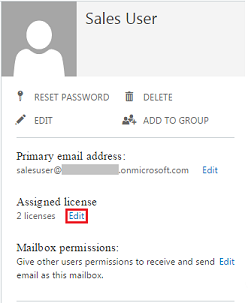
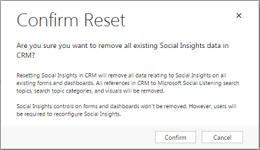
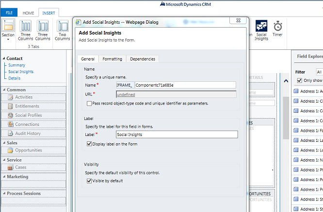
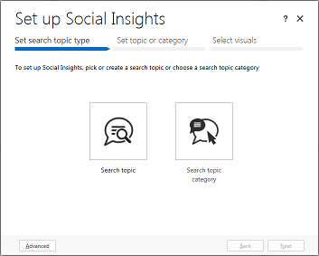
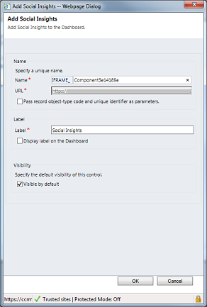
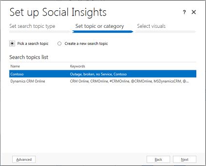
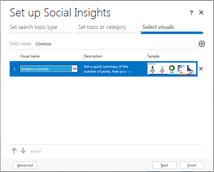
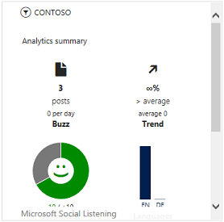

# Connect to Social Engagement

[!INCLUDE [cc-settings-moving](../includes/cc-settings-moving.md)] 

Your customers and stakeholders are talking about you on Facebook, Twitter, or blogs. How do you learn about it? In [!INCLUDE[pn_microsoftcrm](../includes/pn-dynamics-crm.md)] apps, you can get powerful social insights by connecting [!INCLUDE[pn_microsoftcrm](../includes/pn-dynamics-crm.md)] apps to [!INCLUDE[pn_netbreeze_long](../includes/pn-social-engagement-long.md)]. [!INCLUDE[pn_netbreeze_long](../includes/pn-social-engagement-long.md)] collects data from social media websites and presents it to you in charts and graphs that you can use to spot emerging trends in people’s comments, whether they’re positive, negative, or neutral. You can drill down into the data and see who is mentioning you, where they posted the comment, and exactly what they said. Armed with these insights, you can pinpoint what you’re doing right, and address potential issues before bigger problems arise.  
  
 With social insights, you bring social media data directly into [!INCLUDE [pn-crm-shortest](../includes/pn-crm-shortest.md)] apps dashboards and entity forms. As an administrator, you configure the connection to [!INCLUDE[pn_netbreeze_long](../includes/pn-social-engagement-long.md)] and add the [!INCLUDE[pn_social_insights](../includes/pn-social-insights.md)] controls to the entity forms and system dashboards. You use the [!INCLUDE[pn_social_insights](../includes/pn-social-insights.md)] controls to specify what social data you want to see and in what form you want this data to be presented to you. When you set up the [!INCLUDE[pn_social_insights](../includes/pn-social-insights.md)] controls, you choose a search topic or search topic category and visuals. For the search topic you may choose your company name to listen to what is said in social media about your company or your product. Or, you may want to know what is being said about your accounts; if so, choose the Accounts search topic category. After you choose the search topic or search category, you pick the visuals. It can be a graph or chart, or some other visual representation of data. You can find a lot of interesting, useful, and easy to follow information about social listening and social insights in [!INCLUDE [pn-crm-shortest](../includes/pn-crm-shortest.md)] apps in this book: [eBook: Microsoft Social Engagement for CRM](http://go.microsoft.com/fwlink/p/?LinkID=393642).  
  
> [!NOTE]
>  Before you can set up the Social Insights controls in [!INCLUDE [pn-crm-shortest](../includes/pn-crm-shortest.md)] apps, you have to add search topic categories and visuals for your [!INCLUDE [pn-crm-shortest](../includes/pn-crm-shortest.md)] apps organization in [!INCLUDE[pn_netbreeze_long](../includes/pn-social-engagement-long.md)]. You can add search topics in [!INCLUDE[pn_netbreeze_long](../includes/pn-social-engagement-long.md)] directly from within [!INCLUDE [pn-crm-shortest](../includes/pn-crm-shortest.md)] apps. See the [Microsoft Social Engagement Help Center](http://go.microsoft.com/fwlink/p/?LinkID=394325)  
  
   
## Connect Dynamics 365 apps to Social Engagement for Social Insights  
 To configure the connection, you need to have a subscription to [!INCLUDE[pn_netbreeze_long](../includes/pn-social-engagement-long.md)], be an authorized [!INCLUDE[pn_netbreeze_long](../includes/pn-social-engagement-long.md)] user and have a [!INCLUDE[pn_netbreeze_long](../includes/pn-social-engagement-long.md)] instance provisioned for this [!INCLUDE [pn-crm-shortest](../includes/pn-crm-shortest.md)] instance.  
  
> [!NOTE]
>  You must ensure that your [!INCLUDE [pn-crm-shortest](../includes/pn-crm-shortest.md)] apps domain is added to the list of allowed domains in [!INCLUDE[pn_netbreeze_long](../includes/pn-social-engagement-long.md)].  
> 
> [!INCLUDE[proc_more_information](../includes/proc-more-information.md)] [Connect Social Engagement to other domains](https://go.microsoft.com/fwlink/p/?linkid=403288)  
  
1. Click **Settings** > **Administration** > **Microsoft Social Engagement Configuration**.  
  
2. Click **Continue** to accept the legal disclaimer.  
  
   > [!NOTE]
   >  You’re asked to accept this disclaimer  when you connect for the first time.  
  
3. On the **Microsoft Social Engagement Configuration** page, in the **Select the Microsoft Social Engagement solution to connect to** dropdown box, choose the [!INCLUDE[pn_netbreeze_long](../includes/pn-social-engagement-long.md)] instance to which you want to connect. Choose the **Select** button next to the dropdown box. The **Select** button becomes grayed out to indicate that the selection is confirmed.  
  
     
  
> [!WARNING]
>  If you want to switch to a different [!INCLUDE[pn_netbreeze_long](../includes/pn-social-engagement-long.md)] instance, you are asked to confirm it by clicking or tapping the **Confirm** button. Changing the [!INCLUDE[pn_netbreeze_long](../includes/pn-social-engagement-long.md)] instance, may cause any existing [!INCLUDE[pn_social_insights](../includes/pn-social-insights.md)] controls on forms and dashboards to display error messages, because the new instance may not have matching data. All existing [!INCLUDE[pn_social_insights](../includes/pn-social-insights.md)] controls may need to be reconfigured. Also, the existing [!INCLUDE[pn_social_insights](../includes/pn-social-insights.md)] data in [!INCLUDE [pn-crm-shortest](../includes/pn-crm-shortest.md)] apps may need to be reset to remove references to the old instance data.  
> 
> [!NOTE]
>  In [!INCLUDE[pn_v6_online_ur1](../includes/pn-v6-online-ur1.md)], only one [!INCLUDE[pn_netbreeze_long](../includes/pn-social-engagement-long.md)] instance is provided for connection to the [!INCLUDE [pn-crm-shortest](../includes/pn-crm-shortest.md)] instance.  
  
## Assign Social Engagement licenses to Dynamics 365 for Customer Engagement apps users  
 [!INCLUDE[pn_CRM_Online](../includes/pn-crm-online.md)] apps customers automatically have access to [!INCLUDE[pn_netbreeze_long](../includes/pn-social-engagement-long.md)] as part of their subscription at no additional charge. .  
  
 Use the [!INCLUDE[pn_MS_Online_Services_Portal](../includes/pn-ms-online-services-portal.md)] to assign and verify [!INCLUDE[pn_netbreeze_long](../includes/pn-social-engagement-long.md)] licenses.  
  
1. Browse to the [!INCLUDE[pn_MS_Online_Services_Portal](../includes/pn-ms-online-services-portal.md)] ([https://admin.microsoft.com](https://admin.microsoft.com)) and sign in using Global administrator credentials.  
  
2. Choose **Users** > **Active Users** and select a user to assign a license.  
  
3. On the right side of the page, under Assigned license, choose **Edit**.  
  
     
  
4. Expand [!INCLUDE[pn_CRM_Online](../includes/pn-crm-online.md)] apps. Select the check box for [!INCLUDE[pn_netbreeze_long](../includes/pn-social-engagement-long.md)] and choose **Save**.  
  
     
  
   > [!NOTE]
   >  If your subscription is not eligible for [!INCLUDE[pn_netbreeze_long](../includes/pn-social-engagement-long.md)], see [Microsoft Dynamics Social Solutions](http://go.microsoft.com/fwlink/p/?LinkID=401462).  
  
   
## Reset Social Insights  
  
> [!WARNING]
>  This action deletes all existing data in [!INCLUDE [pn-crm-shortest](../includes/pn-crm-shortest.md)] apps for the search topics, search topic categories and visuals for [!INCLUDE[pn_social_insights](../includes/pn-social-insights.md)].  
  
1. Click **Settings** > **Administration** > **Microsoft Social Engagement Configuration**.  
  
2. On the **Microsoft Social Engagement Configuration** page, choose **Reset Social Insights**. The **Reset Social Insights Confirmation** message box appears, choose **Confirm**, if you want to proceed, otherwise choose **Cancel**.  
  
     
  
   

## Add the Social Insights control to a Dynamics 365 for Customer Engagement apps entity form  
 To add [!INCLUDE[pn_social_insights](../includes/pn-social-insights.md)] controls to an entity (record type) form, you have to use the form editor provided in the [!INCLUDE [pn-crm-shortest](../includes/pn-crm-shortest.md)] apps **Customization** area. You can position the [!INCLUDE[pn_social_insights](../includes/pn-social-insights.md)] control anywhere on the form and resize it, just like you would do with the **iFrame** controls. You can make the control bigger by increasing the number of rows and spanning the control over several columns. This is important if you want to make a graph or a chart in the control appear larger and be more readable. [!INCLUDE[proc_more_information](../includes/proc-more-information.md)] [Use the Form Editor](/dynamics365/customer-engagement/customize/use-the-form-editor-legacy.md).  
  
1. Click **Settings** > **Customizations** > **Customize the System**.  
  
2. In the Navigation Pane, under **Components**, expand **Entities**.  
  
3. Expand the entity that you want to add the **[!INCLUDE[pn_social_insights](../includes/pn-social-insights.md)]** control to. Choose **Forms**.  
  
4. In the grid view, choose the entity’s Main form. The entity form opens.  
  
5. Select the **Insert** tab. At the top of the form, on the ribbon, click the **[!INCLUDE[pn_social_insights](../includes/pn-social-insights.md)]** icon. In the setup dialog box, fill out the required fields, such as the unique name of the control and the label name.  
  
    Click to enable **Pass record object-type code and unique identifier as parameters**.  
  
     
  
6. Click **OK**. The [!INCLUDE[pn_social_insights](../includes/pn-social-insights.md)] control is now added to the entity form. You can resize the control or move the control to another location on the form.  
  
7. Switch back to the **Home** tab. Choose **Save** and then choose **Publish** to publish the added customizations. The control called **Configure Social Insights** appears on all records based on this form. The search topics, search categories and visuals can be added to the control.  
  
> [!NOTE]
>  You don’t need administrator permissions to set up [!INCLUDE[pn_social_insights](../includes/pn-social-insights.md)] on the entity record.  
  
   
## Add and set up Social Insights controls on the system dashboards  
  
> [!NOTE]
>  You don’t need administrator permissions to add and set up [!INCLUDE[pn_social_insights](../includes/pn-social-insights.md)] controls on the personal dashboard.  
  
 You can add the [!INCLUDE[pn_social_insights](../includes/pn-social-insights.md)] controls to the existing system dashboards or to a new dashboard. Let’s create a new dashboard and add the [!INCLUDE[pn_social_insights](../includes/pn-social-insights.md)] control to it. We’ll use the **Set Up [!INCLUDE[pn_social_insights](../includes/pn-social-insights.md)]** wizard to lead us through the setup. Shortly after the setup is finished and customizations are published, the charts and graphs with social data will appear on your dashboard.  
  
1. Click **Settings** > **Customizations** > **Customize the System**.  
  
2. In the Navigation Pane, under **Components**, choose **Dashboards**.  
  
3. Choose **New** on the command bar. Choose a layout and choose **Create**.  
  
4. On the dashboard form, enter the name of the dashboard in the **Name** text box and choose **Save**.  
  
5. To add the control, choose **Insert Social Insights** icon in the center of the section on the dashboard form, or choose **More Commands** () on the command bar and then choose **[!INCLUDE[pn_social_insights](../includes/pn-social-insights.md)]** in the dropdown list. **Set Up [!INCLUDE[pn_social_insights](../includes/pn-social-insights.md)]** wizard appears.  
  
     
  
6. In the **Set Up [!INCLUDE[pn_social_insights](../includes/pn-social-insights.md)]** wizard, choose **Advanced**. The **Add [!INCLUDE[pn_social_insights](../includes/pn-social-insights.md)]** dialog appears. Fill in the required fields and choose **OK**. You can also use the default values and choose **OK** or **Cancel** to close the dialog box.  
  
     
  
7. In the **Set Up [!INCLUDE[pn_social_insights](../includes/pn-social-insights.md)]** wizard main window, choose **Search topic** or **Search topic category**, and then choose **Next**.  
  
8. To pick the search topic or the search topic category, in the dropdown list, choose the topic or the category, depending on what you chose in the previous step and then choose **Next**.  
  
   > [!NOTE]
   >  You can create a new search topic, instead of choosing a search topic in the dropdown list. Choose **Create a new search topic**, fill in the required fields and choose **Next**.  
  
     
  
9. In the visuals drop-down list, choose a graph or a chart you want, such as **Analytics summary**, **Recent posts** or **Trends**. You can add as many visuals as you want and move them up and down the list using the **MOVE UP** and **MOVE DOWN** arrows. You can also delete a visual by clicking or tapping the delete icon displayed to the right of the visual. Choose **Finish**.  
  
     
  
10. On the command bar, choose **Save** and then choose **Close**.  
  
11. To publish the customizations, choose **Publish All Customizations** on the command bar. After the customizations are published, you can see the social insights on your dashboard.  
  
      
  
## Privacy notice  
[!INCLUDE[cc_privacy_crm_gcc_social_listening_configuration](../includes/cc-privacy-crm-gcc-social-listening-configuration.md)]
  
### See also  
 [Manage social data](../admin/control-social-data.md)   
 [eBook: Microsoft Social Engagement for CRM](http://go.microsoft.com/fwlink/p/?LinkID=393642)   
 [Microsoft Social Engagement Help Center](http://go.microsoft.com/fwlink/p/?LinkID=394325)
