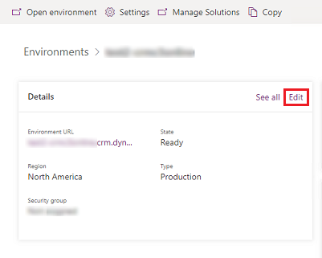
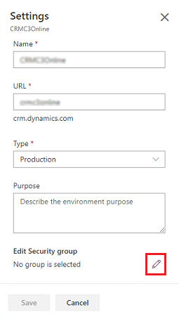
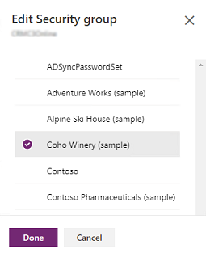

# Control user access to environments: security groups and licenses

If your company has multiple Common Data Service environments, you can use security groups to control which licensed users can be a member of a particular environment.  
  
Consider the following example scenario:  
  
|environment|Security Group|Purpose|  
|--------------|--------------------|-------------|  
|Coho Winery Sales|Sales_SG| Provide access to the environment that creates sales opportunities, handles quotes, and closes deals.|  
|Coho Winery Marketing|Marketing_SG|Provide access to the environment that drives marketing efforts through marketing campaigns and advertising.|  
|Coho Winery Service|Marketing_SG|Provide access to the environment that processes customer cases.|  
|Coho Winery Dev|Developer_SG|Provide access to the Sandbox environment used for development and testing.|  
  
In this example, four security groups provide controlled access to a specific environment.  
  
 Note the following about security groups:  
  
- When users are added to the security group, they are added to the Common Data Service environment.  
  
- When users are removed from the group, they are disabled in the Common Data Service environment.  
  
- When a security group is associated with an existing environment with users, all users in the environment that are not members of the group will be disabled.  
  
- If a Common Data Service environment does not have an associated security group, all users with a Common Data Service license (Customer Engagement, Microsoft Flow, PowerApps, etc.) will be created as users and enabled in the environment.  
  
- If a security group is associated with an environment, only users with Common Data Service licenses that are members of the environment security group will be created as users in the Common Data Service environment.  
  
<!-- When you remove a security group that is associated with a Common Data Service environment, either by editing the environment and removing the security group or by deleting the security group, Common Data Service licensed users who were members of the security group will have the same access to Customer Engagement apps.  -->

- Removing a security group from an environment is currently not supported.
  
- When you assign a security group to an environment, that environment will not show up in [home.dynamics.com](https://home.dynamics.com) for users not in the group.  
  
- If you do not assign a security group to an environment, the environment will show up in [home.dynamics.com](https://home.dynamics.com) even for those who have not been assigned a security role in that Common Data Service environment.  

- If you do not specify a security group, all users who have a Common Data Service license, (Customer Engagement, Flow, PowerApps, etc.) will be added to the new environment.
  
- You cannot yet make security groups members of other security groups. Check back for availability of support for nested security groups.

> [!NOTE]
> All licensed users, whether or not they are members of the security groups, must be assigned security roles to access environments. You assign the security roles in the Customer Engagement web application. Users can’t access environments until they are assigned at least one security role for that environment. For more information, see [Configure environment security](database-security.md).
  
### Create a security group and add members to the security group  

1.  Sign in to the [Microsoft 365 admin center](https://admin.microsoft.com).  
  
2.  Select **Groups** > **Groups**.  
  
3.  Select **+ Add a group**.  
  
4.  Change the type to **Security group**, add the group **Name** and **Description**. Select **Add** > **Close**.  
  
5.  Select the group you created, and then next to **Members**, select **Edit**.  
  
6.  Select **+ Add members**. Select the users to add to the security group, and then select **Save** > **Close** several times to return to the **Groups** list.  
  
7.  To remove a user from the security group, select the security group, next to **Members**, select **Edit**. Select **- Remove members**, and then select **X** for each member you want to remove.  
  
> [!NOTE]
> If the users you want to add to the security group are not created, create the users and assign to them the Common Data Service licenses.  
> 
> To add multiple users, see: [bulk add users to Office365 groups](http://go.microsoft.com/fwlink/p/?LinkID=615203).  
  
### Create a user and assign license  
  
1. In the [!INCLUDE[pn_office_365_admin_center](../includes/pn-office-365-admin-center.md)], select **Users** > **Active users** > **+ Add a user**. Enter the user information, select licenses, and then select **Add**.  
  
   [!INCLUDE[proc_more_information](../includes/proc-more-information.md)] [Add users individually to Office 365 - Admin Help](http://go.microsoft.com/fwlink/p/?LinkID=615205)  
  
### Associate a security group with a Common Data Service environment  
  
1. Sign in to the Power Platform Admin center at [https://admin.powerplatform.microsoft.com](https://admin.powerplatform.microsoft.com) as an admin (Dynamics 365 Service admin, Office 365 Global admin, or Delegated admin).
  
2. In the navigation pane, select **Environments**, select an environment, and then select **Edit**.  
  
   > [!div class="mx-imgBorder"] 
   > 

3. In the **Settings** page, select **Edit** ().
  
   > [!div class="mx-imgBorder"] 
   > 

4. Select a security group, select **Done**, and then select **Save**.

   > [!div class="mx-imgBorder"] 
   > 

The security group is associated with the environment.

   > [!div class="mx-imgBorder"] 
   > 

