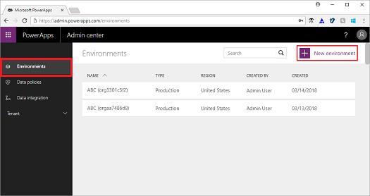

# Create and manage environments in the PowerApps Admin center

## Create environments

Follow these steps to create a PowerApps environment and a database for that environment.

### Prerequisites
 To follow this topic, the following items are required:
 - A PowerApps plan. Alternatively, you can sign up for a [free PowerApps trial](https://web.powerapps.com/signup?redirect=marketing&email=).
 - PowerApps Environment Admin, Office 365 Global Admin, or Azure Active Directory Tenant Admin permissions. For more information, see [Environments administration in PowerApps](environments-administration.md).

### Sign in to the PowerApps Admin center
Sign in to the Admin center at [https://admin.powerapps.com](https://admin.powerapps.com).

### Create an environment and database
1. In the navigation pane, click or tap **Environments**, and then click or tap **New environment**.

    
2. In the **New environment** dialog box, enter a name for the environment, and then select a region and environment type from the drop-down lists. The region  defaults to the Azure Active Directory Tenant home region, but you may select any region from the drop-down list. You cannot change the region once the environment is created. When you're done, click or tap **Create environment**.

    

    Select **Preview(United States)** to get early access to the upcoming PowerApps functionalities. Learn more about the [PowerApps Preview Program](preview-environments.md).
3. Once the environment is created, you'll receive a confirmation message in the dialog box and you'll be prompted to create a database. Click or tap **Create database** to enable access to the Common Data Service.

    **Note:** At this time, you can only create a database in the Azure Active Directory Tenant home region.

    
4. Select the currency and language for the data stored in the database. You cannot change the currency or language once the database is created. When you're done, click or tap **Create database**.

    

    It may take several minutes to create the database on the Common Data Service. Once the database is created, the new environment appears in the list of environments on the **Environments** page.

    

    Click or tap the environment to view the environment details.

## Creating an environment

### Who can create environments?
Your license determines whether you can create environments.

| License | Trial | Production |
| --- | --- | --- |
| PowerApps Plan |Yes (one)| Yes |
| PowerApps Trial |Yes (one)| Yes |
| Dynamics 365 Plans |Yes (one)| Yes |
| Office 365 Plans |No | No |
| Dynamics 365 Apps Plans |Yes (one)| Yes |
| Dynamics 365 Teams Plans   |No | No |
| PowerApps Community Plan   |No | No |

### Where can environments be created?
You will be able to create new environments from [https://web.powerapps.com][https://web.powerapps.com] and from the [PowerApps Admin center](https://admin.powerapps.com). If you create an environment, you will automatically be added to the Environment Admin role for that environment. There is not be a limit on the number of environments that you can participate in as a member of the Environment Admin or Environment Maker role. For more information about environments, see [Administer environments in PowerApps](environments-administration.md). For instructions on how to create an environment, see [Create an environment](create-environment.md).

## Managing environments for your organization
In PowerApps Admin center,  you can manage all of the environments that you have created or to which you have been added to the Environment Admin role. From the Admin center, you can perform all administrative actions on an environment, including the following:

* Add or remove a user or group from either the Environment Admin or Environment Maker role.  For more information, see [Administer environments in PowerApps](environments-administration.md).
* Provision a Common Data Service database for the environment. For more information, see [Create a Common Data Service database](create-database.md).
* Set Data Loss Prevention policies. For more information, see [Data loss prevention policies](prevent-data-loss.md).
* Set database security policies (as open or restricted by database roles). For more information, see [Configure database security](database-security.md).
* Members of the Azure AD tenant Global administrator role (includes Office 365 Global admins) can also manage all environments that have been created in their tenant and set tenant-wide policies from the PowerApps Admin center.