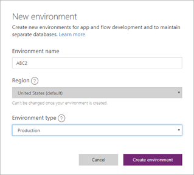
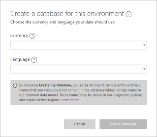
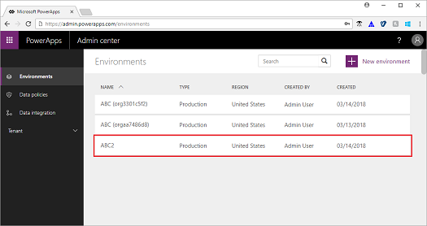

# Create an environment
An environment is a space to store, manage, and share your organization’s business data, apps, and flows. It also serves as a container to separate apps that may have different roles, security requirements, or target audiences. PowerApps automatically creates a single default environment for each tenant, which is shared by all users in that tenant.

Every environment can have zero or one Common Data Service database, which provides storage for apps. When users create an app in an environment, that app can connect to any data source, including connections, gateways, and flows. However, the app is only permitted to connect to the Common Data Service databases in that same environment. How you choose to leverage environments depends on your organization and the apps you're trying to build. For more information, see [Environments overview](environments-overview.md).

We are working to provide environment creation within the Power Platform Admin center. Until that is enabled, you can create environments in:

1. The Dynamics 365 Admin center. See [Add an instance to your subscription](https://docs.microsoft.com/dynamics365/customer-engagement/admin/add-instance-subscription).

2. The Microsoft Flow admin center. See [Create an environment](https://docs.microsoft.com/flow/environments-overview-admin#create-an-environment).

3. The PowerApps Admin center. See below.

Choose the platform that matches where you'll be doing your work. <!-- We need a better explanation -->

> [!IMPORTANT]
> If you purchased the new capacity-based license, until creating environments is available through the Power Platform Admin center, you can create environments through the Dynamics 365 Admin/Flow/PowerApps centers. If you still need more environments, you can contact [Support](get-help-support.md).

## Create an environment in the PowerApps Admin center
Follow these steps to create a PowerApps environment and a database for that environment.

## Prerequisites
 To follow this topic, the following items are required:
 - Either a PowerApps Plan 2 or Microsoft Flow Plan 2 license. Alternatively, you can sign up for a [free PowerApps Plan 2 trial](https://web.powerapps.com/signup?redirect=marketing&email=).
 - PowerApps Environment Admin, Office 365 Global Admin, or Azure Active Directory Tenant Admin permissions. For more information, see [Environments administration in PowerApps](environments-administration.md).

## Sign in to the PowerApps Admin center
Sign in to the Admin center at [https://admin.powerapps.com](https://admin.powerapps.com).

## Create an environment and database
1. In the navigation pane, click or tap **Environments**, and then click or tap **New environment**.

    
2. In the **New environment** dialog box, enter a name for the environment, and then select a region and environment type from the drop-down lists. The region  defaults to the Azure Active Directory Tenant home region, but you may select any region from the drop-down list. You cannot change the region once the environment is created. When you're done, click or tap **Create environment**.

    

    Select **Preview(United States)** to get early access to the upcoming PowerApps functionalities. Learn more about the [PowerApps Preview Program](preview-environments.md).
3. Once the environment is created, you'll receive a confirmation message in the dialog box and you'll be prompted to create a database. Click or tap **Create database** to enable access to the Common Data Service.

    **Note:** At this time, you can only create a database in the Azure Active Directory Tenant home region.

    
4. Select the currency and language for the data stored in the database. You cannot change the currency or language once the database is created. When you're done, click or tap **Create database**.

    

    It may take several minutes to create the database on the Common Data Service. Once the database is created, the new environment appears in the list of environments on the **Environments** page.

    

    Click or tap the environment to view the environment details.

## FAQ

### I’m a Customer Engagement customer and recently bought/renewed to the new Capacity offers. Am I eligible to create an environment using the 1GB database capacity?
Yes. However, the feature to provision using the 1GB rules is coming soon. Please stay tuned for more updates.

### I’m a PowerApps/Flow customer. Am I eligible to create an environment using the 1GB database capacity?
Yes. However, the feature to provision using the 1GB rules is coming soon. Please stay tuned for more updates.

### I’m an existing Customer Engagement customer and I have not transitioned to the new Capacity offers yet. Can I provision using the 1GB available database capacity rules?
No. You should continue using the [Dynamics 365 Admin center](https://docs.microsoft.com/dynamics365/customer-engagement/admin/sign-in-office-365-apps#direct-sign-in-to-the-dynamics-365-administration-center) for provisioning. 

### In the new capacity-based offers, is there any limit on how many environments I can create?
Provisioning environments is based on available capacity. At least 1GB available database capacity is required to provision. Check your storage capacity [here](https://admin.powerplatform.microsoft.com/analytics/capacity).

### There are multiple admin centers to manage environments. Which should I use?
We are working to consolidate the centers. Until this is completed, please use the admin center where your environment resides. See [Use the various admin centers](admin-centers.md)

<!-- 
### What is the licensing/role requirement to provision and administer Environments?
You can find more details here. 
-->

### See also 
[Manage environments in PowerApps](environments-administration.md)  
[Preview: Common Data Service storage capacity](capacity-storage.md)

