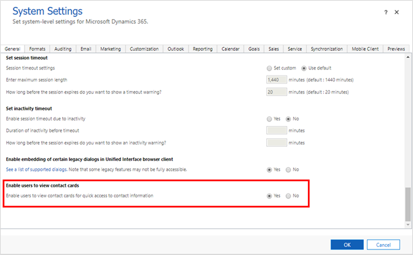

# Enable viewing profile cards

[!INCLUDE [cc-settings-moving](../includes/cc-settings-moving.md)] 

Microsoft’s people experience is centered around profile cards that have been around in Microsoft Outlook and other Office apps and services on the web. When you select someone’s name or picture in Outlook or other Office apps, you can find information related to them on their profile card. The profile card is also sometimes referred to as contact card or people card. Profile cards are available on contacts and users in any Unified Interface app.

> [!NOTE]
> If multi-factor authentication has been enabled for Office 365 services and not enabled for Dynamics 365 for Customer Engagement, profile cards will not be rendered for users in Unified Interface.
>
> The profile card feature involves a network call to the Office 365 service to display the card. Please make sure that following endpoints are reachable, by configuring and updating network perimeter devices such as firewalls and proxy servers.
> 
> - *.loki.delve.office.com
> - loki.delve.office.com
> - loki.delve-gcc.office.com
> - lpcres.delve.office.com 
> - Port: TCP:443 
> 
> To view the complete endpoint requirements for connectivity from a user’s machine to Office 365 for profile cards to be displayed in Unified Interface, see [Office 365 URLs and IP address ranges](https://docs.microsoft.com/office365/enterprise/urls-and-ip-address-ranges#microsoft-365-common-and-office-online) ID 130.

## Prerequisites

The following settings/environment are required for profile cards to be enabled in Dynamics 365 for Customer Engagement apps.

1. Office 365 (Exchange Online)
2. Dynamics 365 Unified Interface Build 9.1.0.4626 or higher
3. Enable Dynamics 365 Admin setting
   1. Navigate to **Settings** > **Administration** > **System Settings**
   2. Select the **General** tab.
   3. For **Enable users to view contact cards**, select **Yes**, and then **OK**.

> [!div class="mx-imgBorder"] 
> 

For information on how to use profile cards, see [View the profile card for a contact or user](https://docs.microsoft.com/dynamics365/customer-engagement/basics/profile-card).

