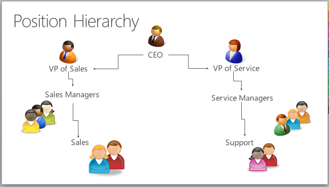
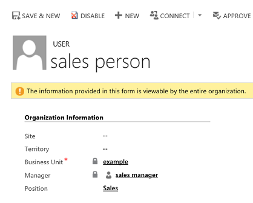
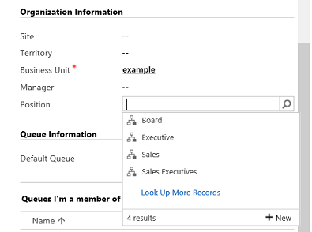
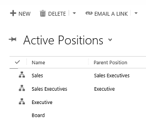
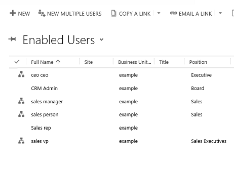

# Hierarchy security to control access

The hierarchy security model is an extension to the existing security models that use business units, security roles, sharing, and teams. It can be used in conjunction with all other existing security models. The hierarchy security offers a more granular access to records for an organization and helps to bring the maintenance costs down. For example, in complex scenarios, you can start with creating several business units and then add the hierarchy security. This will achieve a more granular access to data with far less maintenance costs that a large number of business units may require.  
  
## Manager hierarchy and Position hierarchy security models  
 Two security models can be used for hierarchies, the Manager hierarchy and the Position hierarchy. With the Manager hierarchy, a manager must be within the same business unit as the report, or in the parent business unit of the report’s business unit, to have access to the report’s data. The Position hierarchy allows data access across business units. If you are a financial organization, you may prefer the Manager hierarchy model, to prevent managers’ accessing data outside of their business units. However, if you are a part of a customer service organization and want the managers to access service cases handled in different business units, the Position hierarchy may work better for you.  
  
> [!NOTE]
>  While the hierarchy security model provides a certain level of access to data, additional access can be obtained by using other forms of security, such as security roles.  
  
## Manager hierarchy  
 The Manager hierarchy security model is based on the management chain or direct reporting structure, where the manager’s and the report’s relationship is established by using the Manager field on the system user entity. With this security model, the managers are able to access the data that their reports have access to. They are able to perform work on behalf of their direct reports or access information that needs approval.  
  
> [!NOTE]
>  With the Manager hierarchy security model, a manager has access to the records owned by the user or by the team that a user is a member of, and to the records that are directly shared with the user or the team that a user is a member of.  When a record is shared by a user who is outside of the management chain to a direct report user with Read-only access, the direct report's manager only has Read-only access to the shared record. 
>   
>  In addition to the Manager hierarchy security model, a manager must have at least the user level Read privilege on an entity, to see the reports’ data. For example, if a manager doesn’t have the Read access to the Case entity, the manager won’t be able to see the cases that their reports have access to.  
  
 For a non-direct report in the same management chain of the manager, a manager has the Read-only access to the non-direct report’s data. For a direct report, the manager has the Read, Write, Update, Append, AppendTo access to the report’s data. To illustrate the Manager hierarchy security model, let’s take a look at the diagram below. The CEO can read or update the VP of Sales data and the VP of Service data. However, the CEO can only read the Sales Manager data and the Service Manager data, as well as the Sales and Support data. You can further limit the amount of data accessible by a manager with “Depth”. Depth is used to limit how many levels deep a manager has Read-only access to the data of their reports. For example, if the depth is set to 2, the CEO can see the data of the VP of Sales, VP of Service and Sales and Service Managers. However, the CEO doesn’t see the Sales data or the Support data.  
  
   

 It is important to note that if a direct report has deeper security access to an entity than their manager, the manager may not able to see all the records that the direct report has access to. The following example illustrates this point.  
  
-   A single business unit has three users: User 1, User 2 and User 3.  
  
-   User 2 is a direct report of User 1.  
  
-   User 1 and User 3 have User level read access on the Account entity. This access level gives users access to records they own, the records that are shared with the user, and records that are shared with the team the user is a member of.  
  
-   User 2 has Business Unit read access on the Account entity. This allows User 2 to view all of the accounts for the business unit, including all of the accounts owned by User 1 and User 3.  
  
-   User 1, as a direct manager of User 2, has access to the accounts owned by or shared with User 2, and any accounts that are shared with or owned by a team that User 2 is a member of. However, User 1 doesn’t have access to the accounts of User 3, even though his or her direct report may have access to User 3 accounts.  
  
## Position hierarchy  
 The Position hierarchy is not based on the direct reporting structure, like the Manager hierarchy. A user doesn’t have to be an actual manager of another user to access user’s data. As an administrator, you will define various job positions in the organization and arrange them in the Position hierarchy. Then, you add users to any given position, or, as we also say, “tag” a user with a particular position. A user can be tagged only with one position in a given hierarchy, however, a position can be used for multiple users. Users at the higher positions in the hierarchy have access to the data of the users at the lower positions, in the direct ancestor path. The direct higher positions have Read, Write, Update, Append, AppendTo access to the lower positions’ data in the direct ancestor path. The non-direct higher positions, have Read-only access to the lower positions’ data in the direct ancestor path.  
  
 To illustrate the concept of the direct ancestor path, let’s look at the diagram below. The Sales Manager position has access to the Sales data, however, it doesn’t have access to the Support data, which is in the different ancestor path. The same is true for the Service Manager position. It doesn’t have access to the Sales data, which is in the Sales path. Like in the Manager hierarchy, you can limit the amount of data accessible by higher positions with “Depth”. The depth will limit how many levels deep a higher position has a Read-only access, to the data of the lower positions in the direct ancestor path. For example, if the depth is set to 3, the CEO position can see the data all the way down from the VP of Sales and VP of Service positions, to the Sales and Support positions.  
  
   
  
> [!NOTE]
>  With the Position hierarchy security, a user at a higher position has access to the records owned by a lower position user or by the team that a user is a member of, and to the records that are directly shared to the user or the team that a user is a member of.  
>   
>  In addition to the Position hierarchy security model, the users at a higher level must have at least the user level Read privilege on an entity to see the records that the users at the lower positions have access to. For example, if a user at a higher level doesn’t have the Read access to the Case entity, that user won’t be able to see the cases that the users at a lower positions have access to.  
  
## Set up hierarchy security  
These settings can be found in the Power Platform Admin center by going to **Environments** > [select an environment] > **Settings** > **Users + Permissions** > **Hierarchy security**.

Make sure you have the System Administrator or System Customizer security role or equivalent permissions to update the setting.

- Follow the steps in [View your user profile](https://docs.microsoft.com/powerapps/user/view-your-user-profile).
- Don’t have the correct permissions? Contact your system administrator.
  
 The hierarchy security is disabled by default. To enable:  
  
1. Select an environment and go to **Settings** > **Users + Permissions** > **Hierarchy security**.
  
2. Under **Turn on Hierarchy Modelling** select **Enable Hierarchy Modeling**.  
  
> [!IMPORTANT]
>  To make any changes in **Hierarchy security**, you must have the **Change Hierarchy Security Settings** privilege.  
  
 After you have enabled the hierarchy modeling, choose the specific model by selecting the **Manager Hierarchy** or **Custom Position Hierarchy**. All system entities are enabled for hierarchy security out-of-the-box, but, you can exclude selective entities from the hierarchy. The **Hierarchy Security** window shown below:  
  
> [!div class="mx-imgBorder"] 
> 

  
 Set the **Depth** to a desired value to limit how many levels deep a manager has a Read-only access to the data of their reports. For example, if the depth equals to 2, a manager can only access his or her accounts and the accounts of the reports two levels deep. In our example, if you log in into model-driven apps in Dynamics 365, such as Dynamics 365 Sales and Customer Service, not as an Administrator, who can see all accounts, but, as the VP of Sales, you’ll only be able to see the active accounts of the users shown in the red rectangle, as illustrated below:  

> [!div class="mx-imgBorder"] 
> 
  
> [!NOTE]
>  While, the hierarchy security grants the VP of Sales access to the records in the red rectangle, additional access can be available based on the security role that the VP of Sales has.  
  
## Set up Manager and Position hierarchies  
 The Manager hierarchy is easily created by using the manager relationship on the system user record. You use the Manager (**ParentsystemuserID**) lookup field to specify the manager of the user. If you have already created the Position hierarchy, you can also tag the user with a particular position in the Position hierarchy. In the following example, the sales person reports to the sales manager in the Manager hierarchy and also has the Sales position in the Position hierarchy:  

> [!div class="mx-imgBorder"] 
> 
  
 To add a user to a particular position in the Position hierarchy, use the lookup field called Position on the user record’s form, as show below:  
  
> [!IMPORTANT]
>  To add a user to a position or change the user’s position, you must have the **Assign position for a user** privilege.  

> [!div class="mx-imgBorder"] 
> 
  
 To change the position on the user record’s form, on the nav bar, choose **More** (…) and choose a different position, as shown below:  
  
> [!div class="mx-imgBorder"] 
> 
  
 To create a Position hierarchy:  
  
1. Select an environment and go to **Settings** > **Users + Permissions** > **Positions**.
  
   For each position, provide the name of the position, the parent of the position, and the description. Add users to this position by using the lookup field called **Users in this position**. Below is the example of Position hierarchy with the active positions.  

   > [!div class="mx-imgBorder"] 
   > 
  
   The example of the enabled users with their corresponding positions is shown below:  
  
   > [!div class="mx-imgBorder"] 
   > 

## Performance considerations  
 To boost the performance, we recommend:  
  
-   Keep the effective hierarchy security to 50 users or less under a manager/position. Your hierarchy may have more than 50 users under a manager/position, but you can use the Depth setting to reduce the number of levels for Read-only access and with this limit the effective number of users under a manager/position to 50 users or less.  
  
-   Use hierarchy security models in conjunction with other existing security models for more complex scenarios. Avoid creating a large number of business units, instead, create fewer business units and add hierarchy security.  
  
### See also  
 [Security in Common Data Service](wp-security.md)   
 [Query and visualize hierarchical data](https://docs.microsoft.com/dynamics365/customer-engagement/customize/query-visualize-hierarchical-data)   

