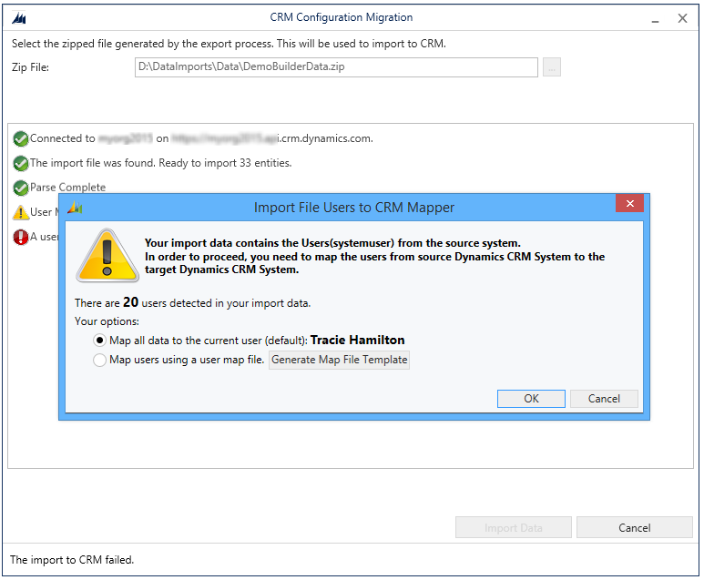

# Import configuration data

[!INCLUDE [cc-settings-moving](../includes/cc-settings-moving.md)] 

After exporting your configuration data from the source environment, you are now ready to import it to the target environment.  
  
## Before you begin 

Download the Configuration Migration Tool. The Configuration Migration tool is available as a [NuGet package](https://www.nuget.org/packages/Microsoft.CrmSdk.XrmTooling.ConfigurationMigration.Wpf). To download the tool, see [Download tools from NuGet](https://docs.microsoft.com/powerapps/developer/common-data-service/download-tools-nuget). Follow the steps on this page to extract the **DataMigrationUtility.exe** tool. 
  
## Import configuration data  
  
1. Start the Configuration Migration tool. Double-click **DataMigrationUtility.exe** in the folder: \[your folder]\Tools\ConfigurationMigration\  
  
2. On the main screen, click **Import data**, and click **Continue**.  
  
3. On the **Login** screen, provide authentication details to connect to your environment from where you want to import data. If you have multiple organizations on the Customer Engagement server, and want to select the organization where to import the configuration data, select the **Always display list of available orgs** check box. Click **Login**.  
  
4. If you have multiple organizations, and you selected the **Always display list of available orgs** check box, the next screen lets you choose the organization that you want to connect to. Select an organization to connect to.  
  
5. Provide the data file. (.zip) to be imported. Browse to the data file, and select it. Click **Import Data**.  
  
6. **This step is applicable only if the data that you are importing contains the user information of the source system**. Enter mapping user information on the target system. You can either map all of them to the user who is running the import process or map to individual users by using a user map file (.xml). If you choose the latter, you will have to either specify an existing user map file or the tool can generate it for you. If you generate a new file, fill in the mapping user name in the **New** parameter for every user on the source server. Select the user map file in the tool when you are done, and click **OK**.  
  
     
  
     The next screen displays the import status of your records. The data import is done in multiple passes to first import the foundation data while queuing up the dependent data, and then import the dependent data in the subsequent passes to handle any data dependencies or linkages. This ensures clean and consistent data import.  
  
7. Click **Finish** to close the tool. 
  
### See also  
 [Manage your configuration data using the Configuration Migration tool](manage-configuration-data.md)
