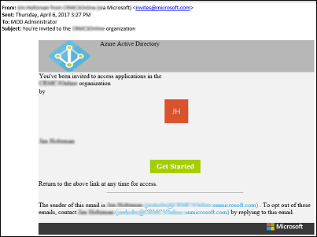
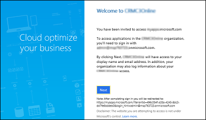
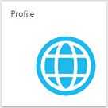
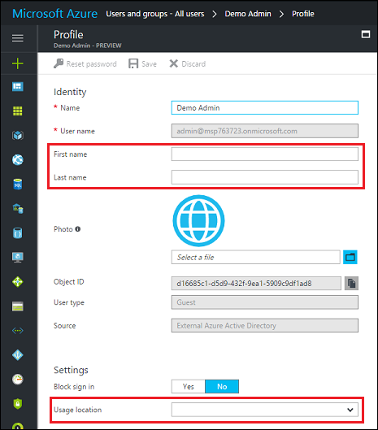
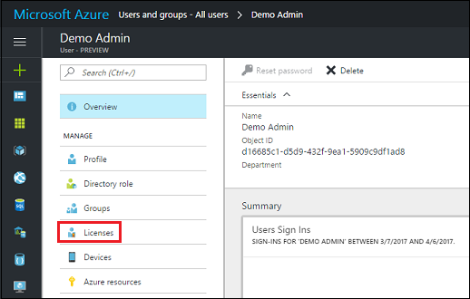
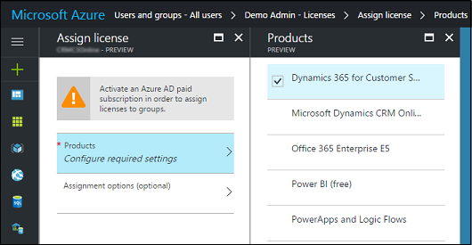

# Invite users with Azure Active Directory B2B collaboration

You can invite other users to access your [!INCLUDE[pn_dyn_365_online](../includes/pn-crm-online.md)] instance. The [!INCLUDE[pn_Office_365](../includes/pn-office-365.md)] Global admin can do this through the [Azure portal](https://portal.azure.com). Invited users can access your [!INCLUDE[pn_dyn_365_online](../includes/pn-crm-online.md)] instance using their own login credentials once a [!INCLUDE[pn_dynamics_crm](../includes/pn-dynamics-crm.md)] license and a security role are assigned to them. You don’t need to create a new user account and temporary password for these invited users in your own [!INCLUDE[pn_Office_365](../includes/pn-office-365.md)] tenant.  
  
   
## Requirements  
  
- To send  business-to-business (B2B) user invitations, you  must have an [!INCLUDE[pn_azure_active_directory](../includes/pn-azure-active-directory.md)] Global admin role.  
  
- To bulk- invite users, get the latest [!INCLUDE[pn_azure_active_directory](../includes/pn-azure-active-directory.md)][!INCLUDE[pn_PowerShell_short](../includes/pn-powershell-short.md)] which can be downloaded from the [PowerShell module's release page](https://www.powershellgallery.com/packages/AzureADPreview/2.0.0.98).  
  
   
## Incompatibilities  
 The following [!INCLUDE[pn_dynamics_crm](../includes/pn-dynamics-crm.md)] features are not supported for B2B invited users.  
  
1. [!INCLUDE[pn_unified_service_desk](../includes/pn-unified-service-desk.md)] client  
  
     Invited users will not be able to use the [!INCLUDE[pn_unified_service_desk](../includes/pn-unified-service-desk.md)] client to log into the host tenant’s [!INCLUDE[pn_dynamics_crm](../includes/pn-dynamics-crm.md)].  
  
2. [!INCLUDE[pn_crm_app_for_outlook_short](../includes/pn-crm-app-for-outlook-short.md)]  
  
     Invited users will not be able to use their own tenant email addresses when performing email related transactions in the host [!INCLUDE[pn_dynamics_crm](../includes/pn-dynamics-crm.md)] instance. Server-side synchronization of invited users’ incoming and outgoing emails are not supported as there can be complications, especially for invited users who are already syncing their emails in their own [!INCLUDE[pn_dynamics_crm](../includes/pn-dynamics-crm.md)] tenant.  
  
3. Invited users cannot perform email activity using their own email address. [!INCLUDE[pn_dyn_365_online](../includes/pn-crm-online.md)] only synchronizes incoming and outgoing emails from [!INCLUDE[pn_Microsoft_Exchange_Online](../includes/pn-microsoft-exchange-online.md)] that is hosted in the same [!INCLUDE[pn_Office_365](../includes/pn-office-365.md)] tenant.  
  
4. [!INCLUDE[pn_office_365_groups](../includes/pn-office-365-groups.md)]  
  
   [!INCLUDE[pn_office_365_groups](../includes/pn-office-365-groups.md)] for [!INCLUDE[pn_dynamics_crm](../includes/pn-dynamics-crm.md)] connects a group to [!INCLUDE[pn_dyn_365_online](../includes/pn-crm-online.md)]. Data (including new conversations and documents) are stored in the [!INCLUDE[pn_Exchange](../includes/pn-exchange.md)] and/or [!INCLUDE[pn_SharePoint_short](../includes/pn-sharepoint-short.md)] system. Since invited users belong to a different [!INCLUDE[pn_Office_365](../includes/pn-office-365.md)] tenant, the invited users do not have permission to create [!INCLUDE[pn_office_365_groups](../includes/pn-office-365-groups.md)] in the invited-to [!INCLUDE[pn_Office_365](../includes/pn-office-365.md)] tenant. However, they can participate in the [!INCLUDE[pn_office_365_groups](../includes/pn-office-365-groups.md)] conversations as a guest in their [!INCLUDE[pn_Outlook_short](../includes/pn-outlook-short.md)] Inbox, but not within [!INCLUDE[pn_dyn_365_online](../includes/pn-crm-online.md)].  
  
   

## Invite a user  
 You can add users to [!INCLUDE[pn_dynamics_crm](../includes/pn-dynamics-crm.md)] through [!INCLUDE[pn_azure_active_directory](../includes/pn-azure-active-directory.md)] B2B user collaboration. Global admins and limited admins can use the [!INCLUDE[pn_azure_shortest](../includes/pn-azure-shortest.md)] portal to invite B2B collaboration users to the directory, to any security group, or to any application.  
  
 Admins can use one of the following methods to invite B2B users to their [!INCLUDE[pn_dynamics_crm](../includes/pn-dynamics-crm.md)] instance:  
  
1. Invite users to your [!INCLUDE[pn_dynamics_crm](../includes/pn-dynamics-crm.md)] instance that has a security group.  
  
   - See [Admins adding guest users to a group](https://docs.microsoft.com/azure/active-directory/active-directory-b2b-admin-add-users).  
  
   - See [Control user access to instances: security groups and licenses](add-instance-subscription.md#control-user-access-to-instances-security-groups-and-licenses) on how to use security groups for your [!INCLUDE[pn_dynamics_crm](../includes/pn-dynamics-crm.md)] instances.  
  
2. Invite users to your [!INCLUDE[pn_dynamics_crm](../includes/pn-dynamics-crm.md)] instance that does not have a security group.  
  
   -   See [Admins adding guest users to the directory](https://docs.microsoft.com/azure/active-directory/active-directory-b2b-admin-add-users).  
  
3. Bulk-invite guest users using a .csv file.  
  
   -   See [PowerShell example](https://docs.microsoft.com/azure/active-directory/active-directory-b2b-code-samples).  
  
   Your invited user will receive an email invitation to get started with B2B user collaboration.  
  
     
  
   When your user accepts the invitation by clicking on the **Get Started** link on the invitation email, they will be prompted to accept the invitation.  
  
     
  
> [!NOTE]
>  Until you add a license to the user account, the user will not have access to [!INCLUDE[pn_dyn_365_online](../includes/pn-crm-online.md)]. Follow the steps below to add a [!INCLUDE[pn_dynamics_crm](../includes/pn-dynamics-crm.md)] license through the [!INCLUDE[pn_azure_shortest](../includes/pn-azure-shortest.md)] portal.  
  
   
## Update user’s name and usage location  
 To assign a [!INCLUDE[pn_dyn_365_online](../includes/pn-crm-online.md)] license, the invited user’s **Usage location** must be specified. Admins can update the invited user’s profile on the [!INCLUDE[pn_azure_shortest](../includes/pn-azure-shortest.md)] portal.  
  
1. Go  to **Azure Active Directory** > **Users and groups** > **All users**. If you don't see the newly created user, refresh the page.  
  
2. Click on the invited user, and then click **Profile**.  
  
     
  
3. Update **First name**, **Last name**, and **Usage location**.  
  
     
  
4. Click **Save**, and then close the Profile blade.  
  
   
## Assign invited users a Dynamics 365 for Customer Engagement apps license and security role  
 Assign your invited users a [!INCLUDE[pn_dyn_365_online](../includes/pn-crm-online.md)] license and security role so the user can use [!INCLUDE[pn_dynamics_crm](../includes/pn-dynamics-crm.md)].  
  
1. Go  to **Azure Active Directory** > **Users and groups** > **All users**. If you don't see the newly created user, refresh the page.  
  
2. Click on the invited user, and then click **Licenses**.  
  
     
  
3. Click **Assign**.  
  
4. Click **Configure required settings**.  
  
5. Select the [!INCLUDE[pn_dynamics_crm](../includes/pn-dynamics-crm.md)] product to license.  
  
     
  
6. Click **Select**, and then click **Assign**.  
  
   Next, assign the invited users with appropriate security roles for the [!INCLUDE[pn_dynamics_crm](../includes/pn-dynamics-crm.md)] instance so they can access it. See [Create users and assign Dynamics 365 for Customer Engagement apps (online) security roles](../admin/create-users-assign-online-security-roles.md).  
  
   
## Update invited user’s email address in the invited-to Dynamics 365 for Customer Engagement instance  
 If you're using a version prior to [!INCLUDE[pn_dynamics_crm](../includes/pn-dynamics-crm.md)], you need to update the invited user’s email address. In Dynamics CRM, go to **Settings** > **Security** > **Users**. Select a user, and then update the invited user’s email address.  
  
   
## Approve email or enable mailbox (not supported)  
 Since server-side synchronization is not supported, [!INCLUDE[pn_dynamics_crm](../includes/pn-dynamics-crm.md)] System admins cannot approve an invited email address or mailbox since emails cannot be synced from the invited user’s [!INCLUDE[pn_Microsoft_Exchange](../includes/pn-microsoft-exchange.md)].  
  
   
## Notify your invited users  
 To complete the user invitation, notify your invited users and provide them with the URL for the instance they are invited to (for example, https://contoso.crm.dynamics.com).  
  
### See also  
 [Azure AD B2B Collaboration is Generally Available!](https://blogs.technet.microsoft.com/enterprisemobility/2017/04/12/azure-ad-b2b-collaboration-is-generally-available/)   
 [Azure Active Directory B2B collaboration code and PowerShell samples](https://docs.microsoft.com/azure/active-directory/active-directory-b2b-code-samples)   
 [Azure Active Directory B2B collaboration frequently-asked questions (FAQ)](https://docs.microsoft.com/azure/active-directory/active-directory-b2b-faq)   
 [Azure Active Directory B2B Collaboration](https://docs.microsoft.com/azure/active-directory/active-directory-b2b-what-is-azure-ad-b2b)   
 [Azure AD B2B: New updates make cross-business collab easy](https://blogs.technet.microsoft.com/enterprisemobility/2017/02/01/azure-ad-b2b-new-updates-make-cross-business-collab-easy/)
