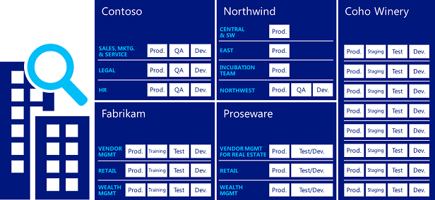
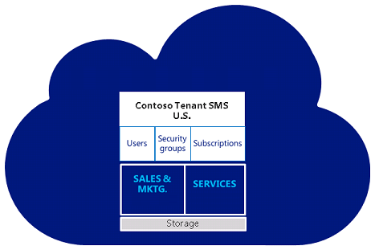
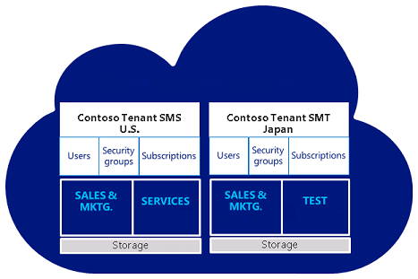

# About multiple online environments or tenants

Model-driven apps in Dynamics 365, such as Dynamics 365 Sales and Customer Service, gives you options for segregating your data and user access. For most companies, adding and using multiple environments in your subscription provides the right mix of functionality and ease of management. Enterprises with separate geographic locations might consider using multiple tenants to separate licenses. Multiple environments can share users among environments; multiple tenants cannot.  
  
## Uses for multiple environments  
 Environments are similar in concept to a high-rise business complex with floors organized according to business functions. Consider each floor within the building as an application (Sales/Service/Marketing, Vendor management, Wealth management) and consider each unit within a floor as an environment for a specific purpose such as production, Training, Testing, and Development.  
  
   
  
 Multiple environments are needed when segregation is required of plugins, workflows, or admin resources that cannot be easily isolated by using business units.  
  
## A multi-environment deployment  
 A typical deployment includes one tenant only. A tenant can include one or more environments; however, an environment is always associated with a single tenant.  
  
   
  
 This example uses two environments for three teams: Sales, Marketing, and Services.  
  
 Sales and Marketing share an environment so lead information can be easily accessed by both. Services has its own environment so tickets and warranties can be managed separately from campaigns and other sales related events.  
  
 You can provide access to one or both environments easily.  Sales and Marketing users could be limited to their environment while Service users with extended access could update support escalations records related to accounts in both environments.  
  
 About single tenant with multiple environments:  
  
- Each environment within the tenant receives its own SQL database.  
  
- Data is not shared across environments.  
  
- See [Common Data Service storage capacity](capacity-storage.md) for how storage is shared across environments.  
  
- All environments for a single customer tenant will be set up in the geography where they initially signed up for their account. Storage consumption is totaled and tracked across all the environments attached to a customer tenant.  
  
- You can set up separate security groups for all environments.  
  
- A licensed user can potentially access all the environments associated with the tenant. Access is controlled by environment security group membership.  
  
- You can purchase additional environments through the Additional environment Add-On. Additional environments can be added only to "paid" subscriptions - not trials or Internal Use Rights (IUR). If you purchased your subscription through Volume Licensing, you must go through your Large Account Reseller (LAR) to purchase the additional environment. More information: [Support overview](support-overview.md)  
  
- You can't merge existing trials or subscriptions onto an additional environment; instead, you will need to move your data and customizations.  
  
## Why use multiple environments?  
 The following are common use cases for multi-environment deployment. Consider these examples when you decide the deployment type that best fits your company's requirements.  
  
 **Master data management**  
  
 In this scenario, a "master" data set provides for change management through a central master data source. This approach requires that the central master data be synchronized to all environments so that each environment has access to the latest version of the core information. Requested changes to the information can be made directly within the master system. Alternatively, users can explicitly access the master system or capture the changes in the local environment, with those changes subsequently passed on to the master environment.  
  
 Requiring that changes be made centrally can provide for centralized change control. For example, anti-fraud checks can be performed to ensure that changes are made only by a central team and not by local teams that might otherwise benefit from a change, such as a change in credit limits. This would provide a second level of change authorization and verification that avoids the ability for a single person or a group of people who work closely together to collaborate to affect a fraud. Pushing a request to a different, independent team can provide protection against potential fraud.  
  
 **Security and privacy**  
  
 Differences in regional, for example European Union (EU), or national legislation can result in variations in requirements for securing data or maintaining data privacy across the different regions or countries in a deployment. In some cases, legislative/regulatory restrictions make it illegal to host data outside the borders of a country or region, and addressing this challenge is particularly critical in specific business sectors.  
  
 For example, consider healthcare sector restrictions on sharing patient information. Some EU regulations require that any health information that is collected about people residing in the EU be maintained and shared only within EU boundaries, while similar data collected about people in the United States (US) is kept within US boundaries. Also consider banking sector restrictions on sharing customer information. In Switzerland, for example, regulations make it illegal to share customer information outside of their national boundaries.  
  
 **Scalability**  
  
 While a single environment of can scale up and out to support the growth of a customer's business, with very high data volumes or levels of complexity, there are additional considerations. For example, in environments with extreme volumes and/or extensive use of Service Scheduling, scaling up [!INCLUDE[pn_SQL_Server_short](../includes/pn-sql-server-short.md)] can require complicated and expensive infrastructure that is prohibitively expensive or extremely difficult to manage.  
  
 There are many scenarios in which there is a natural functional split in capability requirements. In such cases, delegating workloads by creating scale-out scenarios that are based on these functional splits can provide for higher volumes by using commodity infrastructure.  
  
## Add an environment to your subscription  
 For information about how to add an environment to your subscription, see [Create and manage environments](create-environment.md).  
  
## A multi-tenant deployment  
 Global businesses with regional or country models that differ can use tenants to account for variations in approach, market size, or compliance with legal and regulatory constraints.  
  
   
  
 This example includes a second tenant for Contoso Japan.  
  
 User accounts, identities, security groups, subscriptions, licenses, and storage cannot be shared among tenants. All tenants can have multiple environments associated with each specific tenant. Data is not shared across environments or tenants.  
  
 About multiple tenants:  
  
- In a multi-tenant scenario, a licensed user associated with a tenant can only access one or more environments mapped to the same tenant. To access another tenant a user would need a separate license and a unique set of sign-in credentials for that tenant.  
  
   For example, if User A has an account to access Tenant A their license allows them to access any and all environments created within Tenant A - if they are allowed by their administrator.  If User A needs to access environments within Tenant B, they will need an additional license.  
  
- Each tenant will require Power Platform admin(s) with unique sign-in credentials, and each tenant affiliate will manage its tenant separately in the administrator console.  
  
- Multiple environments within a tenant are visible from the interface if the administrator has access.  
  
- You cannot reassign licenses between tenant enrollments. An enrolled affiliate can use license reduction under one enrollment and add licenses to another enrollment to facilitate this.  
  
- On-premises Active Directory federation cannot be established with more than one tenant unless you have top-level domains that you need to federate with different tenants (for example Contoso.com and Fabricam.com).  
  
## Why use multiple tenants?  
 **Functional localization**  
  
 This scenario typically arises in organizations with overlapping but separate functional needs. Some common examples include:  
  
- Organizations with different business divisions, each with a different market or model of operation.  
  
- Global businesses with regional or country models that differ to account for variations in approach, market size, or compliance with legal and regulatory constraints.  
  
  In these types of business environments, an organization often will have common sets of functionality that allow specific regions, countries, or business areas with a degree of localization regarding:  
  
- Information capture. For example, capturing the ZIP Code in the United States would correlate to capturing the Post Code in the United Kingdom.  
  
- Forms, workflows.  
  
**Physical distribution**  
  
 For business solutions that must support users that are physically distributed over large distances, particularly for global deployments, using a single environment may not be suitable because of the implications (such as WAN latency) associated with the infrastructure over which the users connect, which can significantly impact the user experience. Distributing environments to provide users with more local access can reduce or overcome WAN-related issues, as the access occurs over shorter network connections.  
  
## Add a multi-tenant deployment under volume licensing  
 For a multi-tenant deployment, you'll need a Multi-Tenant Amendment. A Multi-Tenant Amendment is an actual amendment to the Volume License agreement used to purchase licenses. Contact your Microsoft Sales Representative or Reseller to obtain the amendment.  
  
## Constraints of multi-tenants  
 Admins who want to deploy and manage multiple tenants should be aware of the following:  
  
- User accounts, identities, security groups, subscriptions, licenses, and storage cannot be shared among tenants.  
  
- A single domain can only be federated with one tenant.  
  
- Each tenant must have its own namespace; UPN or SMTP namespaces cannot be shared across tenants.  
  
- If an on-premises [!INCLUDE[pn_Exchange](../includes/pn-exchange.md)] organization exists, you cannot split this organization across multiple tenants.  
  
- A consolidated Global Address List will not be available, except if explicitly managed downstream from the synchronization.  
  
- Cross-tenant collaboration will be limited to Lync Federation and Exchange Federation features.  
  
- [!INCLUDE[pn_SharePoint_short](../includes/pn-sharepoint-short.md)] access across tenants may not be possible. While this may be solved with Partner Access, the user experience is disrupted and licensing aspects apply.  
  
- There can be no duplicate accounts across the tenants or partitions in the on-premises [!INCLUDE[pn_Active_Directory](../includes/pn-active-directory.md)].  
  
### See also
[Blog: What is a tenant?](https://powerbi.microsoft.com/blog/what-is-a-tenant/)  
[Environments overview](environments-overview.md)
