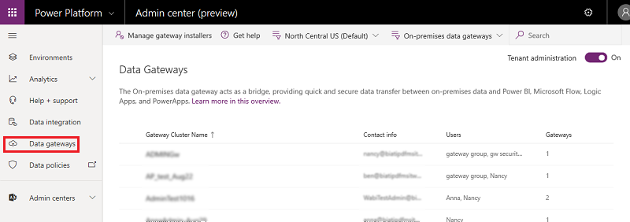
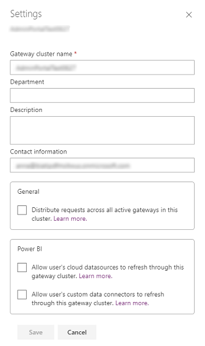
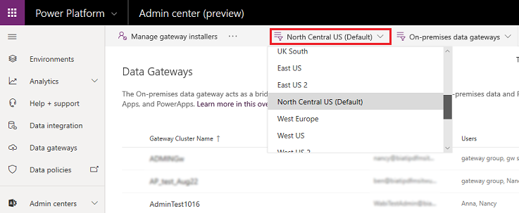
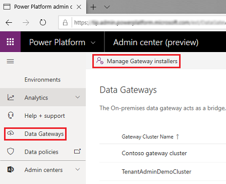
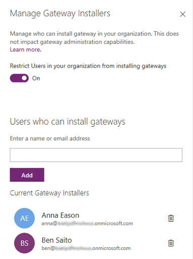
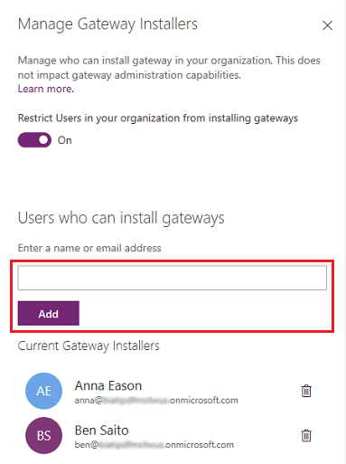
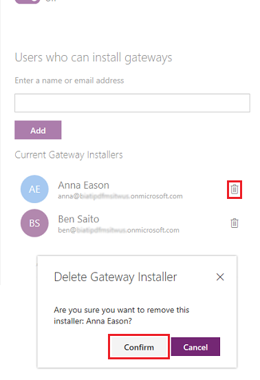
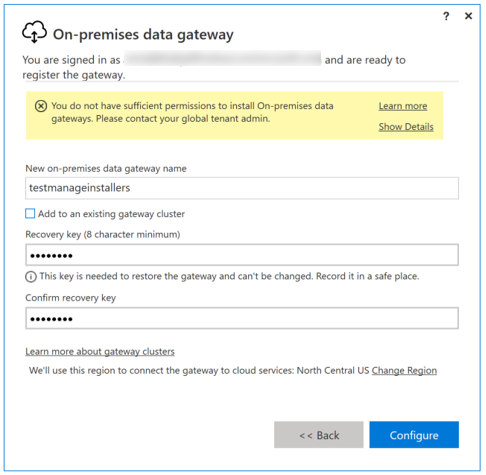

# Preview: On-premises data gateway management

[!INCLUDE [cc-beta-prerelease-disclaimer](../includes/cc-beta-prerelease-disclaimer.md)]

The On-premises data gateway acts as a bridge, providing quick and secure data transfer between on-premises data (data that is not in the cloud) and the Power BI, Power Automate, Logic Apps, and Power Apps services. More information: [What is an on-premises data gateway?](https://docs.microsoft.com/data-integration/gateway/service-gateway-onprem)

You can use the Power Platform Admin center to get visibility into all on-Premises data gateways in a tenant. To do so, sign in as a Power Platform admin and select the **Data Gateway** option.

Users who are part of the Azure AD Global administrator role (which includes Global admins), Power BI service administrators, and Gateway administrators will have access to Data Gateway management on the Power Platform Admin center. There may however be differences in the features available and the operations which can be performed by each of these roles.

The Azure AD Global administrator role (which includes Global admins) and Power BI service administrators will be able to see all gateways in their organizations in addition to the gateways they manage. You can switch between these two views using this toggle in the upper-right corner of the page:

> [!div class="mx-imgBorder"] 
> 

The Gateways page lists all on-Premises data gateway clusters installed on the tenant. In addition, you can review the following information about these clusters:

- **Gateway Cluster Name**: The name of the gateway cluster.
- **Contact Info**: Admin contact information for the gateway cluster. 
- **Administrators**: The list of gateway administrators.
- **Gateways**: The number of gateway members in the gateway cluster.

The gateway cluster list includes both On-premises data gateways and On-premises data gateways (personal mode).

> [!div class="mx-imgBorder"] 
> 

## Details

Select any gateway cluster and select **Details** to see the gateway members, device name, and version in each gateway cluster.

> [!div class="mx-imgBorder"] 
> 

## Settings

> [!NOTE]
> Only gateway admins (not Power Platform admins) can view **Settings**. 

With **Tenant administration** turned off, use **Settings** to set on-Premises data gateway settings such as the gateway cluster name, department, and Power BI settings.

> [!div class="mx-imgBorder"] 
> 

For more information on **Allow user's cloud datasources to refresh through this gateway cluster**, see [Merge or append on-premises and cloud data sources](https://go.microsoft.com/fwlink/p/?linkid=2005525).

For more information on **Allow user's custom data connectors to refresh through this gateway cluster**, see [Use custom data connectors with the on-premises data gateway](https://docs.microsoft.com/power-bi/service-gateway-custom-connectors).

> [!div class="mx-imgBorder"] 
> 

## Manage users

Select the **People** icon () next to the gateway cluster name to see the list of gateway users. Add or remove gateway admins in the **Manage Users** page.

For personal gateways, this would show the owner of the personal gateway and cannot be changed due to the security scope of personal gateways.

For on-Premises data gateway in standard mode, users can be added in any of the following three categories. 
 
- **Admin**: 
  - **Power BI**: Administrators have full control of the gateway, including adding other admins, creating data sources, managing data source users, and deleting the gateway. 
  - **Power Apps and Power Automate**: Administrators have full control of the gateway, including adding other admins, creating connections, additionally sharing gateways in **Can use** and **Can use + share** permission levels and deleting the gateway.
  - **Others**: Administrators have full control of the gateway, including adding other admins and deleting the gateway.
- **Can use**: Users who can create connections on the gateway to use for apps and flows but cannot share the gateway. Use this permission for users who will run apps but not share them. Applies only to Power Apps and Power Automate. 
- **Can use + share**: Users who can create a connection on the gateway to use for apps and flows, and automatically share the gateway when sharing an app. Use this permission for users who need to share apps with other users or with the organization. Applies only to Power Apps and Power Automate. 

> [!NOTE]
> - **Can Use** and **Can use + share** apply only to Power Apps and Power Automate. 
> - While sharing gateways for **Can use** and **Can use + share** permission levels, you can restrict the data source type that the user can connect over the gateway. At least one data source type should be selected for the user to be successfully added.

> [!div class="mx-imgBorder"] 
> 

## Remove

> [!NOTE]
> Only gateway admins (not Power Platform admins) can remove a gateway cluster. 

With **Tenant administration** turned off, use **Remove** to remove a gateway cluster.

> [!div class="mx-imgBorder"] 
> 

For more information, see [Remove or delete an on-premises data gateway](https://docs.microsoft.com/data-integration/gateway/service-gateway-manage#remove-or-delete-an-on-premises-data-gateway).

## Search

Use **Search** to find gateway clusters and see their details. You can search for gateway cluster names and contact info, but not administrators.

> [!div class="mx-imgBorder"] 
> 

## Manage gateways by region

Select the region drop-down to see the list of gateway regions. When you select one of the regions, you'll see a list of gateways installed in that region. You can manage users or view gateway members for these gateways. By default, you'll see gateways within your tenant's default region.

> [!div class="mx-imgBorder"] 
> 

## Filter by gateway type

Select the gateway type drop-down to filter by gateway type. By default, you'll see all data gateways running in standard mode. Use the filter to see data gateways in personal mode or all gateways. For more information, see [Types of gateways](https://docs.microsoft.com/power-bi/service-gateway-onprem#types-of-gateways).

> [!div class="mx-imgBorder"] 
> 

## Manage installers

As either an Azure AD Global administrator (which includes Global admins) or a Power BI service administrator, use Manage Gateway installers to manage who can install the On-premises data gateway in your enterprise. This operation isn't available for gateway admins.

> [!NOTE]
> This feature does not apply for On-premises data gateways (personal mode).

1. Go to the [Power Platform Admin center](https://admin.powerplatform.microsoft.com).

2. Select **Data Gateways** from the left-side menu.

3. Select **Manage Gateway installers**.

   > [!div class="mx-imgBorder"] 
   > 

4. Enable **Restrict Users in your organization from installing gateways**. This option is off by default allowing anyone in your organization to install gateway.

   > [!div class="mx-imgBorder"] 
   > 

5. Add users who can install gateway, and then select **Add**.

   > [!div class="mx-imgBorder"] 
   > 

   > [!NOTE]
   > Currently, we do not support groups for Manage Installers; you can add individual users. 

6. To remove users who have permission to install gateway, select **Remove installer** (), and then select **Confirm**.

   > [!div class="mx-imgBorder"] 
   > 

   > [!NOTE]
   > This does not impact gateways which are already installed. This feature only allows or restricts users from installing gateways going forward.

If a person who doesn't have access to install gateways tries to install one, they will get the following error once they provide their credentials during the gateway registration.

> [!div class="mx-imgBorder"] 
> 

## Get Help
For faster troubleshooting and assistance, select **Get help** to open a Get Help panel. Include the session ID in a customer support ticket for any issues on the Data Gateways feature in the Power Platform Admin center.

> [!div class="mx-imgBorder"] 
> 

### See also
 [On-premises data gateway](https://docs.microsoft.com/data-integration/gateway/service-gateway-onprem) 
 [Connecting to on-premises data sources with On-premises Data Gateway](https://docs.microsoft.com/azure/analysis-services/analysis-services-gateway) 
