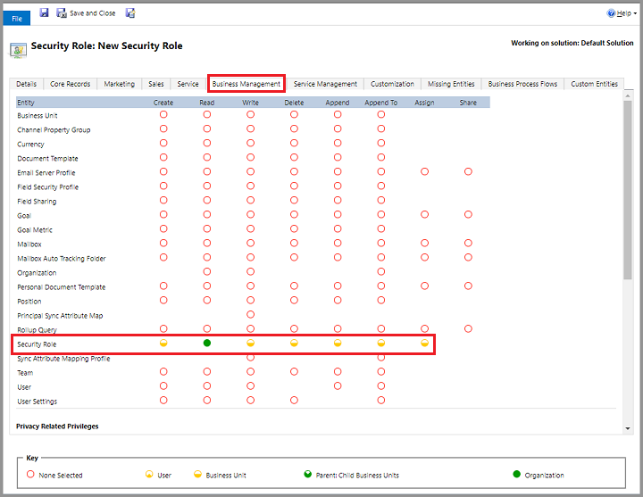

# Create an administrative user and prevent elevation of security role privilege

[!INCLUDE [cc-settings-moving](../includes/cc-settings-moving.md)] 

The [copy security role method](copy-security-role.md) is a quick and easy way to create a new security role based on an existing set of privileges. However, security role privileges can change with product updates which could render the new security role out-of-date and might not function as expected. This is especially true in the case where you want to allow [a certain group of administrative users](create-users-assign-online-security-roles.md#create-an-administrative-user-account) to assign security roles to your users.  We recommend you not copy the System Administrator security role and assign it to users, since this would allow the users to elevate the assigned user to System Administrators.  In addition, newer privileges from product updates will not be automatically added to the copied System Administrator security role resulting in the role having insufficient privileges to continue to assign security roles.

The following steps describe a method to create a new custom security role with privileges that will change dynamically with updates and therefore can continue to be used for security role assignments.

### Create a new custom security role that only has access to "Security Role"

1. Make sure that you have the System Administrator permissions.

    Check your security role  

   - [!INCLUDE[proc_check_your_security_role](../includes/proc-check-your-security-role.md)]  

   - [!INCLUDE[proc_dont_have_correct_permissions](../includes/proc-dont-have-correct-permissions.md)]  

2. Go to **Settings** > **Security** > **Security Roles**, and then choose **New**.
3. Enter a role name, and then select the **Business Management** tab.
4. Scroll down to the **Entity** list and set the **Security Role** entity privileges as follows:

   |Privilege  |Setting  |
   |---------|---------|
   |Create     |Business Unit         |
   |Read     |Organization         |
   |Write     |Business Unit         |
   |Delete     |Business Unit         |
   |Append     |Business Unit         |
   |Append To     |Business Unit         |
   |Assign     |Business Unit         |

   

5. Choose **Save and Close**.

### Assign the new security role to an administrative user

1. Go to **Settings** > **Security** > **Users**.
2. Select an administrative user and then choose **Manage Roles**.
3. Select the new security role.
4. Select all the security roles that the administrative user can assign to other users.
5. Choose **OK**.

> [!NOTE]
> Dynamics 365 for Customer Engagement apps is designed to prevent any elevation of security role privileges. Therefore, the administrative user **cannot** assign System Administrator, System Customizer, or any security roles that have a higher privilege.

### See also
[Global and Service administrators can administer without a license](global-service-administrators-can-administer-without-license.md)
