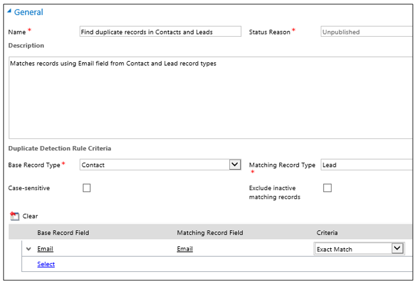

# Set up duplicate detection rules to keep your data clean

To maintain the integrity of your data, it's a good idea to have rules in place to reduce duplicate records in the system. Model-driven apps in Dynamics 365, such as Dynamics 365 Sales and Customer Service, include default duplicate detection rules for accounts, contacts, and leads, but not for other types of records. If you want the system to detect duplicates for other record types, you'll need to create a new rule.  
  
 After you've created duplicate detection rules, you need to turn duplicate detection on.  
  
1. [!INCLUDE[proc_permissions_mgr_vp_sys_admin_sys_cust](../includes/proc-permissions-mgr-vp-sys-admin-sys-cust.md)]  
  
    Check your security role  
  
   1. [!INCLUDE[proc_follow_steps_in_link](../includes/proc-follow-steps-in-link.md)]  
  
   2. [!INCLUDE[proc_dont_have_correct_permissions](../includes/proc-dont-have-correct-permissions.md)]  
  
2. In the Power Platform admin center, select an environment. 

3. Select **Settings** > **Data management** > **Duplicate detection rules**.  
   
4. To create a new duplicate detection rule, choose **New**. Type a name and description.  
  
    –OR–  
  
    To edit an unpublished existing duplicate detection rule, choose the duplicate detection rule.  
  
    –OR–  
  
    To edit a published duplicate detection rule, select the rule. On the **Actions** menu, choose **Unpublish**, and then choose the rule.  
  
5. Select the criteria to be used to identify a record as a duplicate.  
  
   1.  If you are creating a new rule:  
  
       -   In the **Duplicate Detection Rule Criteria** section, in the **Base Record Type** list, choose the type of record that this rule applies to. For example, select **Contacts**.  
  
       -   In the **Matching Record Type** box, choose the type of record to compare. In most cases, you'll probably want to use the same record type for **Base Record Type** and **Matching Record Type**. It's also useful to be able to compare different record types. For example, you might want to compare the **Email** field in Contacts to the **Email** field in Leads.  
  
   2.  If you want the rule to consider only active records while detecting duplicates, select the **Exclude inactive matching records** check box. You should also select this check box if your duplicate detection rule criteria are based on a status field.  
  
   3.  If you want the rule to be case-sensitive, select the **Case-sensitive** check box.  
  
   4.  If you selected different record types for the base and matching record types, for each new criterion, in the **Base Record Field** column, choose **Select**, and then choose a field name. In the same row, in the **Matching Record Field** column, choose **Select**, and then choose a field name.  
  
        \-  OR -  
  
        If you selected the same record types for the base and matching record types, for each new criterion, in the **Field** column, choose **Select**, and then choose a field.  
  
   5.  In the same row, in the **Criteria** column, choose **Select**, and then choose an operator. For example, select **Exact Match**.  
  
   6.  If you specified **Same First Characters** or **Same Last Characters**, in the **No. of Characters** column, choose **Enter Value**, and then enter the number of characters to compare.  
  
   7.  If you don't want the rule to consider blank fields (null values) as equal while identifying duplicates, select the **Ignore Blank Values** check box.  
  
   > [!IMPORTANT]
   >  If the duplicate detection rule contains only one condition, blank values are ignored during duplicate detection job.  
  
    The number of criteria that you can select is limited by the number of characters that can be stored in the matchcode for the record. As you add criteria, watch the **Current matchcode length** value shown at the bottom of the criteria list.  
  
     
  
6. When you're finished adding criteria, choose **Save and Close**.  
  
7. To make the new or changed duplicate detection rule usable, select the rule, and then choose **Publish**.  
  
    When you publish a duplicate detection rule, a matchcode is created for every record in the matching record type for that rule. You can publish only five rules for the same base record type (Account, for example) at a time. You might need to delete or unpublish an existing rule if you bump up against this limit.  
  
> [!NOTE]
> - We recommend that you set the duplicate detection criteria on a field that has unique values, for example, **Email**.  
>   -   You can have more than one duplicate detection rule for each record type.  
  
### See also  
 [Turn duplicate detection rules on or off for the whole organization](../admin/turn-duplicate-detection-rules-off-whole-organization.md) 
 [Run bulk system jobs to detect duplicate records](../admin/run-bulk-system-jobs-detect-duplicate-records.md) 
 [Merge duplicate records for accounts, contacts, or leads](https://docs.microsoft.com/powerapps/user/merge-duplicate-records) 
 [Developer's Guide: Duplicate Rule entities](https://docs.microsoft.com/powerapps/developer/common-data-service/duplicaterule-entities)
