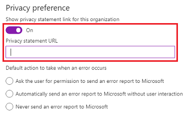

# Manage privacy and security settings

[!INCLUDE [cc-beta-prerelease-disclaimer](../includes/cc-beta-prerelease-disclaimer.md)]

Use these settings to adjust model-driven apps in Dynamics 365, such as Dynamics 365 Sales and Customer Service, privacy and security.

These settings can be found in the Power Platform Admin center by going to **Environments** > [select an environment] > **Settings** > **Privacy + Security**.

Make sure you have the System Administrator or System Customizer security role or equivalent permissions to update the business closures.

**Check your security role**

- Follow the steps in [View your user profile](https://docs.microsoft.com/powerapps/user/view-your-user-profile).
- Don’t have the correct permissions? Contact your system administrator.

## Settings

> [!div class="mx-tableFixed"]
> |Settings|Description|  
> |--------------|-----------------|  
> |**Privacy preference**|More information: [Set error reporting preferences for the organization](#set-error-reporting-preferences-for-the-organization)|  
> |Show privacy statement link for this organization|Default: Off. Select to display the privacy statement link.|  
> |Privacy statement URL|Provide users with a link to your organization's privacy statement. If you show the link, it will be added to the **Settings** menu.| 
> |**Default action to take when an error occurs**|More information: [Replace the privacy statement for the organization](#replace-the-privacy-statement-for-the-organization) |
> |Ask the user for permission to send an error report to Microsoft|Default: Not selected. |  
> |Automatically send an error report to Microsoft without asking me for permission|Default: Not selected.  |  
> |Never send an error report to Microsoft|Default: Not selected. |  
> |**Blocked attachments**| |
> |Set blocked file extensions for attachments (semicolon separated)|Prevent upload or download of certain attachment types that are considered dangerous. Separate file extensions with a semicolon.  Default extensions: ade; adp; app; asa; ashx; asmx; asp; bas; bat; cdx; cer; chm; class; cmd; com; config; cpl; crt; csh; dll; exe; fxp; hlp; hta; htr; htw; ida; idc; idq; inf; ins; isp; its; jar; js; jse; ksh; lnk; mad; maf; mag; mam; maq; mar; mas; mat; mau; mav; maw; mda; mdb; mde; mdt; mdw; mdz; msc; msh; msh1; msh1xml; msh2; msh2xml; mshxml; msi; msp; mst; ops; pcd; pif; prf; prg; printer; pst; reg; rem; scf; scr; sct; shb; shs; shtm; shtml; soap; stm; tmp; url; vb; vbe; vbs; vsmacros; vss; vst; vsw; ws; wsc; wsf; wsh|
> |**Session expiration**|More information: [Security enhancements: User session and access management](user-session-management.md)> |  
> |Set custom session timeout|Default: Off. Select **On** to specify values different from default values.|
> |Enter maximum session length|Default: 1440. After the time you set is reached, users must re-authenticate to model-driven apps in Dynamics 365.|  
> |How long before the session expires do you want to show a timeout warning?|Default: 20. After the time you set is reached, users receive an expiration warning.|  
> |**Inactivity timeout**|More information: [Inactivity timeout](user-session-management.md#inactivity-timeout) |  
> |Set inactivity timeout|Default: Off. Enable to automatically sign out a user. |  

## Replace the privacy statement for the organization  
 By default, the [!INCLUDE[cc_Microsoft](../includes/cc-microsoft.md)] privacy statement is always shown to users with an administrator role only, and not to other (business) users. As an administrator, you can add a link to specify your organization's privacy statement, which is then shown to other users in your organization.  
  
1. Go to **Environments** > [select an environment] > **Settings** > **Privacy + Security**
  
2. Under **Privacy Preferences**, turn on **Show privacy statement link for this organization**.
  
3. In the **Privacy statement URL** box, type the link of the webpage you want to show.  
  
   > [!div class="mx-imgBorder"] 
   > 
  
4. Select **Save**.  
  
> [!NOTE]
>  Any user with the System Administrator security role will always see the [!INCLUDE[cc_Microsoft](../includes/cc-microsoft.md)] privacy statement and not the organization’s privacy statement.

## Set error reporting preferences for the organization 
 When errors occur in the product, data about the problem is sent to [!INCLUDE[cc_Microsoft](../includes/cc-microsoft.md)]. This data – an error report - allows model-driven apps in Dynamics 365 to track and address errors relating to [!INCLUDE[pn_microsoftcrm](../includes/pn-microsoftcrm.md)]. You can help [!INCLUDE[cc_Microsoft](../includes/cc-microsoft.md)] improve products and services when you allow the system to send these error reports.  
  
 By default, individual users have a measure of control over whether to send error reports to [!INCLUDE[cc_Microsoft](../includes/cc-microsoft.md)]. But you, as an administrator, can override their preferences and set up the error reporting preferences for the entire organization.  
  
1. Go to **Environments** > [select an environment] > **Settings** > **Privacy + Security**
  
2. Under **Privacy Preferences**, **Default action to take when an error occurs**, select an action to take. 
  
   > [!div class="mx-imgBorder"] 
   > 
 
3. Select **Save**. 

When you use this setting, you can control error reporting for the entire organization by:  
  
-   Not allowing users to make changes in how error reporting occurs.  
  
-   Changing the default behavior for how error reporting happens.  
  