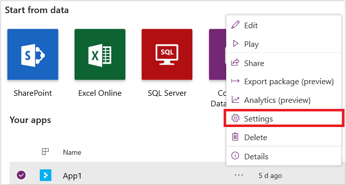
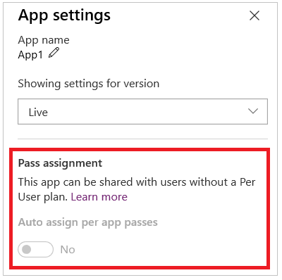

# Purchase Power Apps for your organization

This topic provides information on how to purchase Power Apps for your organization as an administrator. You can purchase Power Apps through the Power Apps website directly, through the [Microsoft 365 admin center](https:admin.microsoft.com), or through your Microsoft representative or partner. This article will also provided information about the trial options available for a Power Apps plan and then explain how to purchase a Power Apps plan as an organization. For more information, see [Manage licenses in your organization](signup-question-and-answer.md).

> [!NOTE]
> To purchase Power Apps for an organization, you must already be an Office 365 Global or Billing Admin of a tenant, or you must create a tenant.

## Choosing the right plan
For details about what licenses you can choose for your organization, see [Licensing overview for Power Platform](pricing-billing-skus.md).

## Purchase Power Apps directly

You can purchase Power Apps subscriptions for your organization from [Power Apps pricing](https://powerapps.microsoft.com/pricing/) page and then assign Power Apps licenses to your users. [Learn more](https://docs.microsoft.com/office365/admin/subscriptions-and-billing/assign-licenses-to-users?view=o365-worldwide).

1. Visit the [Power Apps pricing](https://powerapps.microsoft.com/pricing/) page.

2. Select **Buy now** for the plan you want.

3. Provide information to make the purchase, and then navigate to the [Microsoft 365 admin center](https:admin.microsoft.com) to assign Power Apps licenses to your users.

## Get Power Apps through Office 365

You can purchase Power Apps subscriptions for your organization from the [Microsoft 365 admin center](https:admin.microsoft.com) and then assign Power Apps licenses to your users. [Learn more](https://docs.microsoft.com/office365/admin/subscriptions-and-billing/assign-licenses-to-users?view=o365-worldwide).

### Purchase a subscription trial

1. Browse to the [Microsoft 365 admin center](https:admin.microsoft.com).

2. On the left navigation pane, select **Billing -> Subscriptions**.

3. Select **+ Add subscriptions** on the right side.

4. Under **Other Plans**, hover over the ellipse (...) for the plan you want, and then select **Start free trial**.

5. On the confirmation screen, select **Try now**.

### Purchase a subscription

1. Browse to the [Microsoft 365 admin center](https:admin.microsoft.com).

2. On the left navigation pane, select **Billing -> Subscriptions**.

3. Select **+ Add subscriptions** on the right side.

4. Under **Other Plans**, hover over the ellipse (...) for the plan you want, and then select **Buy now**.

5. Enter the number of licenses you would like to add, and then select **Check out now** or **Add to cart**.

   > [!NOTE]
   > You can add more licenses later if needed.

6. Enter the needed information in the Checkout flow,

## Power Apps per app plan

Power Apps per app plan allows individual users to run 2 applications on a single
portal for a specific business scenario based on the full capabilities of
Power Apps. This plan provides an easy way for users to get started with Power Apps before broader scale adoption. These are available to purchase from the
Office admin center and you can allocate add-ons in the [Capacity](https://admin.powerplatform.microsoft.com/analytics/capacity) area in the Power Platform
Admin center. More information: [Capacity add-ons](capacity-add-on.md)

> [!IMPORTANT]
> Although, Power Apps per app plans appear in Microsoft 365 admin center (<https://admin.microsoft.com>), you shouldn’t attempt to assign them to users there. Power Apps per app plans must be allocated to a Common Data Service environment by an admin in Power Platform Admin center (<https://admin.powerplatform.microsoft.com>). 
>
> After per app plans are allocated to an environment, they are assigned when apps are shared with end users in the environment.

### Allocate per app plans

After purchase, you can allocate per app plans to the environments as required. 

In the [Power Platform Admin center](https://admin.powerplatform.microsoft.com), select **Analytics > Capacity** in the left-side navigation pane. If your organization has purchased add-ons that includes per app plans, an **Add-ons** tile appears on the **Capacity** screen displaying summary information about the capacity add-ons that your organization has.

To allocate add-ons, select **Manage**. For detailed information, see [Allocate or change capacity in an environment](capacity-add-on.md#allocate-or-change-capacity-in-an-environment).

> [!NOTE]
> As an admin, you can restrict who can allocate add-on capacity to environments. More information: [Control who can allocate add-on capacity](capacity-add-on.md#control-who-can-allocate-add-on-capacity)

### Set up app to use per app plans

After an admin allocates Power Apps per app plan to an environment, they're assigned to unlicensed users when an app in that environment is shared with them. 

Follow these steps to turn off assigning per app plans for users when an app
is shared with them:

1. Choose the app in [Power Apps](https://make.powerapps.com).
2. Select **Settings**.

    

3. Under **Pass assignment**, change the **Auto assign per app passes** toggle to **No**. The **Auto assign per app passes** toggle appears in all app setting.

    