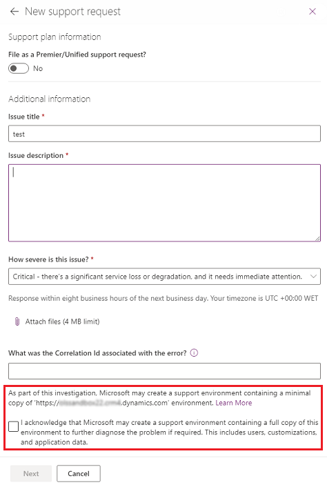

# Manage support environments

A support environment is any non-production environment of Common Data Service used by Microsoft support to reproduce and resolve customer issues. When there is an issue affecting the operation of your online service, Microsoft can create a support environment in your tenant to troubleshoot and repair the issue.  It is isolated from your production environment so it does not impact your business operations. System admins have full control of managing and providing organization data by [copying it](copy-environment.md) to a support environment. 

### What is a support environment?

-  It is an environment created in your tenant by Microsoft for purposes of preventing, detecting, or repairing problems affecting the operation of your online service.
-  It does not require any additional non-production environment to be purchased.
-  The database size of a support environment does not count towards your storage limit.
-  It resides in the same regional datacenter as your source environment. 

### What data is in a support environment?

- When a support environment is initially created by Microsoft, it contains no customer data or customizations.
- System admins manage support environments in the Power Platform admin center.
- System admins can [copy an environment](copy-environment.md) to a support environment, and then choose whether to provide a [Minimal](copy-environment.md#copy-over-everything) or a [Full](copy-environment.md#copy-over-customizations-and-schemas-only) copy of their environment.
- System admins must consent to providing a copy of their data to Microsoft.

### Who has access to a support environment?

Minimal copy:

-  Microsoft staff who are members of a support security group

Full copy:

-  Microsoft staff who are members of an elevated support security group

### What kind of data access does Microsoft have?

Online (via the application):

-  System admin privileges

Database (via SQL query tools):

-  Read/Write access to all tables
-  Access to the database requires additional approval by Microsoft and it is managed, controlled, and granted as needed.
-  Access to the database is time limited (for example, 30 minutes) and expires automatically.

### How long does a support environment stay in your tenant?

1. Seven days or upon resolution of the problem.
2. System admins can [delete](delete-environment.md) the support environment at any time.

### Is access and usage of support environment audited?

Yes.

### What is the consent form in the New support request page?

To assist with diagnosing and resolving a support issue, you can consent to the creation of a [Minimal](copy-environment.md#copy-over-everything) or a [Full](copy-environment.md#copy-over-customizations-and-schemas-only) copy of the environment with the issue.

> [!div class="mx-imgBorder"] 
> 