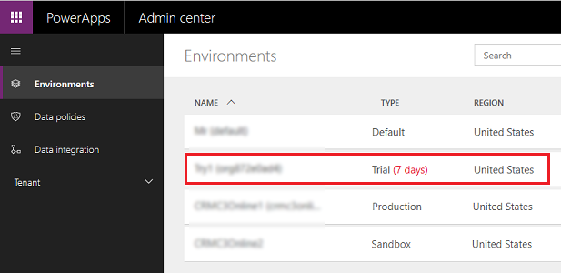
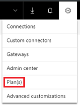

# About Trial environments

Currently, you can create two types of Common Data Service (CDS) for Apps environments: Trial or Production. A Trial environment is useful for trying out Dynamics 365 for Customer Engagement apps at no cost. Trial environments expire after 30 days.

Open the **Environments** page to see the environment types you have and the upcoming expiration date for Trial environments:

> [!div class="mx-imgBorder"] 
> 

## Convert a Trial environment to Production

While using the Trial environment, if you created resources you want to retain longer than 30 days, convert the Trial to a Production environment.

To convert to a Production environment, these criteria must be met:

**A suitable PowerApps plan**. A plan that enables you to create Production environments, for example, PowerApps Plan 2. See [Choose the right plans for your team](https://powerapps.microsoft.com/pricing/) for information on PowerApps plans that include Production environments. See [How do I identify my plan(s)](#how-do-i-identify-my-plans) to determine your PowerApps plan(s).
**Available Production quota**. There are a fixed number of Production environments you can create with your plan. For example, with PowerApps Plan 2, you can create two Production environments. If you've already created two Production environments, you can’t create any more until you delete an existing one. For more information, see [Creating an environment](environments-overview.md#creating-an-environment).

Follow these steps to convert a Trial environment to a Production environment:

1. Go to [https://admin.powerapps.com/environments](https://admin.powerapps.com/environments), and sign in as an admin.
 
2. Open the **Environments** page, and select the Trial environment you want to convert to Production:

    > [!div class="mx-imgBorder"] 
    > 

3. On the **Details** tab, select **Convert**:

    > [!div class="mx-imgBorder"] 
    > 

4. Select **Confirm**:

    > [!div class="mx-imgBorder"] 
    > 

If your environment has a database, it might take several hours to convert to a Production environment. You can monitor the progress through the notification on the **Details** tab:

  > [!div class="mx-imgBorder"] 
  > 

## Frequently asked questions

### Who can convert a Trial environment to a Production environment?

You need to meet the following criteria to convert a Trial environment to a Production environment:

**Have a suitable PowerApps plan**. You need a plan that enables you to create Production environments—for example, PowerApps Plan 2. See [Choose the right plans for your team](https://powerapps.microsoft.com/pricing/) for information on PowerApps plans that include Production environments. See [How do I identify my plan(s)](#how-do-i-identify-my-plans) to determine your PowerApps plan(s).
**Have available Production quota**. There are a fixed number of Production environments you can create with your plan. For example, with PowerApps Plan 2, you can create two Production environments. If you've already created two, you can’t create any more until you delete an existing one.

### What if I don’t have available quota for Production environments?

Contact your Office 365 Global admin or Azure Active Directory (Azure AD) tenant admin to:
- Assign PowerApps Plan 2 to you. 
- Locate another user who has available Production environment quota.

You can also purchase a PowerApps Plan.

### Can every Office 365 Global admin or Azure AD tenant admin convert a Trial environment to a Production environment?

No. Global admins and Azure AD tenant admins need to have available quota for Production environments to be able to convert a Trial environment to a Production environment.

### How can I retain my data and resources if I don’t have a way to convert the Trial environment to a Production environment?

You can export your resources and data to another environment. If you want to retain them for a longer time, we recommend you create a Production environment or an individual environment (with PowerApps Community Plan) and export your resources to that environment. 

Here are some guidelines for exporting resources.

|Type of resource in the environment  |How do I export it?  |
|---------|---------|
|Apps (canvas and model-driven) and flows     |You can use [packaging](environment-and-tenant-migration.md) to export apps and flows from one environment.         |
|Data in the database (Common Data Service (CDS) for Apps environment)     |You have multiple options: <ul><li>[Export to Excel](/powerapps/user/export-data-excel) and save the data. You can [import the data](/powerapps/user/import-data) into another environment.</li> <li>You can use [Data Integrator services](data-integrator.md) and APIs to export data into another environment.</li></ul> |

We delete Trial environments that haven’t had any activity in the environment databases for 30 days.

### How can I create a Production or an individual environment?

You need to have a PowerApps plan that provides Production environment creation. For more information, see [Creating an environment](environments-overview.md#creating-an-environment).

You can create an individual environment by signing up for the [PowerApps Community Plan](https://powerapps.microsoft.com/communityplan/). Note that there are restrictions on sharing apps in individual environments—these environments are meant for personal use only.

### How do I identify my plan(s)?

To determine your plan(s), select the **Gear** icon in the upper-right corner of the PowerApps site, and then select **Plan(s)**.

> [!div class="mx-imgBorder"] 
> 

### See also
[Administer environments in PowerApps](environments-administration.md) 
[Environments overview](environments-overview.md) 
[Choose the right plans for your team](https://powerapps.microsoft.com/pricing/) 
[Licensing overview](pricing-billing-skus.md) 
