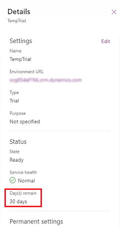
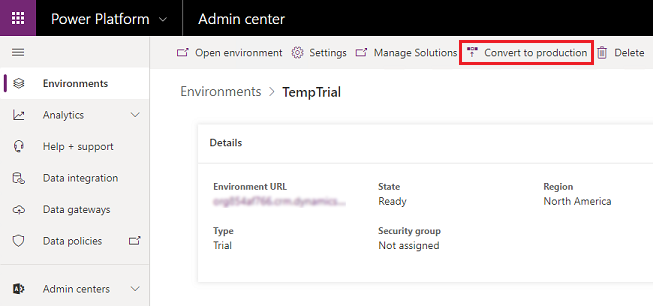

# About trial environments

Using the Power Platform admin center, you can create three types of Common Data Service environments: sandbox, production, or trial. A trial environment is useful for trying out model-driven apps in Dynamics 365 at no cost. Trial environments expire after 30 days.

## Check the expiration date

To determine when a trial environment will expire:

1. Sign into the [Power Platform admin center](https://admin.powerplatform.microsoft.com/) with admin credentials.

2. Go to **Environments** > [select a trial environment] > **See all**. Check out **Day(s) remain**.

   > [!div class="mx-imgBorder"] 
   > 

## Create a trial environment with Dynamics 365 apps

Currently, Dynamics 365 apps such as Dynamics 365 Sales and Dynamics 365 Customer Service can only be enabled in production environments. To create a trial with Dynamics 365 apps, see [Start your digital transformation here](https://trials.dynamics.com).

## Create a trial environment without Dynamics 365 apps

You can create a trial environment in the Power Platform admin center without Dynamics 365 apps such as Dynamics 365 Sales and Dynamics 365 Customer Service. See [Create and manage environments in the Power Platform admin center](create-environment.md) and select **Trial** as the environment type.

## Convert a trial environment to production

While using the trial environment, if you created resources you want to retain longer than 30 days, convert the trial to a production environment.

If you have 1GB of available database capacity, you can convert a trial environment to production. You might need to free up or purchase additional capacity if the trial database exceeds 1GB. To determine the size of the trial database see: [Common Data Service storage capacity](capacity-storage.md).

Follow these steps to convert a trial environment to a production environment:

1. Sign into the [Power Platform admin center](https://admin.powerplatform.microsoft.com/) with admin credentials.

2. Go to **Environments** > [select a trial environment] > **Convert to production**.

    > [!div class="mx-imgBorder"] 
    > 

3. Select **Continue**.

It might take several hours to convert to a production environment.

## Frequently asked questions

### Who can convert a trial environment to a production environment?

If you have 1GB of available database capacity, you can convert a trial environment to production. You might need to free up or purchase additional capacity if the trial database exceeds 1GB. To determine the size of the trial database see: [Common Data Service storage capacity](capacity-storage.md).

### How can I retain my data and resources if I don't have a way to convert the trial environment to a production environment?

You can export your resources and data to another environment. If you want to retain them for a longer time, we recommend you create a production environment or an individual environment (with the [Power Apps Community Plan](https://powerapps.microsoft.com/communityplan/)) and export your resources to that environment. 

Here are some guidelines for exporting resources.

|Type of resource in the environment  |How do I export it?  |
|---------|---------|
|Apps (canvas and model-driven) and flows     |You can use [packaging](environment-and-tenant-migration.md) to export apps and flows from one environment.         |
|Data in the database (Common Data Service environment)     |You have multiple options: <ul><li>[Export to Excel](/powerapps/user/export-data-excel) and save the data. You can [import the data](/powerapps/user/import-data) into another environment.</li> <li>You can use [Data Integrator services](data-integrator.md) and APIs to export data into another environment.</li></ul> |

We delete trial environments that haven't had any activity in the environment databases for 30 days.

### See also
[Environments overview](environments-overview.md) 
[Choose the right plans for your team](https://powerapps.microsoft.com/pricing/) 
[Licensing overview](pricing-billing-skus.md)
