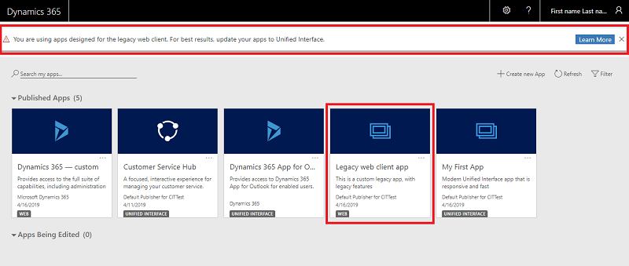
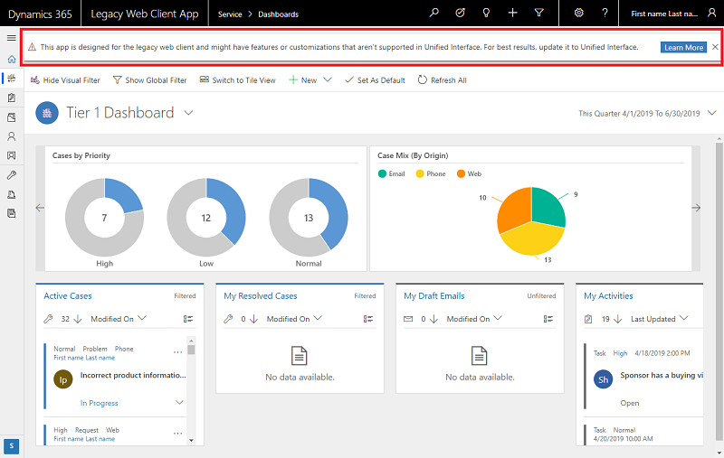

# Update your apps to Unified Interface

When you enable Unified Interface Only, all your apps, including those designed for the legacy web client, run in Unified Interface all the time. Environments with legacy web client apps will show a notification on the home page, prompting System Administrators to update those apps to Unified Interface, as shown below:

"You are using apps designed for the legacy web client. For best results, update your apps to Unified Interface."

> [!div class="mx-imgBorder"] 
> 

A similar notification will be visible to System Administrators whenever they use an app designed for the legacy web client, as shown below:

"This app is designed for the legacy web client and might have features or customizations that aren't supported in Unified Interface. For best results, update it to Unified Interface."

> [!div class="mx-imgBorder"] 
> 

The following are recommended ways to update to Unified Interface based on how the apps were installed in the environment.

## Apps created in your Sandbox environment

- Be sure to import the changes in your target environment via a managed solution only. See [Import, update, and export solutions](https://docs.microsoft.com/powerapps/maker/common-data-service/import-update-export-solutions) for guidance on installing an update to an existing managed solution.
- Modify the app properties by following the steps detailed in [Manage app properties](https://docs.microsoft.com/powerapps/maker/model-driven-apps/manage-app-properties), and set the **Client** type to **Unified Interface**
- Import the changes to your target environment via a managed solution update.

## Apps installed from AppSource

- Contact the app publisher and get a new version that updates the apps to Unified Interface.

## Apps obtained from an ISV or any other third party publisher

- Contact the ISV (Independent Software Vendor) or the third party app publisher and get a new version that updates the apps to Unified Interface.

