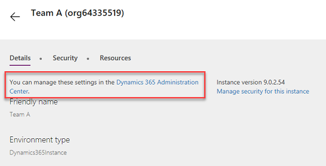

# About Common Data Service 

[!INCLUDE [cc-beta-prerelease-disclaimer](../includes/cc-beta-prerelease-disclaimer.md)]

## Common Data Service

The Common Data Service is a cloud scale database used to securely store data for business applications built on PowerApps. Common Data Service is an abstraction on top of underlying Azure cloud data management services to make it easier to build business applications. Common Data Service provides not just data storage, but a way to implement business logic that enforces business rules and automation against the data. Data in Common Data Service is organized as entities, for example account and contact would be two examples of entities. These entities can have relationships that define the business connection between the data stored in an entity. For example, John works for Contoso would be expressed as a relationship. The security model of Common Data Service enables data protection down to the field level on individual records. A more thorough discussion of security will be covered in the security section.

Common Data Service databases are created in the context of a Power Apps environment. Each environment can have only a single Common Data Service database. Common Data Service databases can be provisioned by you or licensed individuals in your organization to support their custom applications. Common Data Service databases are also automatically provisioned when a model-driven apps in Dynamics 365, such as Dynamics 365 Sales and Customer Service, is added to your tenant.

## Managing Common Data Service database environments

The easiest way to know if you have a Common Data Service database associated with your environments is to look at the detail page of the environment from admin.powerapps.com. If you see the Create my database button then you don’t have one in that environment yet and can create one.

On the other hand, if you don’t see the Create my Database link then the Common Data Service database environment exists and you can click on the Dynamics 365 Administration center link to navigate to the list of all your Common Data Service databases.

From the Dynamics 365 Admin center you can open the environment as well as manage and view some of the environment details. The actions you can take on each environment depends currently on if it started as an environment for model-driven apps in Dynamics 365 or if you started it with just the core Common Data Service entities. For core Common Data Service environments, you can only copy or set notifications. On Common Data Service environments you also have the ability to reset the environment if it is of type Sandbox, and potentially convert an environment to a Sandbox to then test or reset.

### See also
[Microsoft Learn: Get started with Common Data Service](https://docs.microsoft.com/learn/modules/get-started-with-powerapps-common-data-service/) 
[Environments overview](environments-overview.md) 
[Create and manage environments in the Power Apps Admin center](create-environment-powerapps.md)
