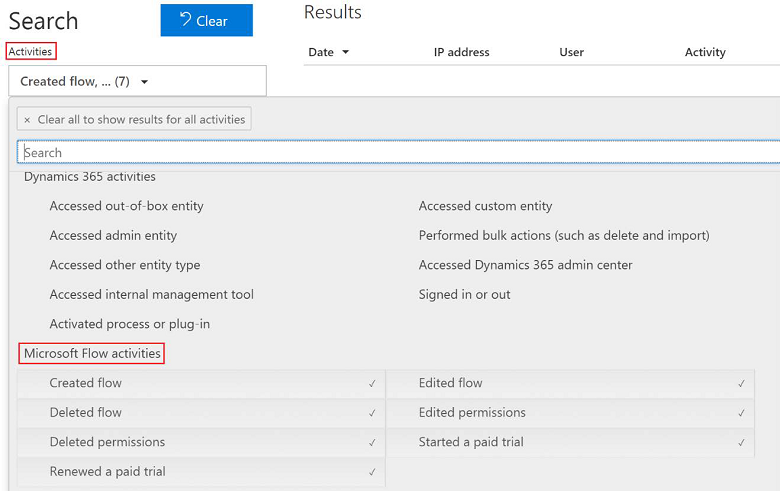
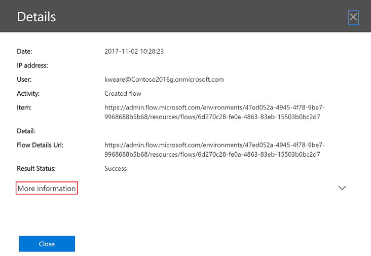
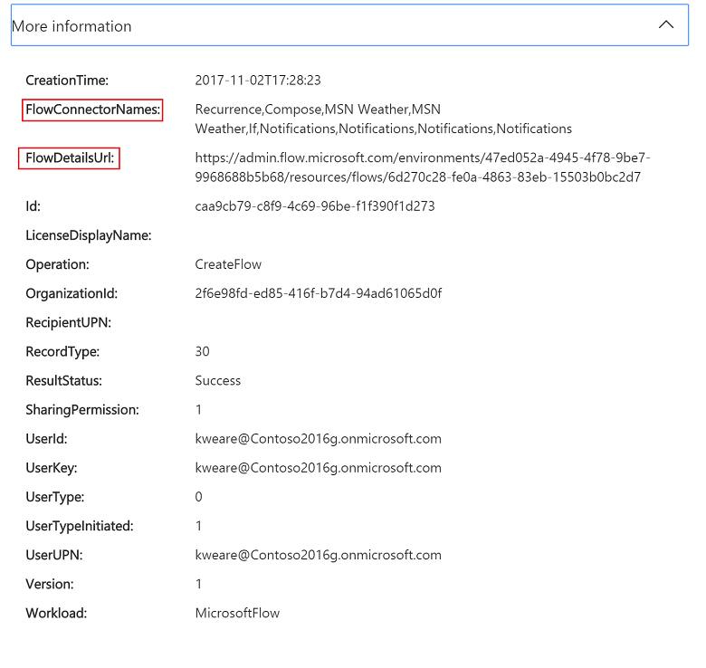

# Compliance and data privacy

[!INCLUDE [cc-beta-prerelease-disclaimer](../includes/cc-beta-prerelease-disclaimer.md)]

Microsoft is committed to the highest levels of trust, transparency, standards conformance, and regulatory compliance. Microsoft’s broad suite of cloud products and services are all built from the ground up to address the most rigorous security and privacy demands of our customers.

To help your organization comply with national, regional, and industry-specific requirements governing the collection and use of individuals’ data, Microsoft provides the most comprehensive set of compliance offerings (including certifications and attestations) of any cloud service provider. There are also tools for administrators to support your organization’s efforts. In this part of the document we will cover in more detail the resources available to help you determine and achieve your own organization requirements.

## Trust Center

The Microsoft Trust Center (https://www.microsoft.com/en-us/trustcenter) is a centralized resource for obtaining information on Microsoft’s portfolio of products. This includes information on security, privacy, compliance, and transparency. While this paper may contain some subset of this information for PowerApps, it is important to always refer to the Microsoft Trust Center for the most up to date authoritative information.

For quick reference, you can find the Trust Center Information for the Microsoft Power platform here https://www.microsoft.com/en-us/TrustCenter/CloudServices/business-application-platform/default.aspx This will include information on PowerApps, Microsoft Flow and Power BI.

## Data Location

Microsoft operates multiple data centers world-wide that support the Microsoft Power platfrom applications. When your organization establishes a tenant, it establishes the default geographical (geo) location. In addition, when creating environments to support applications and contain CDS for Apps data the environments can be targeted for a specific geo. A current list of the geos for the Microsoft Power platform can be found here https://www.microsoft.com/en-us/TrustCenter/CloudServices/business-application-platform/data-location

To support continuity of operations, Microsoft may replicate data to other regions within a geo, but the data will not move outside the geo to support data resiliency. This supports the ability to fail over or recover more rapidly in the event of a severe outage. There are some reasonable exceptions to keeping data in the specific geo that are listed on the above site primary focused on legal and support. It’s also important to note, that you or your users can take actions that expose data outside of the geo. Other
services can also be configured to access the data and expose it outside of the geo. By default, authorized users can access the platform and your applications and data from anywhere in the world where there is connectivity.

## Data Protection

Data as it is in transit between user devices and the Microsoft datacenters are secured. Connections established between customers and Microsoft datacenters are encrypted, and all public endpoints are secured using industry-standard TLS. TLS effectively establishes a security-enhanced browser to server connection to help ensure data confidentiality and integrity between desktops and datacenters. API access from the customer endpoint to the server is also similarly protected. Currently, TLS 1.2 (or higher) is required for accessing the server endpoints.

Data transferred through the on-premises data gateway is also encrypted. Data that users upload is typically sent to Azure Blob storage, and all metadata and artifacts for the system itself are stored in an Azure SQL database and Azure Table storage.

All instances of the Common Data Service for Apps database use SQL Server Transparent Data Encryption (TDE) to perform real-time encryption of data when written to disk, also known as encryption at rest.

By default, Microsoft stores and manages the database encryption keys for your instances so you don’t have to. The manage keys feature in the Dynamics 365 admin center gives administrators the ability to self-manage the database encryption keys that are associated with instances of Dynamics 365 (online). You can read more about managing your own keys here https://docs.microsoft.com/en-us/dynamics365/customer-engagement/admin/manage-encryption-keys-instance but generally it is recommended have Microsoft manage the keys unless you have a specific business need to maintain your own.

## Resources to manage GDPR Compliance

The European Union General Data Protection Regulation (GDPR) is one of the newest privacy regulations enacted that gives rights to people to manage their personal data. In this section we will look at some of the tools and resources available for the Microsoft Power platform to assist administrators in their efforts to comply with GDPR. Some of these resources and tools may also helpful to assist you in other data privacy related tasks not directly related to GDPR. A complete discussion of GDPR is beyond the scope of this paper, however in this section we will focus on the tools and resources to support your efforts. Additionally, Microsoft has a section on the trust center dedicated to GDPR resources and information that can be helpful. You can find that here https://www.microsoft.com/en-us/TrustCenter/Privacy/gdpr/default.aspx

First, let’s review at some of GDPR’s terminology that matters in this context:

|Term  |Relevance  |
|---------|---------|
|Data Subject     | GDPR identifies people as data subjects. It is their personal data that might have been collected by your organization either in the employment of the person or some interaction collecting their personal data        |
|Data Controller     |Organizations that collect and process data for their own purposes         |
|Data Processor     | Organizations that process data on behalf of others        |
|Personal Data     | Any information relating to an identified or identifiable natural person.        |

As an administrator one of the key activities in support of GDPR will be related to Data Subject Rights (DSR) requests. These are formal requests from a Data Subject to a Data Controller (likely your organization) to act on their personal data in your systems. GDPR gives rights to Data Subjects to obtain copies, request corrections, restrict processing of the data, delete the data and to receive copies in an electronic format so it could be moved to another Data Controller.

The following links point to detailed information to help you respond to DSR requests depending on the features your organization is using.

|Platform Feature Area  |Link to detailed response steps  |
|---------|---------|
|PowerApps  |  [Responding to Data Subject Rights (DSR) requests to export PowerApps customer data](powerapps-gdpr-export-dsr.md)      |
|CDS for Apps     |  [Responding to Data Subject Rights (DSR) requests for Common Data Service for Apps customer data](common-data-service-gdpr-dsr-guide.md)     |
|Microsoft Flow     | https://docs.microsoft.com/flow/gdpr-dsr-summary        |
|Microsoft Accounts (MSAs)     | https://docs.microsoft.com/flow/gdpr-dsr-summary-msa        |
|Dynamics 365     |https://docs.microsoft.com/microsoft-365/compliance/gdpr-dsr-dynamics365         |

## Office 365 Security and Compliance Center

You may also find Microsoft Compliance Manager helpful to manage your compliance efforts across Microsoft cloud services in a single place. More details about Compliance Manager can be found here https://aka.ms/compliancemanager .

## Microsoft Flow Audit Log Events

In the compliance center Audit Log Search administrators can now search and view Microsoft Flow events. Events include Created flow, Edited flow, Deleted flow, Edited Permissions, Deleted Permissions, Started a paid trial, Renewed a paid trial. Using the portal you can choose what you want to search and a time window.

> [!div class="mx-imgBorder"] 
> 

From the resulting query results when you drill down into an item you get a details page with the following type of information.

> [!div class="mx-imgBorder"] 
> 

The real good information comes from clicking on the More Information and drilling down into the real detail page:

> [!div class="mx-imgBorder"] 
> 

Audit data is retained for 90 days. You can do CDSV exports of the data allowing you to move it into Excel or PowerBI for further analysis. You can find a complete walkthrough of using the audit information here https://flow.microsoft.com/en-us/blog/security-and-compliance-center/