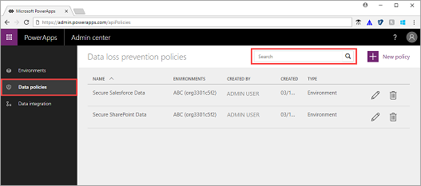
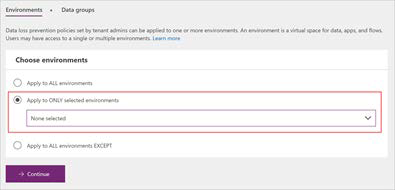
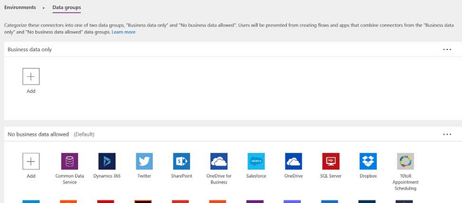
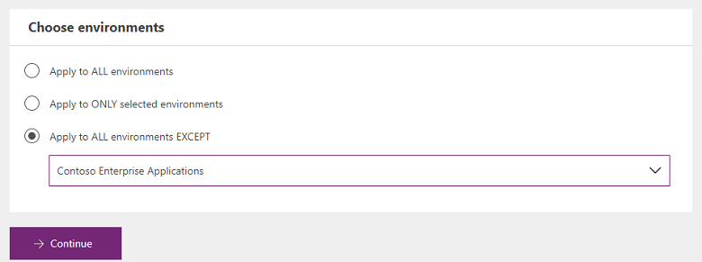
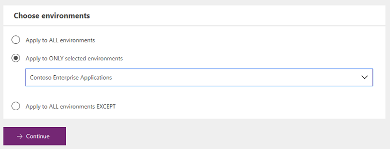

# Data loss prevention policies

[!INCLUDE [cc-beta-prerelease-disclaimer](../includes/cc-beta-prerelease-disclaimer.md)]

Your organization’s data is likely one of the most important assets you are responsible for safeguarding as an administrator. The ability to build apps and automation that uses the data allows your company to be successful. PowerApps and Microsoft Flow allow rapid build and rollout of these high value applications that allow users to measure and act on the data in real time. Applications and automation are increasingly becoming more connected across multiple data sources and multiple services. Some of these services might be external 3rd party services and might even include some social networks. Users will often have good intentions but might overlook the potential for exposure from data leakage to services and audiences that shouldn’t have access to the data.

Data Loss Prevention (DLP) policies that help protect organizational data from unintended exposure, are available for administrators to create. They can act as guardrails to help prevent users from unintentionally exposing the data. DLP policies can be scoped at the environment and tenant level offering flexibility to craft policies that are sensible and do not block high productivity.

DLP policies enforce rules of what connectors can be used together by classifying connectors as either Business Data only or No Business Data allowed. Simply, if you put a connector in the business data only group, it can only be used with other connectors from that group in the same app. Keep reading and we will cover some scenarios for using this later in this section.

## What policies do we already have?

From the PowerApps Admin Center (admin.powerapps.com) you can see the current policies you have in place in your tenant. This should be your first stop as a new administrator to understand what is currently active.

> [!div class="mx-imgBorder"] 
> 

## Creating new DLP Policies

When you create a new DLP policy you first decide on the scope. If you are only an environment administrator, you will see a selection to choose one of your environments to associate with the DLP policy. If you are a tenant administrator you will have the ability to apply to All Environments, Selected Environments or All Environments EXCEPT.

For the process to create a DLP policy, see [Create a data loss prevention (DLP) policy](create-dlp-policy.md).

> [!div class="mx-imgBorder"] 
> 

Environment only admins do have the ability to view policies created by tenant admins to understand what might apply to their environment.

One thing to consider is that environment specific policies can’t override tenant-wide DLP policies. For example, if you only allow use of Common Data Service connectors in an environment, an individual user that is only an environmental admin can’t override that policy to allow social network connectors to be used.

## Configuring connectors for a DLP policy

By default, all connectors are considered part of the No business data allowed list and no connectors are included in the business data only group. This effectively means that all connectors can be used with other connectors.

> [!div class="mx-imgBorder"] 
> 

When new connectors are added they are added to the Default category which is No business data allowed. If you would prefer you can change which category is considered the default, and then all new connectors will be classified in that category by default.

> [!div class="mx-imgBorder"] 
> 

Typically, though most companies will want to treat new connectors as No business data allowed until they evaluate if it is appropriate to use with what they have classified as business data.

Let’s look at an example if we were to create a new tenant wide DLP policy that had just the Common Data Service added to the Business Only Data and all others in No Business Data. Let’s look at a few application examples and the outcome of this policy.

|Connectors used in Application or flow  |Impact of DLP  |
|---------|---------|
|SharePoint and OneDrive     |This would be allowed         |
|Common Data Service     | This would be allowed        |
|Common Data Service and SharePoint     |This would not be allowed         |
|SharePoint and Twitter     |This would be allowed         |
|SharePoint, Twitter and Common Data Service     |This would not be allowed         |

> [!div class="mx-imgBorder"] 
> 

Users accessing a PowerApp or Flow impacted by the DLP policy will see a message informing of the DLP policy conflict. As an administrator you should have a process and plan in place to handle these types of support needs if you are using DLP policies.

> [!div class="mx-imgBorder"] 
> 

One thing to keep in mind, DLP policies created for a connector do not understand that that connector could be configured to talk to Dev, Test and Production, etc. When you configure a DLP policy it is all or nothing. So, if you want to allow the connector to talk to a test database in the test environment, but not allow it to connect to the production database in that same test environment, then DLP policies won’t help you restrict that. Another way to say the same thing, is DLP policies are Connector aware, but do not control the connections that are made using the connector.

## Strategies for creating DLP policies

As an administrator taking over an environment or starting to support use of PowerApps and Microsoft Flow DLP policies should be something you evaluate and create within the first 30 days. This ensures a base set of policies are in place before too many users start creating connections that might violate your policies.

For smaller environments where the users are highly capable and are trusted you could start out with no DLP policies taking only the default options. This is the most flexible option and can be changed at any time. Keep in mind introducing more restrictive policies later could conflict with existing assets. These conflicts could have business impact when existing apps and flows stop working until either the app / flow is brought into compliance or the DLP policy relaxed.

For larger environments it is recommend you have a plan in place for DLP policies. It is best to do this in conjunction with your plan for managing environments in your organization. While there is an endless combination of connectors you might have in your own environment we will be using an example that you can tailor to fit your own needs. Let’s setup a framework for a generic DLP policy template that could apply to many organizations, only modifying it for some of their specific needs.

First, let’s look at our environment setup and assumptions. The following are the environments we are expecting to manage in our organization.

|Environment  |Expected Use / Policy  |
|---------|---------|
|Contoso – Default     | This is the default environment, and anyone can create apps and flows in it        |
|Contoso Enterprise Apps     |This is a Production environment with applications managed with formal review before being promoted here. This could also be more business unit aligned e.g. Marketing, Finance etc.         |
|Community Plan Environments (0…N)     |These will be automatically created by any users in our org that sign up for the free Community Plan         |
|User Owned Environments (0…N)     |These are Production or Trial Environments created by users with a PowerApps plan or PowerApps Trial         |

We now are going to design a tenant wide default DLP policy. Our goal is to ensure that as people create their own environments and test and explore they minimize mix of core business data without us first working with them.

Our goal is to apply this default global policy to all environments except Contoso Enterprise Applications which we are going to manage by a separate DLP policy.

> [!div class="mx-imgBorder"] 
> 

We have identified the following connectors as our initial set of business only data allowed connectors (remember you can always add to this list at any time!).

> [!div class="mx-imgBorder"] 
> 

With this policy in place any use outside of those business connectors will need to have exceptions handled and we will cover that shortly.

For Contoso Enterprise Application environment since we excluded it from our policy we have two choices. We can either leave it wide open since we only deploy to it trusted applications that we as administrators install and configure or we establish a DLP policy for it to match its application needs. The following new DLP policy shows how we would create a DLP specific for that environment.

> [!div class="mx-imgBorder"] 
> 

The following is an example that might look like a super set of our global one – notice it includes some social network and 3rd party connectors – but since these are all trusted apps and flows that is ok.

> [!div class="mx-imgBorder"] 
> 

Now with this in place, you need a plan on how to handle exceptions. You really have three choices

1. Deny the request
2. Add the connector to the default DLP policy
3. Add the users’ environments to the All Except list for the Global default DLP and create a user specific DLP policy with the exception included.

Hopefully that helps you understand how you might apply DLP policies in your organization. These are just some of the many options you could configure with DLP policies.

