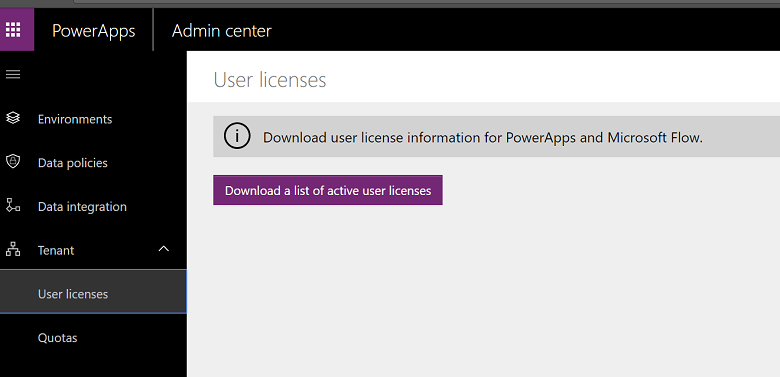
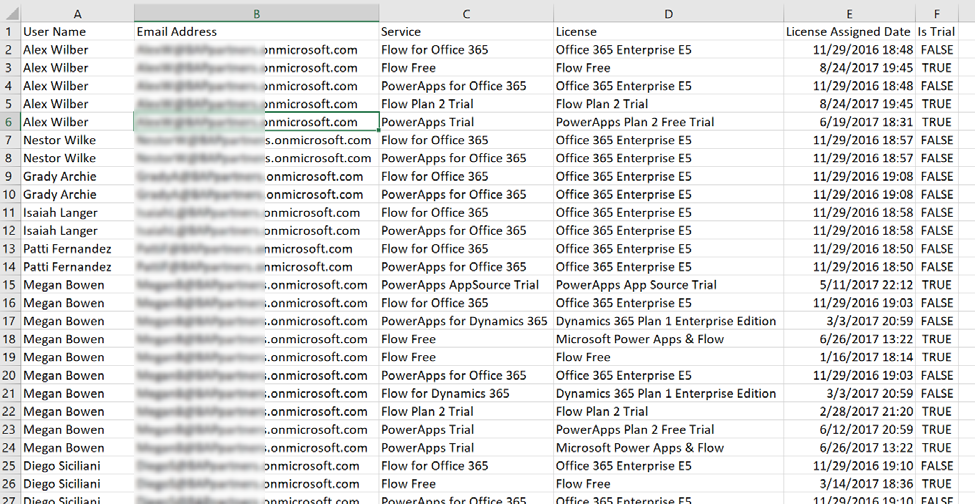

# About licensing and license management

[!INCLUDE [cc-beta-prerelease-disclaimer](../includes/cc-beta-prerelease-disclaimer.md)]

Organizations can obtain licenses by either licensing Microsoft PowerApps or
Flow specifically or by it being included in the license of another Microsoft
cloud service offering. For example, both Office 365 and Dynamics 365 provide
entitlements for PowerApps and Microsoft Flow. As with most Microsoft licensing,
you can mix and match for users as appropriate giving some additional
entitlements.

In the rest of this section we will highlight some of the key implications and
scenarios related to licensing, but it is not the product licensing
documentation, you should consult that for any of the latest details. Pricing
and specific plan details for PowerApps and Flow can be found in the 
[licensing guide](https://go.microsoft.com/fwlink/?linkid=2085130).

## Use of connectors

PowerApps and Microsoft Flow use connectors to interact with services. Connectors can be
standard, premium or custom. To use premium connectors users must be licensed
with Standalone PowerApps or Microsoft Flow licenses.

## Trial Plans

Trial plans are available for both PowerApps and Microsoft Flow. Free trials
last 30 days for PowerApps and 90 days for Microsoft Flow plans. Users can
self-service sign up for these trials in your organization. This can be done by
explicitly visiting the pricing pages or by being prompted when they attempt an
action in the apps that require additional licensing.

For Microsoft Flow, an unlicensed user that signs in to flow.microsoft.com will
be setup with the free Flow plan. If later they try to perform an action like
sharing a Flow, they will be prompted to sign up for a trial. In this example,
if the user accepted the offer for trial they would be signed up for a Flow
trial. This trial would not show up under the user licenses in the Office 365
Portal, however you would be able to see it in the PowerApps license report
discussed later in this security section.

For PowerApps, if a user signs up for a PowerApps trial they will get a
PowerApps per user trial if needed for any of the actions they take such as
creating an environment.

As the administrator, you will likely be assisting users that had started in a
trial and either want to continue experimenting or are ready to get a regular
license to keep working with the app they are building. If you are moving to a
regular license for a user, it would also be a good time to work with them to
see if their app should stay where it was built or should be moved according to
the environment strategy you adopt. For those not ready to get a full license
but want to keep experimenting you could help them get setup on the community
plan and help them move their application and flow assets into their new
developer environment.

## PowerApps Community Plan

In addition to the trial plans, there is also a free PowerApps Community Plan.
This is a special plan that allows individual self-service sign up and it
provides an individual environment that the user can use to build apps and
flows. These environments will show up on the administrator’s list of
environments and will list the type of environment as “Developer”. The
environments are for individual use, so there is no ability to share with other
users. Users in your organization can self-service signup for this plan even if
they have PowerApps and Flow license entitlements via another licensing plan.
Signup for the community plan can be found
here <https://powerapps.microsoft.com/communityplan/> and more details on its
features here <https://docs.microsoft.com/powerapps/maker/dev-community-plan>

## What users are licensed

You can always look at individual user licensing in the Microsoft 365 admin
center by drilling into specific users. From the PowerApps administration center
you can also produce a report focused on PowerApps licenses. This is one of the
steps we recommend you do right away as a new administrator trying to understand
your current licensing.

You can download the report from [admin.powerapps.com](https://admin.powerapps.com) -\> **Tenant** -\> **User
Licensing**

> [!div class="mx-imgBorder"] 
> 

The report is an Excel workbook that once downloaded you can use all of Excel’s
features to filter the data to what you are looking for. The following is an
example of the downloaded workbook.

> [!div class="mx-imgBorder"] 
> 

