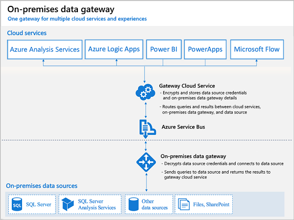

# Preview: About On-premises gateway

[!INCLUDE [cc-beta-prerelease-disclaimer](../includes/cc-beta-prerelease-disclaimer.md)]

The on-premises gateway allows Power Apps and Power Automate to reach back to on-premise resources to support hybrid integration scenarios. The gateway leverages Azure Service Bus relay technology to security allow access to on-premise resources.

> [!div class="mx-imgBorder"] 
> 

## Gateway On-premise Install

The gateway service must run on a local server in your on-premise location. The server does not have to be the same one as the resources it will proxy access to, however it should be on the same local network to reduce latency. It does however need to be able to access the target resource with as low of latency as possible. Multiple application and flow connections can use the same gateway install. You can only install one gateway on a server.

During the install the gateway is setup to use NT Service\PBIEgwService for the Windows service logon. You can switch this to a domain user or managed service account if you’d like.

## Gateway Administration Access

By default, you have this permission on any gateway that you install. As the administrator you can grant another users permission to co-administrate the gateway. It is recommended you always have multiple administrators specified to handle employee events in your organization.

## Use of stored credentials

When you setup a data source on the gateway you will need to provide credentials for that data source. All actions to that data source will run using these credentials. Credentials are encrypted securely, using asymmetric encryption before they are stored in the cloud. The credentials are sent to the machine, running the gateway on-premises, where they are decrypted when the data source is accessed.

## Port Usage

The gateway service creates an outbound connection to Azure Service Bus so there are no inbound ports required to be open. The outbound connection communicates on ports: TCP 443(default), 5671, 5672 9350 through 9354.

It is recommended that you whitelist the IP addresses for the data region in your firewall. You can download the latest list here https://www.microsoft.com/download/details.aspx?id=41653 These IP addresses are used for outbound communication with Azure Service Bus.

## Gateway Access

Most of the Power Apps and Power Automate licenses have access to use the gateway with the exception of some of the lower end Office 365 licenses (Business and Office Enterprise E1 SKUs).

## Updates to the Data Gateway

Updates are not auto-installed for the On-premises data gateway. It is highly encouraged to remain current with the latest data gateway version as the updates to the gateway is are released on a monthly basis.

## Gateway Disaster Recovery

A recovery key is assigned (i.e., not auto-generated) by the administrator at the time the On-Premises Data Gateway is installed. The recovery key is required if the gateway is to be relocated to another machine, or if the gateway is to be restored. Therefore, the key should be retained where other system administrators can locate it if necessary.

### See also
[On-premises data gateway](https://docs.microsoft.com/power-bi/service-gateway-onprem)