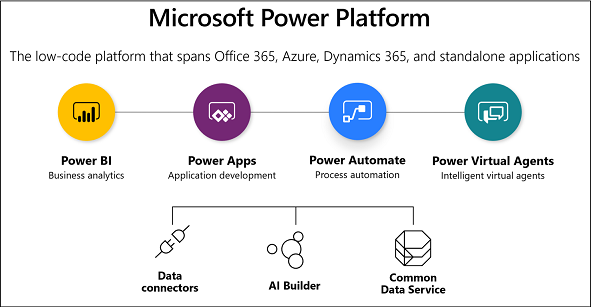

# Power Apps overview

Power Apps is part of Microsoft Power Platform that also includes Power BI and Power Automate, leveraging the common infrastructure of Common Data Service and data connectors. These capabilities are built on and leverage Microsoft Azure cloud services. Applications built using Power Apps can also include Azure cloud services to scale from individual productivity to enterprise mission critical line of business applications.

Power Apps includes several key concepts/components:

|Component  |Description  |
|---------|---------|
|Power Apps applications     |These are the applications that users interact with on their desktop or mobile devices. There are two styles of applications; canvas and model-driven. Canvas applications can also be embedded into SharePoint, Teams, Power BI and model-driven apps in Dynamics 365 (such as Dynamics 365 Sales and Customer Service).         |
|Power Automate    | Automated workflows that orchestrate across services using connectors. Flows can be triggered to run when events occur in other systems and services or scheduled to run at a specific time. Users can also interact with flows in the mobile app by pressing virtual buttons.        |
|Common Data Service    |A cloud scale datastore to manage data used by business applications. Data is stored within a set of entities. An initial schema is defined by the Common Data Model. Common Data Service provides built-in capabilities for business rules, workflows, calculated and rollup fields and more.         |
|Common Data Model     | An open-sourced definition of standard entities that represent commonly used concepts and activities. Every Common Data Service database starts with the entities defined as “core”. Application builders can add their own custom entities to support specific business scenarios.        |
|Connectors     | There are 200+ connectors that make it easy for application builders to connect to both Microsoft and 3rd party services, from model-driven apps in Dynamics 365 to Dropbox. The connectors allow Canvas Apps and flows to easily use API (application programming interfaces) services without any developer knowledge. Custom connectors can also be configured to allow use of APIs that aren’t covered by the public connectors.        |
|On-premises Gateways     | On-premises gateway allows Power Apps and Power Automate to connect to on-premises resources to support hybrid integration scenarios. The gateway leverages Azure Service Bus relay technology to security allow access to on-premise resources.        |

## Usage Scenarios

Power Apps can be utilized in several different types of scenarios:

### Individual/Team Productivity Applications

With self-service scenarios, users are empowered to take their own ideas of how they can optimize what they do every day and express them in the form of a Power Apps app or Power Automate automation. These assets can be shared with other team members and when successful promoted to be broader enterprise assets. Previously, these scenarios were out of reach and required high cost development resources to succeed. As an enterprise administrator your role is to put in place the guard rails to foster a healthy individual productivity while at the same time safeguarding sensitive business data and ensuring continuity when individuals leave your company.

### Model-driven apps in Dynamics 365

These 1st party model-driven apps, such as Dynamics 365 Sales and Dynamics 365 Customer Service, are built on and therefore deployed into Power Apps environments and utilize the Common Data Service for data storage and core platform services. These applications are the quickest way to tackle common business scenarios like customer engagement, while still allowing tailoring to your company’s individual requirements. Custom apps and flows can be built to embed into or extend model-driven apps in Dynamics 365 even further.

### Apps from AppSource

In addition to Microsoft built apps, 3rd party ISVs can also build on top of the Power Apps platform and are found via the AppSource marketplace. These apps can install into your existing environments or into their own depending on your unique needs.

### SharePoint, Outlook, Teams and Excel

Power Apps apps can also be embedded into the applications users already use. Often this increases user adoption because they don’t have to learn a totally new application from what they are already using. Power Apps is now the primary way to customize SharePoint Online list forms. In the past, this required higher maintenance developer code to accomplish. As an administrator you will be enabling these experiences and ensuring users have the right permissions and policies to interact with the applications.

### Mission critical line of business applications

Using the same tools and technique Microsoft uses to build model-driven apps in Dynamics 365, enterprise customers can build their own line of business applications. These differ from the individual productivity scenario above in that they often solve broader more complex problems. These applications are also often built by dedicated teams tasked with implementing them. The teams typically follow a more defined process for building the application. As an enterprise administrator you will be helping them put in place the necessary Application Lifecycle Management (ALM) to facilitate development and day to day operations.

These are the key scenarios you will encounter, but not an endless list as it is really up to the capabilities and the creativity of your organization to determine how it leverages the platform. As an enterprise administrator, you can choose to either be a blocking force in the way of that creativity, or an enabler. As an enabler, you will put in place the necessary licensing, policies and processes needed to ensure success of the teams.
