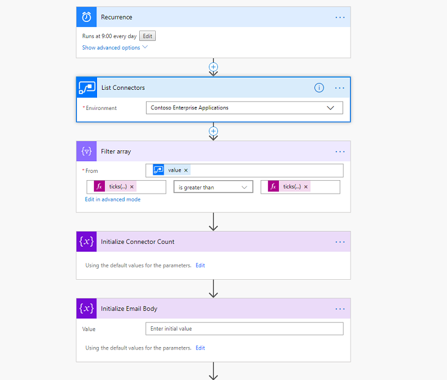

# Automation of tasks with Flow

[!INCLUDE [cc-beta-prerelease-disclaimer](../includes/cc-beta-prerelease-disclaimer.md)]

One of the unique things about Microsoft Flow is you can use it to manage itself along with other parts of the Microsoft Power platform. The following connectors can be helpful to automate administrator tasks with Microsoft Flow.

|Connector  |Possible uses  |
|---------|---------|
|Flow management connector  https://docs.microsoft.com/en-us/connectors/flowmanagement/     |Can be used to automate working with Flows including getting lists of new flows or connectors in your environments.         |
|Office 365 Users connector  https://docs.microsoft.com/en-us/connectors/office365users/     |Useful for automating actions around users. For example, you could use the connector to get the manager of a user that owns an environment to be able to send them an e-mail for approval.         |
|Approval connector  https://docs.microsoft.com/en-us/connectors/approvals/     | Often administrators need to get approvals and Flow offers a rich approval set of tasks you can automate this process.        |
|Microsoft Forms  https://docs.microsoft.com/en-us/connectors/microsoftforms/     | Forms is an easy way to collect information to start an admin task. This can be combined with the Approval connector to get manager approval.        |
|Azure AD connector  https://docs.microsoft.com/en-us/connectors/azuread/     |Useful to perform tasks such as adding a user to a group or even creating the group.         |

## Common Flow tasks

daily on schedule, and uses the Flow Management connector to get a list of the connection in the environment and sends you an e-mail. You can add it to your flows quickly using the template https://us.flow.microsoft.com/en-us/galleries/public/templates/5a6ef26db3b749ed88b7afb377d11ecf/list-new-microsoft-flow-connectors/

> [!div class="mx-imgBorder"] 
> 

If you want to try building it yourself, there is a good walkthrough of creating the flow from scratch here: https://flow.microsoft.com/en-us/blog/new-flow-connector-notifications/

