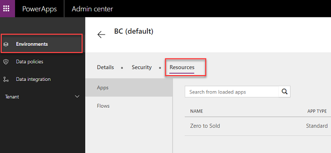

# Working with the admin portals

In a perfect world as an administrator you would only visit a single portal to perform all your administrative tasks but given the scope and breadth of the different products involved and their differing release cycles, there are multiple portals with which you will interact. The following outlines the different portals and the most common tasks you perform there.

|Portal  |Common Tasks  |
|---------|---------|
|Power Platform Admin center  https://admin.powerplatform.microsoft.com     |The new unified administrative portal for Power Platform admins. Currently this portal can be used for Common Data Service environment Management, to submit Dynamics 365 and Microsoft Power Automate focused support tickets, and to view Power Apps and Power Automate admin analytics. Over time the following admin experience will be migrated and replaced by the [Power Platform Admin center](https://admin.powerplatform.microsoft.com/):  <ol><li>Power Apps Admin Portal</li> <li>Power Automate Admin Portal</li><li>Business platform admin center</li> <li>Dynamics 365 admin center</li> </ol>   |
|Power Apps Admin Portal  https://admin.powerapps.com     |Creating and managing environments including security starts here. Within each environment you can manage the apps and flows. Monitoring to see who is licensed and building things. Managing Data Loss Prevention Policies. Manage Common Data Service Data Integration projects. Over time this will migrated & replaced by the [Power Platform Admin center](https://admin.powerplatform.microsoft.com/).         |
|Power Apps Maker Portal  https://web.powerapps.com     |This portal is focused on building Power Apps but can also view and manage Common Data Service components, manage connectors and gateways. You can also see application statistics from details on apps here.         |
|Power Automate Admin Portal https://admin.flow.microsoft.com     |This points to the same site as admin.powerapps.com. Over time this will migrated & replaced by the [Power Platform Admin center](https://admin.powerplatform.microsoft.com/).         |
|Business platform admin center  https://admin. businessplatform.microsoft.com     |This points to the same site as admin.powerapps.com. Over time this will migrated & replaced by the [Power Platform Admin center](https://admin.powerplatform.microsoft.com/).        |
|Dynamics 365 admin center https://port.crm. dynamics.com/G/manage/index.aspx     |The Dynamics 365 admin center, that can be leveraged to perform certain Common Data Service Environment management activities like renaming, deleting, and resetting.         |
|Environment Management  https://port.crm<N>.dynamics.com /G/Instances/InstancePicker.aspx     |This environment management portal is reached from admin.powerapps.com when managing the Common Data Service database or from the Dynamics 365 admin center. Here you will see a list of all the Common Data Service databases and can perform actions such as backup, as well as other actions on a per environment basis.         |
|Microsoft 365 admin center  https://admin.microsoft.com/AdminPortal     |Here you will manage users and their license assignment as well as you can launch into many of the individual admin centers from here.         |
|Microsoft Azure https://portal.azure.com     |Advanced Azure AD management tasks like conditional access is managed here. Also if you support any developer application registration it is also done here. This is also where you start setup of your on-premises gateways.         |
|Security & Compliance Center https://protection.office.com     |In addition to the general compliance tasks, administrators can come here to search the Audit log to see Power Automate audit events         |

Over the near-term future we will see consolidation of the Power Apps, Power Automate, and the Dynamics 365 administration portals into a more unified administrative portal experience.
For partners helping their customers manage their cloud services using delegated administration capabilities you will not be able to use delegated access to the Power Apps and Power Automate portals. Currently, you would need to have a user in the customers tenant and assign that user a Power Apps plan.

## Common portal tasks

**Managing flows and applications in an environment**

> [!div class="mx-imgBorder"] 
> 

**View application analytics**

> [!div class="mx-imgBorder"] 
> 

View Power Automate Analytics can be found from drilling down from the list of flows.

> [!div class="mx-imgBorder"] 
> 

From here you will see the following details for that specific flow.

> [!div class="mx-imgBorder"] 
> 

