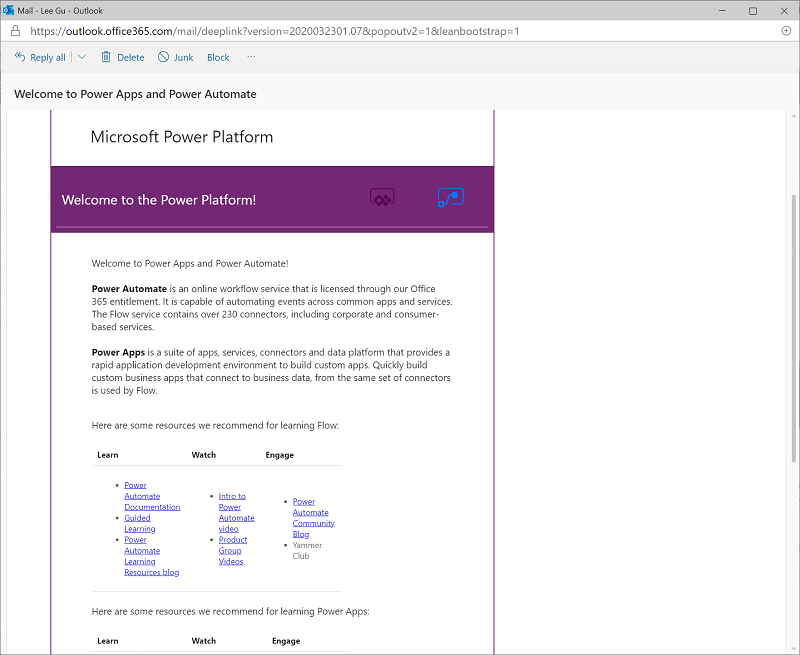

# Use nurture components

An essential part of establishing a CoE is nurturing your makers and an internal community. You will want to share best practices and templates and onboard new makers – the assets in this solution can help develop a strategy for this motion.  

The Nurture Components solution contains assets relevant to everyone in the organization: admins, makers, as well as end users of apps and flows.

Learn how to [set up the nurture components](setup-nurture-components.md).

Here's a breakdown of the assets that form the Nurture components:

1. **Onboard new makers, provide training and share best practices**
    1. [Admin | Welcome Email (Flow)](#flows)
    1. [Template Catalog (Canvas App)](#apps)
    1. [Admin | Newsletter with Product Updates (Flow)](#flows)
    1. [Training in a day Management and Registration (Canvas Apps)](#apps)
    1. [Training in a day Feedback Reminder, Registration Confirmation and Reminder (Flow)](#flows)
1. **Encourage Adoption**
    1. [App Catalog (Canvas App)](#apps)

## Entities

- **InADayAttendees** Represents attendees that have registered for a Training in a Day course using the Training in a Day registration canvas app
- **InADayEvent** Represents avaialbe training events created through the Training in a Day management canvas app

## Flows

### Admin \| Welcome Email

Sends an email to a user who created a Power App, Flow, Custom Connector or Environment. This flow gets triggered when a new record is created in the Maker table.  

You can customize the email sent out by the Flow, by default it will look like the following:

### Admin \| Newsletter with Product Updates

Sends a weekly email with a summary of product updates, consisting of blog posts from the Power Apps / Power Automate / Power BI product blogs and the Power Apps Community blog  

### Training In A Day \| Feedback Reminder

Sends an email to attendees of a training event on the day and requests feedback

### Training In A Day \| Registration Confirmation

Sends an email to an attendee when they register for a training in a day event

### Training In A Day \| Reminder 3 days prior to event

Sends a reminder email to an attendee of a training in a day event 3 days prior to the event  

:::row:::
   :::column span="":::
      
   :::column-end:::
   :::column span="":::
      
   :::column-end:::
:::row-end:::

## Apps

### App Catalog

A Canvas app that gives visibility to certain apps to the organization. Admins can choose which apps to highlight in the app catalog if the app meets admin requirements and is meant to be shared broadly.

When you first open the App Catalog, you will not see any apps there at first. There is a field on the Power Apps App entity called *In App Catalog*, which is a two-option set type field (aka Boolean). If the value is set to *Yes*, the app will show up in the catalog. Following the [Compliance Business Process](example-processes.md) in the Admin app will allow you to publish an app to the App Catalog.

**Permission**: Once you are using this process, the App Catalog can be shared with the entire organization.

**Pre-Requisite**: This app uses CDS; a Premium license is therefore required for every app user.

### Template Catalog

Canvas app that allows CoE Admins to share app and component templates as well as best practice documents with their makers.

**Permission**: Once you have content ready, the Template Catalog can be shared with the entire organization.

**Pre-Requisite**: This app is using SharePoint in the background and requires a SharePoint site to be configured. This is described under [setup nurture components](setup-nurture-components.md)).

This app cannot be tested out in the managed solution; it can only be tested and used once you've [imported it into your extended unmanaged solution](modify-components.md)). This is due to some limitations in the environment variables and data sources in the canvas apps.

Learn how to set up the template catalog: [Extend, customize and modify components](modify-components.md).

#### Training In A Day – Management

If you are planning to run an internal training in a day event (such as App in a Day), this
canvas app will enable you to create and manage events.

**Permission**: Share with CoE Admins or the owners of your internal training
events.

**Pre-Requisite**: This app uses CDS; a Premium license is therefore required for the admins who are using it.

#### Training In A Day – Registration

If you are planning to run training in a day event (such as App in a Day, this canvas app will enable your end users to register for upcoming events.

**Permission**: Once you are running internal training events, share with everyone in the organization.

**Pre-Requisite**: This app uses CDS; a Premium license is therefore required for everyone in your org.

