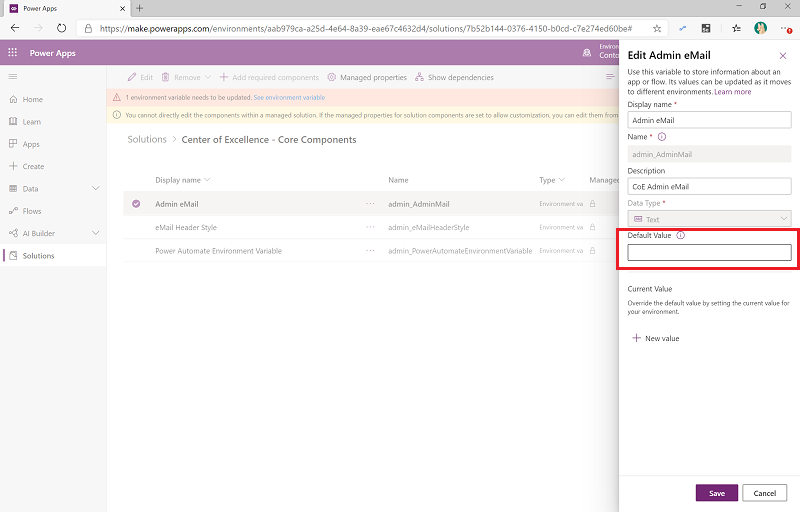
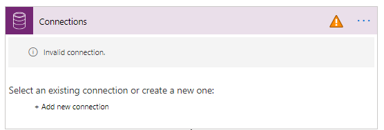
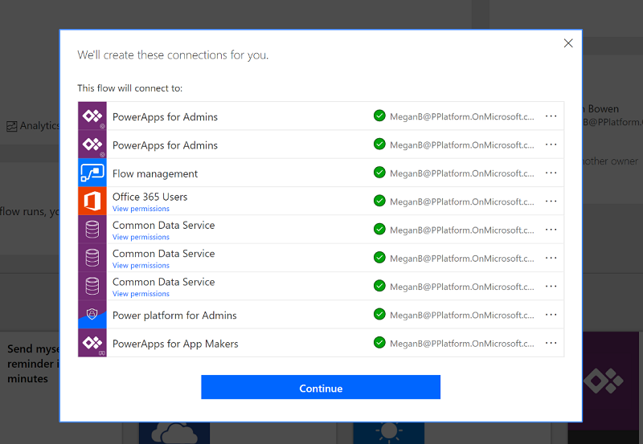

# Set up core components

The Center of Excellence (CoE) Core Components solution provides components that you need to get started with setting up a CoE. They sync all your resources into entities and build admin apps on top of that to help you get more visibility into the apps, flows, and makers that exist in your environment. Additionally, apps like the DLP Editor and Set New App Owner help with daily admin tasks.  

The Core Components solution contains assets that are only relevant to admins.

## Import the solution

This is the first step of the installation process and is required for every other component in the starter kit to work. You'll need to create an environment in which to set up the CoE. More information about how to decide on the best strategy for your organization: [Establishing an Environment Strategy for Microsoft Power Platform](https://powerapps.microsoft.com/blog/establishing-an-environment-strategy-for-microsoft-power-platform/) and [Application lifecycle management](https://docs.microsoft.com/power-platform/admin/wp-application-lifecycle-management)

1. Download the CoE Starter Kit compressed file ([aka.ms/CoeStarterKitDownload](https://aka.ms/CoeStarterKitDownload)), and extract the zip file.

1. Create an environment in which to set up the CoE.

   1. Go to [aka.ms/ppac](https://admin.powerplatform.microsoft.com/).
   1. Select **Environments** > **+ New**, and then fill in a name, type, and purpose.
   1. Select **Yes** for creating the database, and then select **Next**.
   1. Leave sample apps and data set to **No**, and then select a security group who can view this environment. Then select **Save**.

1. Go to your new environment.

    1. Go to [make.powerapps.com](<https://make.powerapps.com>)
    1. Go to the environment you just created, in which the CoE solution will be hosted. In the example in the following screenshot, we're importing to the environment named **Contoso CoE**.

     

1. Select **Solutions** on the left navigation bar.

1. Select **Import**. A pop-up window appears. (If the window doesn't appear, be sure your browser's pop-up blocker is disabled and try again.)

1. In the pop-up window, select **Choose File**.

1. Choose the **Center Of Excellence Core Components** solution from the file explorer (CenterOfExcellenceCoreComponents_x_x_x_xx_managed.zip).

1. When the compressed (.zip) file has been loaded, select **Next**.

1. Select **Next**, then select **Import**. (This can take some time.)

1. When the import succeeds, the list of the components that were imported is displayed.

1. Select **Close**.

1. On the **Solutions** page, select **Publish All Customizations**. This is a good practice to follow whenever you make changes to a solution, but especially so when importing.

>[!NOTE]
>When importing the solution, sometimes Power Automate components show a warning of type *Process Activation* and a duplicate record of that component. You can ignore these warnings for flows.

## Configure the CoE Settings entity

This section explains how to enter data in the CoE Settings entity, which is included in the Common Data Service instance from step 2, above.

This entity will hold a single row of information which contains your logo, brand colors, and so on, which different applications will reference.

The following assets depend on the CoE Settings entity:

- **Canvas apps**: The optional branding details (logo, brand colors) in all the canvas apps are pulled from this entity. Optional support and community channel links are also used.
- **Optional flows**: The optional branding details and support channel links are used in the communication flows. You'll also configure links to the canvas apps in the settings. (The main flow that syncs data to the resource entities doesn't depend on this setting configuration.)

1. Go to [make.powerapps.com](https://make.powerapps.com/), select **Apps**, and open the Power Platform Admin View model-driven app in Play mode.

1. In the left navigation, select **Configure**.

1. In the **Configure view** screen, select **+ New** to create a new record.

1. Provide values as listed in the following table.

1. Select **Save**.

1. Don't add more records to the CoE Settings table; there's no need. The dependent components will always get values from the first record.

| Name | Setting value |
|------|------------|
| Brand Logo | Link to your logo as an image file |
| Brand Primary Color          | Hexadecimal value of your primary brand color (\#CCCCC)
| Brand Secondary Color        | Hexadecimal value of your secondary brand color (\#DDDDDD)                                                    |
| Email End User Support       | Email address for your helpdesk or user computing support team                                        |
| Email Maker Support          | Email address for your Power Platform maker support team                                              |
| Link to Community Channel    | Link to your internal Power Platform community (for example, Yammer, Teams)                            |
Link to Learning Resource    | Link to internal Power Platform learning resources, or you might link to aka.ms/PowerUp    |
Link to Policy Documentation | Link to internal Power Platform policies; for example, a Teams channel or SharePoint site |
Version                      | Set to 1.0                                                                                            |
Company Name                 | Your company name as it will appear in dashboards |

## Update environment variables

The environment variables are used to store application and flow configuration data with data specific to your organization or environment. This means that you only have to set the value once and it will be used in all necessary flows and apps.

All of the sync flows depend on all environment variables' being configured.

After importing the solution, you may see an error at the top, notifying you that environment variables need to be configured. For the Core Components solution, three environment variables need to be configured. The following screenshot shows an example of what the error message will look like.

 

>[!TIP]
>To view all Environment Variables in the Environment, open the Default Solution for the Environment, and filter to Type Environment Variable

- Select a variable, and then configure its **Default Value**.

   

    Configure the following variables for the Core Components solution, and then select **Save**.

    | Name | Default Value |
    |------|---------------|
    |Power Automate Environment Variable | For a US environment: <https://us.flow.microsoft.com/manage/environments/>  For an EMEA environment: <https://emea.flow.microsoft.com/manage/environments/>  For a GCC environment: <https://gov.flow.microsoft.us/manage/environments/> |
    |Admin eMail                         | Email address used in flows to send notifications to admins; this should be either your email address or a distribution list |
    |eMail Header Style                  | CSS style used to format emails that are sent to admins and makers. A default value is provided.

## Activate the Sync Template flows

The flows with the prefix *Sync* are required for populating data in the resource-elated Common Data Service entities (Environments, Power Apps Apps, Flows, Connectors, and Makers).

The sync flows are used to write data from the admin connectors into the Common Data Service entities. None of the other components will work if the sync flows aren't successfully configured and run.

The following flows are required to sync data to the resource entities:

-  **Admin \| Sync Template v2**  
    Flow type: Scheduled (daily by default)  
    Description: This flow syncs environment details to the CoE Common Data Service entity, Environments.

-  **Admin \| Sync Template v2 (apps, custom connectors, flows, model-driven apps)**  
    Flow type: Automated  
    Description: These flows rely on the _Admin \| Sync Template v2_ flow and are triggered automatically when environment details are created or modified in the CoE Common Data Service Environments entity. These flows then crawl environment resources and store data in the PowerApps App, Flow, Connection Reference, and Maker entities.

1. **Admin \| Sync Template v2 (Connectors)**  
    Flow type: Scheduled (daily by default)  
    Description: This flow stores all connector information in the Common Data Service PowerApps Connector entity.

1. **Admin \| Sync Template v2 (Sync Flow Errors)**  
    Flow type: Scheduled (daily by default)  
    Description: If any of the sync flows fail, the failure is stored in the Common Data Service Sync Flow Errors entity. This scheduled flow sends a report of failures to the admin.

The flows are all part of the solution. There are two options to consider for activation of the flows. Option 1 takes longer to configure than option 2, but it's easier to receive updates with option 1.

### Option 1: Keep the flow in the solution, and update each action connection

Use this option if you'd like to continue receiving updates to the flow through this solution. This takes longer to set up because the connections for each action need to be individually configured.

1. Go to the *Center of Excellence - Core Components* solution.

    1. Go to [make.powerapps.com](https://make.powerapps.com), and set the current environment to the same environment where the CoE solution is installed.

    1. In the left navigation, select **Solutions**, and then select the **Center of Excellence - Core Components** solution.

1. Select the flow name (all flows starting with *Admin | Sync Template v2*) to get to the flow details screen, and then select **Edit**.

    

1. The flow will open in the maker studio. For each action that requires a connection, there will be a warning icon on the right side of the action. This indicates the need for a connection to be selected.

    
  
1. Update all the connections. If you see an error message when you select **Save**, that means that more connections still need to be made; these are likely hidden in conditional nodes.

    - Some connections will need to be created, if they aren't already available.

    - Some actions might be hidden within other built-in actions, such as a condition or scope. Expand those actions to find the hidden ones.

    - We suggest you start at the top of the flow and work down step by step, opening each step as you go, until you find them all.

1. After all actions have a connection, select **Save**.

1. Repeat the above steps for *Admin \| Sync Template v2 – Apps, Connectors, Custom Connectors, Flows, Model Driven Apps and Sync Flow Errors*.

1. Ensure that the flows are turned on.

1. Trigger the sync flows to populate your data.

    - Select **Admin \| Sync Template v2**. This will open a new tab to the flow details page.

    - Select **Run**.

### Option 2: Save a copy of the flows outside of the solution

If you save a copy of the flows from the solution, the connections are created automatically for you. The drawback of this method is that if you copy the flows from the solution, the copied flows don't get updated when you update the solution package to newer versions. You'll have to import the new solution and copy the flows again to upgrade them to the latest version.

1. Go to the *Center of Excellence - Core Components* solution.

    1. Go to [make.powerapps.com](https://make.powerapps.com), and set the current environment to the same environment where the CoE solution is installed.

    1. In the left navigation, select **Solutions**, and then select **Center of Excellence - Core Components**.

1. Select the flow you want to copy, to go to the flow details page.

1. Select **Save As**.

   

1. A pop-up window appears with the message, "We'll create these connections for you." Select **Continue**.

   

1. Rename the copy if you want, and then select **Save**.

1. At this point, the copy has been created. You can now view the flow in the **My Flows** page in the left navigation. Remember that the copy of the flow will *not* be visible in the Center of Excellence – Core Components solution.

1. Repeat the above steps for *Admin \| Sync Template v2 – Apps, Connectors, Custom Connectors, Flows, Model Driven Apps and Sync Flow Errors*.

1. Turn each flow on.

    1. Select each flow.

    1. This will open a new tab to the flow details page.

    1. Select **Turn On**.

1. Trigger the sync flows to populate your data.

    1. Select **Copy of Admin \| Sync Template v2**. This will open a new tab to the flow details page.

    1. Select **Run**.

## Set up Audit Log sync

The Audit Log sync flow connects to the Office 365 Audit Log to gather telemetry data (unique users, launches) for apps. The CoE Starter Kit will work without this flow; however, usage information (app launches, unique users) in the Power BI dashboard will be blank.

More information: [Set up the Audit Log connector](setup-auditlog.md)

## Set up the Power BI dashboard

The CoE Power BI dashboard provides a holistic view with visualizations and insights into resources in your tenant: environments, apps, Power Automate flows, connectors, connection references, makers, and audit logs. Telemetry from the audit log is stored from the moment you set up the CoE Starter Kit, so over time you can look back and identify trends for longer than 28 days.

More information: [Set up the Power BI dashboard](setup-powerbi.md)

## Share apps with other admins

The Core Components solution doesn't contain any apps for makers or users, only admin-specific apps. These components are designed to give admins better visibility and overview of resources and usage in their environments. None of the components are to be shared with makers or users.

The user account who uploaded the solution, and the environment admin of the environment the solution exists in, will have full access to the solution; however, you might want to share these apps with specific other users. More information: [Share a canvas app in Power Apps](https://docs.microsoft.com/powerapps/maker/canvas-apps/share-app)

## Wait for flows to finish

After the sync flows have finished running (depending on the number of environments and resources, this can take a few hours), you're ready to use the core components of the CoE Starter Kit.

**To check the status of a flow**

1. Select **Admin \| Sync Template v2**.

   This will open a new tab to the **Flow detail** page.

1. View **Runs**.
