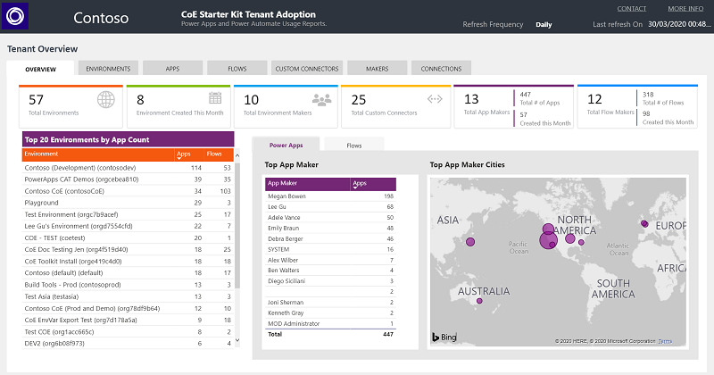
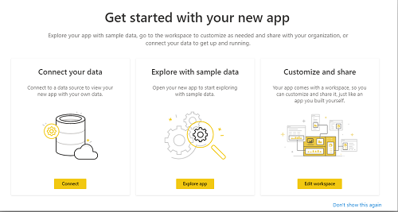

# Set up Power BI Dashboard

The Power BI Dashboard provides a holistic view with visualizations and insights into resources in your tenant: environments, apps, Power Automate flows, connectors, connection references, makers and audit logs. Telemetry from the audit log is stored from the moment you set up the CoE Starter Kit, so over time you can look back and identify trends.

You can either get the CoE Power BI Dashboard from AppSource or download the Power BI file and configure it in Power BI Desktop, which would allow you to make changes to it. Both options are described below - and both require you to get the Environment URL first.

## Get the Environment URL

You need the environment URL of the Power Platform environment the CoE Starter Kit is installed in. Power BI will connect to the Common Data Service entities in that environment.

1. Go to the [Power Platform Admin Center](https://aka.ms/ppac).
1. Select **Environments**, and select the Environment where the Center of Excellence solution is installed.
1. Copy the organization URL in the details window.   
1. If the URL is cut off, you can see the full URL by selecting **See all \> Environment URL**. 

## Option 1: Get the Power BI Dashboard from App source

> [!NOTE]
> You can't deploy from AppSource if you're deploying to the government cloud (GCC). If you're using GCC, please use the [Configure the Power BI Dashboard using the pbix file](#option-2-configure-the-power-bi-dashboard-using-the-pbix-file) instructions below.

1. A prerequisite is to have the [CoE Core Components Solution](setup-core-components.md) installed.

1. Navigate to the [CoE Starter Kit page on App Source](https://appsource.microsoft.com/product/power-bi/powerapps_pbi.powerapps_coe).

1. Select **Get It Now**  

1. Accept the Terms & Conditions and make sure you have signed in by using your organization account.

1. Wait for the app to be installed.

1. After the app installation is finished, select **Go to app**.  

1. To connect the dashboard to your own environment and data, select **Connect**  

1. Copy and paste the URL you retrieved in *Step 1 Get the Environment URL* (section above) under **EnvironmentUrl** and select **Next** 

1. Confirm your login to finish setting up the app.

The Dashboard app will appear under the **Reports** tab of your workspace and can be opened from there.

## Option 2: Configure the Power BI Dashboard using the pbix file

You can also configure and modify the Power BI Dashboard by working directly with the Power BI (pbix) file and the Power BI Desktop client. This gives you more flexibility in terms of modifying the dashboard to your own branding and include/exclude pages or visuals you want to see in the dashboard.

1. Open the **PowerPlatformAdminDashboard.pbix** file with Power BI Desktop client, which can be found in the CoE Starter Kit pack you downloaded from [aka.ms/CoeStarterKitDownload](https://aka.ms/CoEStarterKitDownload)

1. Sign in to the Power BI Desktop Client with your organization account that has access to the environment you have installed the CoE Starter Kit in.

1. Go to **Transform Data** in the **Home** ribbon.  

1. Select the **OrgUrl** parameter and replace the URL with your instance's URL. Make sure to keep the 'https://'.  

1. Select **Close & Apply**. Your data will now load, and the dashboard will update.

1. Select **Publish** and choose the workspace you want to publish the report to.

1. You can find the report later by navigating to [app.powerbi.com](https://app.powerbi.com/)
