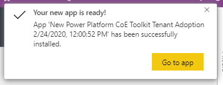
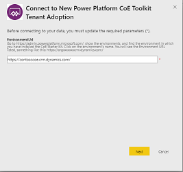

# Set up the Power BI dashboard

The Power BI dashboard provides a holistic view with visualizations and insights into resources in your tenant: environments, apps, Power Automate flows, connectors, connection references, makers and audit logs. Telemetry from the audit log is stored from the moment you set up the Center of Excellence (CoE) Starter Kit, so over time you can look back and identify trends.

You can either get the CoE Power BI dashboard from AppSource or download the Power BI file and configure it in Power BI Desktop, which will allow you to make changes to it. Both options are described below; both options require you to get the environment URL first.

## Get the environment URL

You need the environment URL of the Power Platform environment the CoE Starter Kit is installed in. Power BI will connect to the Common Data Service entities in that environment.

1. Go to the [Power Platform admin center](https://aka.ms/ppac).

1. Select **Environments**, and select the environment where the CoE solution is installed.

1. Copy the organization URL in the details window.

   

   If the URL is truncated, you can see the full URL by selecting **See all** > **Environment URL**.

   

## Option 1: Get the Power BI dashboard from AppSource

> [!NOTE]
> You can't deploy from AppSource if you're deploying to the government cloud (GCC). If you're using GCC, please use the [Configure the Power BI Dashboard by using the .pbix file](#configure-by-using-pbix-file) instructions below.

Before performing this procedure, you must have installed the [CoE Core Components solution](setup-core-components.md).<!--Is this really necessary? You already got the environment URL, you couldn't have gotten it otherwise. And also, if this applies to Option 1, it should by rights be repeated in Option 2 (but I don't think it's necessary either place).-->

1. Go to the [CoE Starter Kit page on AppSource](https://appsource.microsoft.com/product/power-bi/powerapps_pbi.powerapps_coe).

1. Select **Get It Now**

   

1. Accept the terms and conditions, and make sure you have signed in by using your organization account.

1. Wait for the app to be installed.

1. After the app installation is finished, select **Go to app**.

   

1. To connect the dashboard to your own environment and data, select **Connect** 

   

1. Copy and paste the URL you retrieved in [Get the environment URL](#get-the-environment-url), above, and then select **Next**

   

1. Confirm your sign-in to finish setting up the app.

The dashboard app will appear under the **Reports** tab of your workspace, and can be opened from there.

## Option 2: Configure the Power BI dashboard by using the .pbix file

You can also configure and modify the Power BI dashboard by working directly with the Power BI (.pbix) file and the Power BI Desktop client. This gives you more flexibility in terms of modifying the dashboard to your own branding, and including (or excluding) pages or visuals you want to see (or not see) in the dashboard.

1. In the Power BI Desktop client, open the **PowerPlatformAdminDashboard.pbix** file, which can be found in the CoE Starter Kit you downloaded from [aka.ms/CoeStarterKitDownload](https://aka.ms/CoEStarterKitDownload).

1. Sign in to the Power BI Desktop client with your organization account that has access to the environment you installed the CoE Starter Kit in.

1. Go to **Transform Data** on the **Home** ribbon.

   

1. Select the **OrgUrl** parameter, and replace the URL with the URL of your instance. Be sure to keep the 'https://'.

   

1. Select **Close & Apply**. Your data will now load, and the dashboard will be updated.

1. Select **Publish**, and then choose the workspace you want to publish the report to.

You can find the report later by going to [app.powerbi.com](https://app.powerbi.com/).
