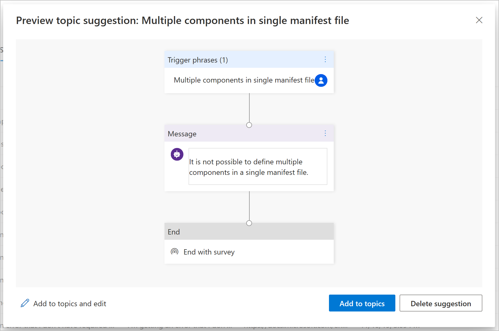
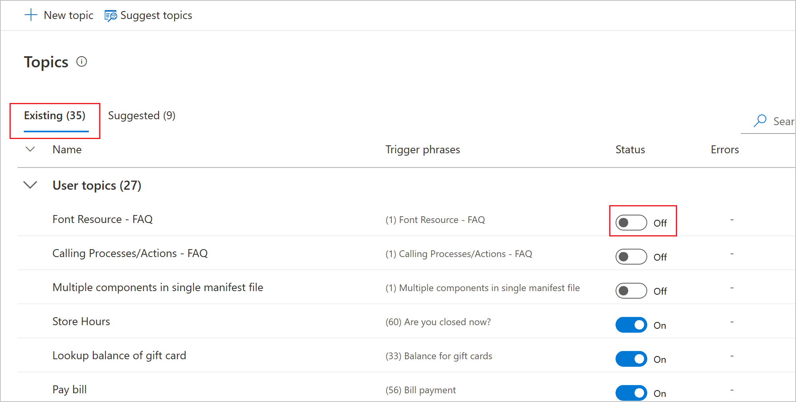

# Create topics from existing support content on the web

You can use content from existing webpages when creating a Power Virtual Agents bot. This <!--note from editor: Deleted "feature" here because you haven't described it yet, you're still setting up the scenario.-->is useful if you already have help or support content, such as FAQ pages or support sites. 

Rather than copying and pasting or manually re-creating this content, you can use AI-assisted authoring to automatically extract and insert relevant content from existing webpages into your bot.

This feature uses AI to determine the structure and content of a webpage. It isolates content blocks that pertain to single<!--"support"? SELF --> issues and classifies them into topics. The feature then identifies what the <!--note from editor: You don't need quotation marks because you're not using the terms in an unusual way.-->[**Trigger phrase** (question) and **Message** node (answer)](authoring-create-edit-topics.md) should be for each topic.

There are three main steps to using the feature: 

1. Use **Suggest topics** to extract content from FAQ or support pages.
2. Add the suggested topics to your bot.
3. Enable the topics.

You can [test the topics in the test chat](authoring-test-bot.md), but you'll need to [publish your bot for customers](publication-fundamentals-publish-channels.md) to see the latest changes.

>    
> [!VIDEO https://www.microsoft.com/en-us/videoplayer/embed/RE4mNOt]
>

## Extract content from webpages
<!--We've got a lot of terms for this feature ("tool," "suggestions extraction wizard," "Get topics wizard," "extraction wizard.") But it doesn't seem to be a named wizard in the UI (those are actually rare), and the Style Guide wants us to "focus on what the customer needs to do to accomplish the task." It looks to me like the thing in the UI that is "run" is the **Suggest topics** command. The edits to terminology below are suggested.-->
To get suggestions from webpages, you first need to extract suggestions for topics from the pages you want to use that contain support content.

After the extraction is complete, you'll be shown the suggested topics for further review. Suggested topics aren't automatically added to your bot, but you can [easily add them](#add-suggested-topics-to-an-existing-bot).

>[!IMPORTANT]
>The **Suggest topics** command is built to run on webpages that are in the form of FAQ pages or support sites. Other types of pages that don't have that structure might not work as expected.
<!--Style Guide says headings should have no end punctuation. It also recommends using an infinitive phrase for procedure headings, which I'd like to do below, but then it wouldn't match much of the other PVA content.-->
**To extract content from existing webpages**

<!--note from editor about this procedure: I moved the image of the empty Topics page up to follow step 3. I moved step 6 into step 5, since the image that followed step 6 pertained to step 5 too. (And also, step 6 was optional - you don't necessarily have to delete anything.)-->
1. Select **Topics** on the side navigation pane.

    

2. Go to the **Suggested** tab. 

3. If it's the first time you're getting suggestions, the list of suggested topics will be blank. A link to **Get started** or **Learn more** appears instead.

    

4. Select **Get started** or **Suggest topics** to open the suggestions extraction tool. 

5. Enter each webpage you want to extract content from, and then select **Add**. The URLs must be secure (they must start with *https://*). If you add a page by mistake, you can remove it by selecting the Delete icon.

    

7. When you're done adding pages, select **Start**. The process can take several minutes, depending on the complexity and number of webpages you added. An alert at the top of the screen lets you know the extraction is in progress. <!--note from editor: You could take care of this in text rather than a graphic if you said "The message 'Getting your suggestions. This may take several minutes' appears at the top of the screen while the extraction is in progress."-->

    

>[!TIP]
>You can add multiple webpages, but we recommend that you include only a few at a time<!--Suggested.--> to keep the list of suggestions manageable<!--Is this what you mean by "manageable"? Or do you mean the tool will take too long to run?-->.

>[!IMPORTANT]
>You won't be able to add more URLs while the **Suggest topics** command is running.

The tool provides explicit feedback about errors so that you can understand and address the issue. For example, you might be unable to extract content because the site you're referencing is down.<!--Suggested.-->

After you've successfully extracted content, a number of suggestions will appear. You can now review these suggestions to see what to add to your bot.

## Add suggested topics to an existing bot

After the extraction process has been completed, the successfully extracted topic suggestions appear on the **Suggested** tab. Review them individually to decide which ones you want to include in your bot. You can also just add suggestions without reviewing them. 

**To review suggestions and add them to your bot**
<!--note from editor about formatting: The nested numbered list under step 2 wouldn't show a hanging indent until I changed the numbering from a, b, c to 1, 2, 3. I can't explain this! but it does look right now.-->
1. Select the name of the suggested topic.  

2. Review the trigger phrases and suggested **Message** node. <!--note from editor: The following point doesn't really flow with this discussion. I know you're fully describing the UI, but at this point it seems to diverge from the task at hand. Yet it also seems important to mention that the reader will be able to get feedback about the choices made here, it won't just be a one-way street. What if this were turned into a note at the end of the procedure instead? (See below.)-->(Each topic will end with a survey, so your customers will be able to let you know whether they found it helpful.<!--Style Guide doesn't want "or not" after "whether." --> You can deal with the suggested topic in three ways: 

    1. To make edits to the topic, select **Add to topics and edit**. The topic will open, where you can <!--Suggested, to make it a bit clearer what the link covers.-->[edit the trigger phrases or enter the authoring canvas](authoring-create-edit-topics.md) to make changes to the conversation flow. The topic will also be removed from the list of suggestions.    

    2. To directly add the suggested topic without making any changes, select **Add to topics**. The topic is added and saved, but you'll stay on the list of suggested topics. The topic will also be removed from the list of suggested topics.  

    3. To completely remove the suggestion, select **Delete suggestion**. The topic will be deleted from the list of suggested topics. Run the extraction tool again to restore it.  

    

> [!NOTE]
> Each topic that you add to your bot will end with a survey that asks customers whether they found the topic helpful. You can use this feedback to inform further choices for topics<!--SELF! -->.

**To add or delete suggested topics directly from the suggestions list**

1. In the suggested topics list, hover over the name of the suggested topic you want to add or delete. 

    1. To add the topic to your bot, select **Add to Existing topics**. You won't see a preview of the topic, and the topic will be automatically removed from the list of suggested topics.

    2. To delete the suggested topic, select **Delete**. The topic will be deleted from the list of suggested topics. Run the extraction tool again to restore it.

    
    
2. You can also add or delete multiple topic suggestions at a time. If you select multiple rows, you'll see options to **Add to topic** or **Delete**.

    

## Enable topics in your bot

Suggested topics are added to the **Existing**<!--edit okay?--> tab with their status set to **Off**. This way, topics won't be prematurely added to your bot.<!--Suggested. If you don't like it, something needs to fix the slightly misplaced modifier. "Setting it to this status" seems to be told from the feature developer's point of view, not the user. Maybe it could be "Being set to -->

**To enable topics for use**

1. Select **Topics** on the side navigation pane.
    
<!--note from editor: You don't need to show this graphic twice.    -->

2. Go to the **Existing** tab. 

3. For each topic you want to enable, turn on the toggle under **Status**<!--note from editor: Toggle wording is via WSG. Alt text below is suggested; if you don't like it, please use "toggle switch rather than "switch toggle."-->.

    

<!--note from editor: The "See also" that follows is Dynamics style. It's a level-3 heading so it doesn't show up in the article mini-TOC, and it doesn't use bullets but is simply a stacked list.-->
### See also

[Create your first bot](authoring-first-bot.md)  
[Create and edit topics](authoring-create-edit-topics.md)  
[Fundamentals - Publish your bot](publication-fundamentals-publish-channels.md)
