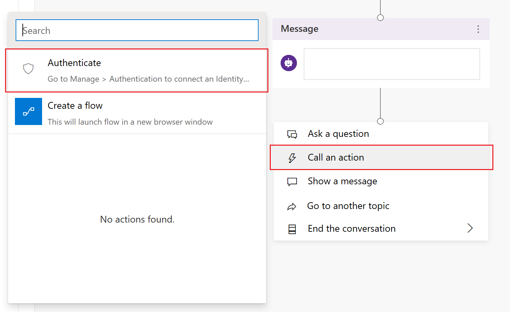

# User Authentication on bot topics

You can enable user authenticiation directly within a Power Virtual Agents bot conversation. This means you can prompt a user to sign in using single sign-on, retrieve a user token for that user, and then use that token to retrieve the user's information from a backend system.


> [!IMPORTANT] 
> Before using this feature, you must follow the [end-user authentication configuration instructions](configuration-end-user-authentication.md).


## Adding user authentication with the **Call an action** menu

**Insert the authentication node template:**

In a [topic](getting-started-create-topics.md), select the plus icon (+) to add a new node.

Select **Call an action** and then select **Authenticate**. 



Once selected, a number of new nodes will be added automatically.

> [!WARNING] 
> Add image for Authentication in the Action picker

## Authenticate node

The "Authenticate" node is where the user, if not already signed in, will get prompted with a Sign in card. You can see the user's experience below.

> [!WARNING] 
> Add image for the test bot with Sign In card

Once the user enters their username and password in the prompt (hosted by the Identity Provider, AAD in this example), they might get prompted to enter a validation code depending on the channel. Channels such as Teams does not require the user to enter a validation code.

### User successfully signed in

On the left side, you have the condition where the user successfully signed in ```IsLoggedIn = True```. You should add your logic that uses the AuthToken under this path.

### User failed to sign in 
On the right side, you have the condition where the user failed to sign in, under "None of these conditions". You should add any logic you might want to treat this case. Examples build in are a retry, and a way to escalate to a human agent if required. You should customize this for your particular scenario and usage.

## Variables 
Notice that two variables are available for usage once the user signs in: ```IsLoggedIn``` and ```AuthToken```. 

### IsLoggedIn

The ```IsLoggedIn``` variable is a boolean containing the signed in status of the user. You can test this variable to create branching logic in your topics to check for successful login such as in the usage above, or to opportunistically fetch user information only if the user is signed in.

### AuthToken

The ```AuthToken``` variable contains the user's token, obtained after the user is signed in. This is the variable you will pass to Flows, so it can connect to back-end APIs and fetch the users information, or take actions on users behalf.

> [!WARNING] 
> Make sure you're passing the AuthToken variable only to trusted sources. It contains user authentication information, which, if compromised, could harm the user.

Do not use AuthToken inside Message nodes, or on flows which you don't trust. 

## AuthToken usage without Authentication node.

You will notice that both ```IsLoggedIn``` and ```AuthToken``` variables are available even if you don't use the template provided by the "Call an action" menu entry. If you pass the AuthToken variable without first having the user go through the "Authenticate" node, the user will be prompted to sign in at that step. This can be useful if you always expect the user to be signed in, or if your user is being redirected from a different topic. We suggest you use the template provided by the "Call an action" entry in order to treat cases where the user fails to sign in.

> [!NOTE] 
> If the user signs out in the middle of a  converstaion, they will be prompted to sign in again if the topic hits a node using the ```AuthToken``` variable.

## Testing your topic

Make sure to test your topic using a real user configured in your Identity Provider using the "Test your bot" link in the bottom right. Ensure both the sign in success and failure path are exercised, so there are no surprises if your users failed to sign in.
