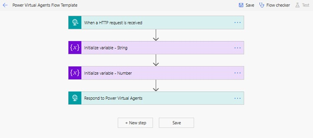
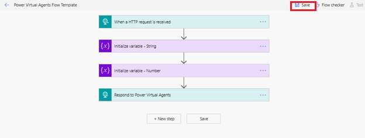
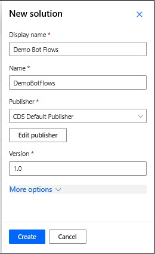
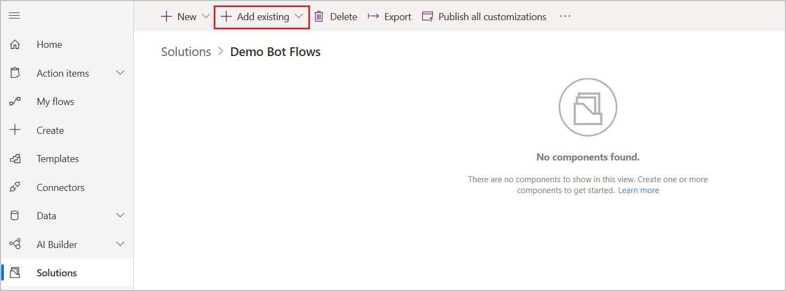
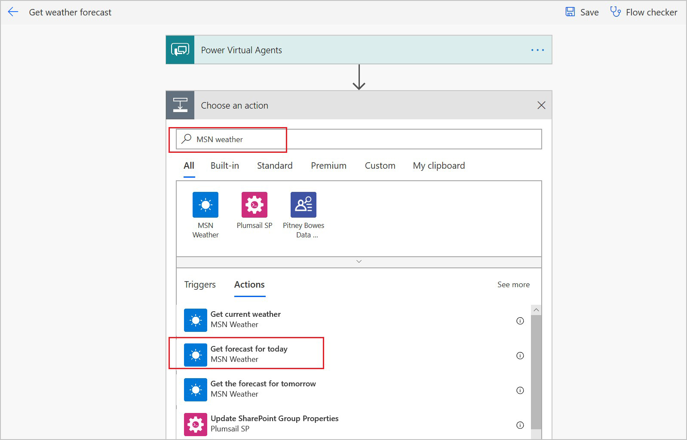
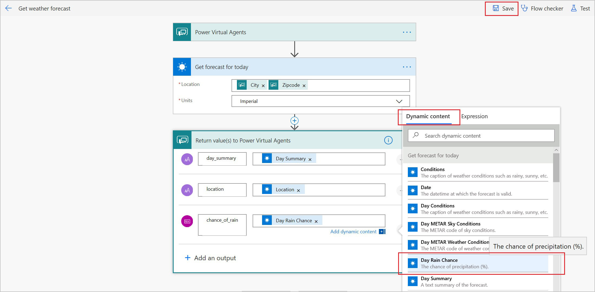
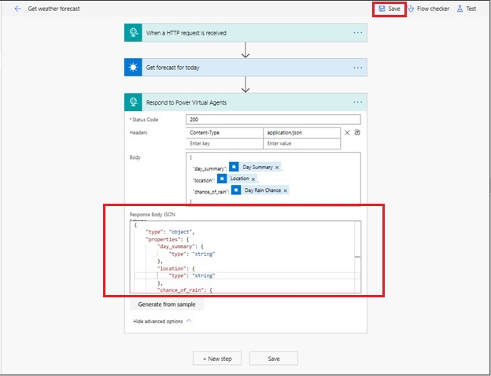

# Add actions to your bot using Microsoft Power Automate 

[!INCLUDE [cc-beta-prerelease-disclaimer](includes/cc-beta-prerelease-disclaimer.md)]

## Create a new flow from Power Virtual Agents Dialog Editor
You can enable your bot to perform an action by calling a Microsoft Automate. The flow that can be called from a Dialog must be in the same Common Data Service environment as your bot. To create a flow for the bot, select Call an action node and use Create a flow option:

Using Create a flow option will open a starter flow template in Microsoft Automate portal in a separate tab. The Microsoft Automate portal will automatically open in the same environment as the bot using the same user credentials:

This template is an example of a flow that can be used by bots. To be suitable for bots, a Microsoft Automate flow requires a special kind of trigger and response actions: 

•	Trigger:  HTTP Request

•	Response Action:  HTTP Response

Bots can use the following types of inputs and outputs with Microsoft Automate flows:

•	Number

•	String

•	Boolean

This example in the template shows how to specify a flow to accept 2 input parameters from a bot, a String and a Number, as specified in HTTP Request Body JSON Schema by this JSON snippet:

HTTP Request Body JSON Schema:

{
    "type": "object",
    "properties": {
        "flow_input_string": {
            "type": "string"
        },
        "flow_input_number": {
            "type": "number"
        }
    }
}

An HTTP Response action must be used to return outputs to the bot. This template provides an example on how to return 2 output parameters to the bot, a String and a Number:

Note that both Body and Response Body JSON Schema sections must be filled out in HTTP Response action:

HTTP Response Body:

HTTP Response Body JSON Schema (under advanced options):

{
    "type": "object",
    "properties": {
        "flow_output_string": {
            "type": "string"
        },
        "flow_output_number": {
            "type": "number"
        }
    }
}

This template provides a fully functional flow that would accept 2 parameters, a Sring and a Number, and retun them to a bot as outputs. Press Save button to save your new flow:

Your flow will be saved to My flows tab on Microsoft Automate portal:

## Add your flow to Solutions tab on Microsoft Automate portal

To ensure your flow can be used with bots, it must be moved from My Flows tab into Solutions tab on Microsoft Automate portal. 

Go to Solutions tab on Microsoft Automate portal to see what solutions are already available to you. You can use any of the existing solutions, or you can create a new solution for your flows.

To create a new solution, click on New solution button:

Give your new solution a name, then select CDS Default Publisher in Publisher field, give it a version number, and press Create button: 

Go to your new solution and use Add existing menu to add a flow: 

In Add existing flow screen, select Outside of solutions tab and select your flow. Then press Add button to add your flow to this solution:

This flow will be moved from My Flows into a solution and is now ready to be used in a bot. 

You can now see this flow on the list of available actions when you use Call an action node in the Dialog editor:

## Modify your flow on Microsoft Automate portal

You can rename and modify your flow on Microosft Automate Portal. For example, the flow we have just created using the template can be updated to provide a weather forecast when called from a bot.

To modify a flow, go to Solutions tab on Microsoft Automate portal to open your flow solution. Then use a flow’s Edit menu option:

This flow will open in editing experience where you can rename and update it. Rename your flow to Get weather forecast and add the following flow input parameters to HTTP Request trigger as shown below:

•	City (String)

•	Zipcode (Number)

Request Body JSON Schema:

{
    "type": "object",
    "properties": {
        "City": {
            "type": "string"
        },
        "Zipcode": {
            "type": "number"
        }
    }
}

Next, choose Add an action to create a new action below HTTP Request:

Type in MSN weather in the search box and choose Get forecast for today action from the list:

Once the action is selected, an MSN Weather Connector is added. Add flow inputs City and Zipcode as parameters for Location field in MSN Weather Connector. 

Use Add dynamic content option and select City and Zipcode from the list:

Delete both Initialize Variable nodes using Delete option – they are not needed for Get weather forecast flow:

In HTTP Response Body, add parameters that you want to return to the bot. Using Add dynamic content option, add thhe following outputs to the flow’s HTTP Response action:

•	day_summary (String)

•	location (String)

• chance_of_rain (Number)

You must also add the following JSON code to Response Body JSON Schema and Save your changes:

HTTP Response Body JSON Schema (under advanced options):

{
    "type": "object",
    "properties": {
        "day_summary": {
            "type": "string"
        },
        "location": {
            "type": "string"
        },
        "chance_of_rain": {
            "type": "number"
        }
    }
}

## Use your flow in a bot

You can use you new flow in any Topic in a bot; you can pass variables to this as inputs flow and receive outputs that can be used in the dialog. Select Topics in the left pane to open the Topics page, and then select New topic.

Picture 8 (Create a new Topic)

Specify a name, description, and trigger phrases for the topic. A trigger phrase is a phrase that a customer enters in the chat window to start a conversation with the bot. You can include punctuation in a trigger phrase, but it is best to use short phrases rather than long sentences.
For example, for a Daily Deals topic, you could specify the following trigger phrases:
daily deals
deal of the day
current deals
today’s deals
current offers
today’s specials

Once you have created the topic, you can create a conversation path that uses your flow. Select Edit to open the conversation editor.

In the conversation editor, enter a bot response in the Bot Says node, and then select User Says to display the User Responses node.

Picture 9 (Create bot converstaion that calls a flow)

## To test the flow
1. In the **Test bot** pane, select **Start over with latest conversation**. Then specify a trigger phrase for the topic that contains the flow.

2. Enter your email address at the prompt.

    The bot displays the email address to the customer to confirm that it will send a message to that address and stores the message specified in the flow in the **(x) message** variable.

    The flow then sends the message to the customer.
    
 Picture 10 (Test bot converstaion that calls a flow)

