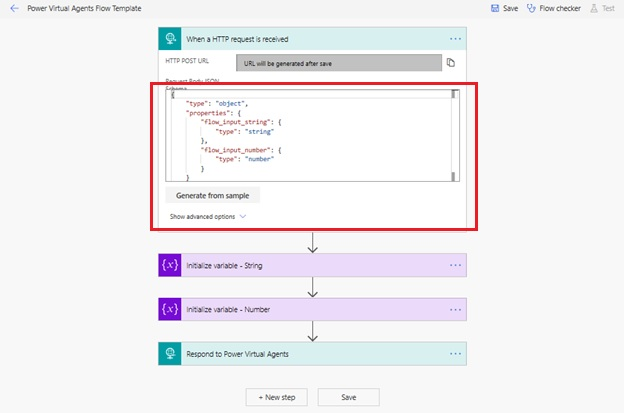
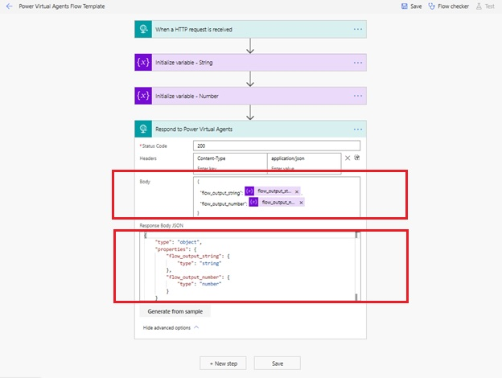
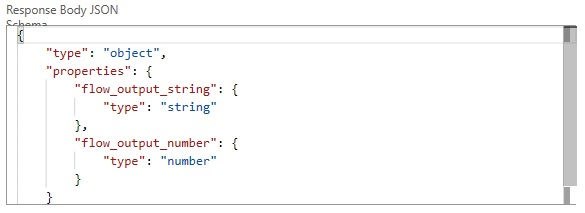
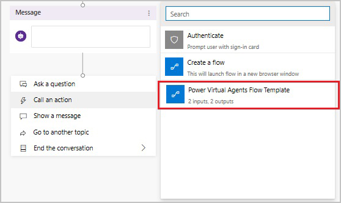
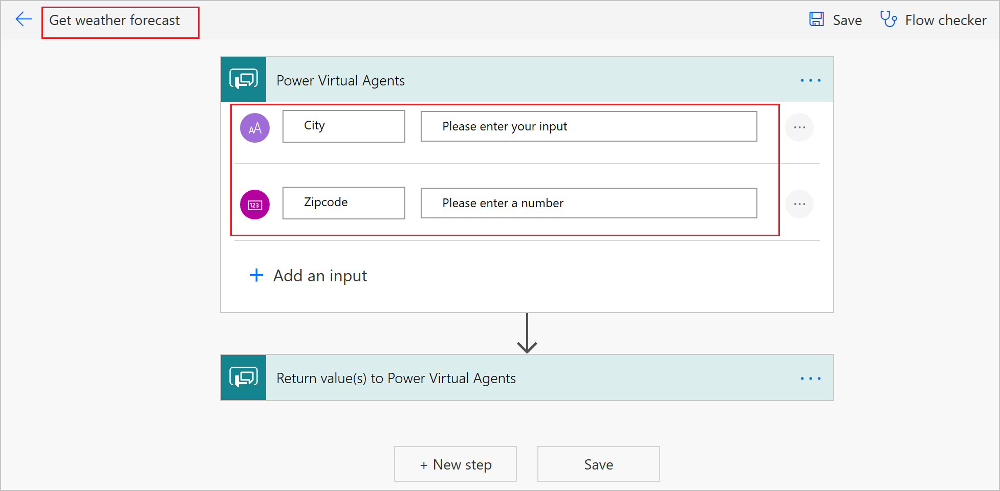
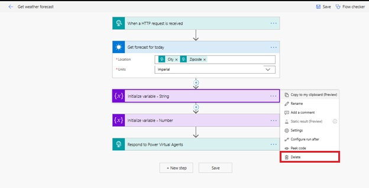
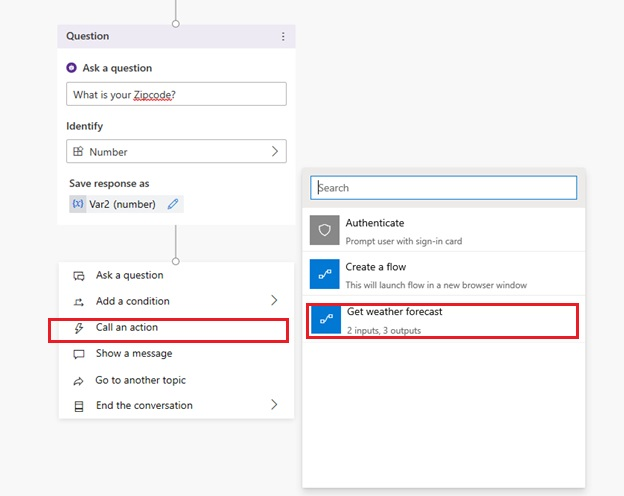
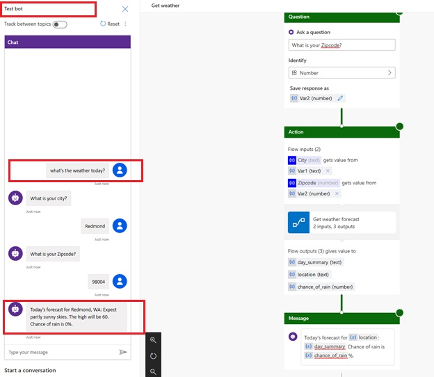

# Add actions to a bot using Microsoft Power Automate 

[!INCLUDE [cc-beta-prerelease-disclaimer](includes/cc-beta-prerelease-disclaimer.md)]

## Create a new flow from Power Virtual Agents Dialog Editor
You can enable your bot to perform an action by calling a Microsoft Automate. The flow that can be called from a Dialog must be in the same **Common Data Service environment** as your bot. To create a flow for the bot, select **Call an action** node and use **Create a flow** option:

Using **Create a flow** option will open a starter flow template in Microsoft Automate portal in a separate tab. The Microsoft Automate portal will automatically open in the same environment as the bot using the same user credentials:

This template is an example of a flow that can be used by bots. To be suitable for bots, a Microsoft Automate flow requires a special kind of trigger and response actions: 

•	Trigger:  **HTTP Request**

•	Response Action:  **HTTP Response**

Bots can use the following types of inputs and outputs with Microsoft Automate flows:

•	Number

•	String

•	Boolean

This example in the template shows how to specify a flow to accept 2 input parameters from a bot, a String and a Number, as specified in **HTTP Request Body JSON Schema** by this JSON snippet:

**HTTP Request Body JSON Schema**:

{
    "type": "object",
    "properties": {
        "flow_input_string": {
            "type": "string"
        },
        "flow_input_number": {
            "type": "number"
        }
    }
}

An **HTTP Response** action must be used to return outputs to the bot. This template provides an example on how to return 2 output parameters to the bot, a String and a Number:

Note that both **Body** and **Response Body JSON Schema** sections must be filled out in **HTTP Response** action:

**HTTP Response Body**:

**HTTP Response Body JSON Schema** (under advanced options):

{
    "type": "object",
    "properties": {
        "flow_output_string": {
            "type": "string"
        },
        "flow_output_number": {
            "type": "number"
        }
    }
}

This template provides a fully functional Microsoft Automae flow that would accept 2 parameters, a Sring and a Number, and retun them to a bot as outputs. Press **Save** button to save your new flow:

Your flow will be saved to **My flows** tab on Microsoft Automate portal:

## Move a flow to Solutions tab on Microsoft Automate portal

To ensure your flow can be used with bots, it must be moved from **My Flows** tab into **Solutions** tab on Microsoft Automate portal. 

Go to **Solutions** tab on Microsoft Automate portal to see what solutions are already available to you. You can use any of the existing solutions, or you can create a new solution for your flows.

To create a new solution, click on **New solution** button:

Give your new solution a name, then select **CDS Default Publisher** in **Publisher** field, give it a **version number**, and press **Create** button: 

Go to your new solution and use **Add existing** menu to add a flow: 

In **Add existing flow** screen, select **Outside of solutions** tab and select your flow. Then press **Add** button to add your flow to this solution:

This flow will be moved from **My Flows** tab and into a solution. It is now ready to be used in a bot. 

You can now see this flow on the list of available actions when you use **Call an action node** in the Dialog editor:

## Modify a flow on Microsoft Automate portal

You can rename and modify your flow on Microosft Automate Portal. For example, the flow we have just created using the template can be updated to provide a weather forecast when called from a bot.

To modify a flow, go to **Solutions** tab on Microsoft Automate portal and open your flow's solution. Use your flow’s **Edit menu** option to open this flow in editing experience:

Rename your flow to **Get weather forecast** and add the following flow input parameters to **HTTP Request trigger**, as shown below:

•	City (String)

•	Zipcode (Number)

**Request Body JSON Schema**:

{
    "type": "object",
    "properties": {
        "City": {
            "type": "string"
        },
        "Zipcode": {
            "type": "number"
        }
    }
}

Next, choose **Add an action** to create a new action below **HTTP Request**:

Type in **MSN weather** in the search box and choose **Get forecast for today** action from the list:

A new **MSN Weather Connector** is added to the flow. Add flow inputs **City** and **Zipcode** as parameters for **Location** field in MSN Weather Connector. Use **Add dynamic content** option and select **City** and **Zipcode** from the list:

**
Delete both **Initialize Variable** nodes using **Delete** option – they are not needed for **Get weather forecast** flow:

In **HTTP Response Body**, add output parameters that you want to return to the bot. Using **Add dynamic content** option, add the following outputs to the flow’s HTTP **Response** node:

•	day_summary (String)

•	location (String)

• chance_of_rain (Number)

Add the following JSON code to **Response Body JSON Schema** and **Save** your changes:

**HTTP Response Body JSON Schema** (under advanced options):

{
    "type": "object",
    "properties": {
        "day_summary": {
            "type": "string"        },
        "location": {
            "type": "string"
        },
        "chance_of_rain": {
            "type": "number"
        }
    }
}

This flow is you ready to be used in with the bots.

## Call Microsoft Automate flow as an Action from a bot 

You can call this Micrsosft Automate flow from a bot Topic using **Call an action** node. You can pass variables to this flow and receive flow outputs that can be used in a **Dialog**.

To create a new **Topic**, go your **Virtual Agent Editor** and select **Topics** tab. Create a new **Topic** and name it as **Get weather**. Add a few **trigger phrases** for your new **Topic**:

•	will it rain

•	today’s forecast

•	get weather

•	what’s the weather

To create a **Dialog** for your **Topic**, click on **Go to authoring canvas**:

Use **Ask a question** nodes to have the bot ask users for the **City (String)** and **Zipcode (Number)** inputs:

Next, use **Call an action** option to create an **Action** node to call **Get weather forecast** flow:

Use **City (Var1)** and **Zipcode (Var2)** parameters as inputs for this flow, and add **Show a message** node to display weather forecast data using flow’s outputs:

Press a **Save button** to save your Dialog. You new Topic that uses a Microsoft Automate flow to lookup a weaher forecast for a user is now ready for testing.

## Test your Dailog

In the **Test bot** pane, start a conversation with the bot by typing in a trigger phrase for the topic that contains the flow.

Enter your City and Zipcpde at the prompt and get todays' weather foreast from the bot:

    
