# Add actions to a bot using Power Automate 

[!INCLUDE [cc-beta-prerelease-disclaimer](includes/cc-beta-prerelease-disclaimer.md)]

You can enable your bot to perform an action by calling a Microsoft Power Automate flow. Flows can help you automate activities, or call backend systems. For example, you can use flows in conjunction with [end-user authentication](advanced-end-user-authentication.md) to retrieve information about a specific user after they've signed in.

You call flows from within topics, as a discrete **Call an action** node. You can utilize existing flows that have been created in your [Power Apps environment](environments-first-run-experience.md) or you can create a flow from within the Power Virtual Agents [authoring canvas](authoring-create-edit-topics.md).

>[!IMPORTANT]
>The flow that can be called from a topic must be in the same [Common Data Service environment](/powerapps/maker/common-data-service/data-platform-intro) as your bot.
>Flows must also be in a solution in Microsoft Power Automate. You can [move flows into solutions](#move-a-flow-to-the-solutions-tab-on-the-microsoft-automate-portal) so they appear in the authoring canvas.

Flow typically use variables to take in and output information. The variables can then be used in other nodes within the topic.

## Create a new flow from the Power Virtual Agents authoring canvas 

 

**Create a new flow for an existing bot:**

1. Go to the [**Topics page**](authoring-create-edit-topics.md) for the bot you want to edit.

1. Open the authoring canvas for the topic you want to call a flow from.

1. Select the plus (**+**) icon underneath an existing node to add a new node. 

    

1. In the node selection window, select **Call an action**, and then select **Create a flow**. 

    

Using the **Create a flow** option will open a starter flow template in the [Microsoft Automate portal](https://preview.flow.microsoft.com/en-us/) in a separate tab.

>[NOTE]
>The Microsoft Automate portal will automatically open in the same environment as the bot using the same user credentials

This template is an example of a flow that can be used by bots. To be suitable for bots, a Microsoft Automate flow requires a special **Power Virtual Agents** trigger and response action: 
- Flow trigger:  **Power Virtual Agents**
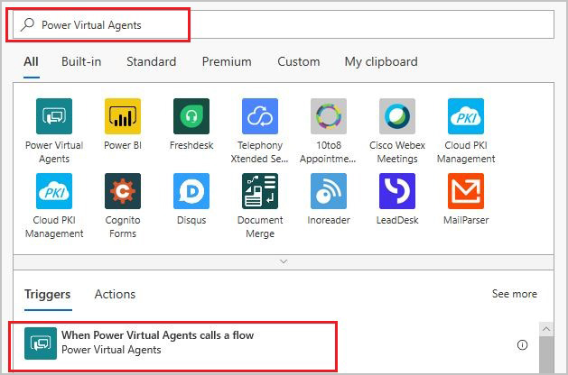

- Response action:  **Power Virtual Agents**

## Input and output parameters

There is no upper limit on how many input or output parameters a bot Power Automate flow can have. Bots can use the following types of inputs and outputs with Microsoft Automate flows:

- Number
- String
- Boolean

The following types are unsupported:

- Object
- Date
- Timestamp
- List [String]
- List [Number]
- List [Boolean]
- List [Object]
- List [Date]
- List [Timestamp]

>[NOTE]
>Bot is able to receive up to 1MB of data from a Power Automate flow in a single action. There is no upper limit on the maximum size of data that a bot can pass to a Power Automate flow.

### Input parameters

To specify a flow to accept *input* parameters from a bot, select **Add an input** option in **Power Vitual Agents trigger** UI and select the type a - `string`, `number` or a `boolean`:

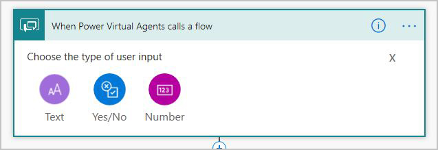

For example, you can select **Text** and **Number** to add the following input parameters to the flow:
- **String_Input** of type `string`
- **Number_Input** ot type `number` 

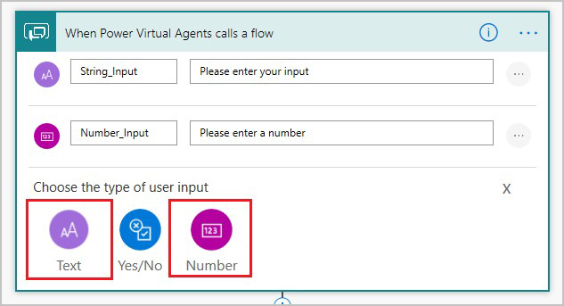

### Output parameters

To return *output* parameters to the bot that can be a `string`, `number` or a `boolean`, select **Add an output** option in **Power Vitual Agents response** UI, and select the approprite type for the output:

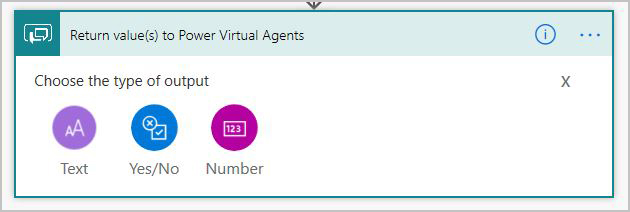

For example, you can select **Text** and **Number** to add the following output parameters to the flow and assign return values for them:
- **String_Output** of type `string`
- **Number_Output** ot type `number`

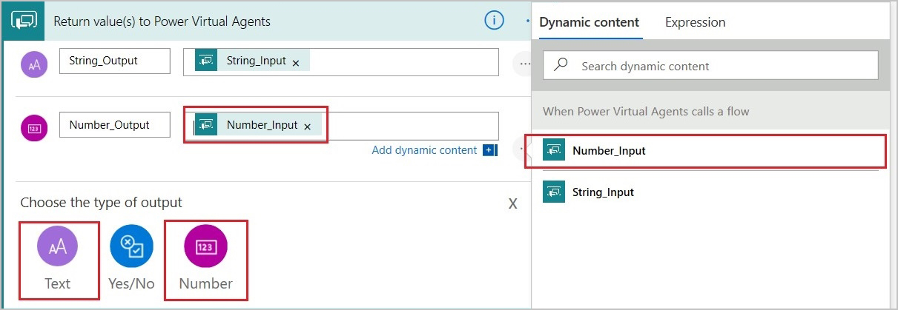

This example pwould create a fully functional flow that accepts two parameters, a `string` and a `number`, and returns them to a bot as outputs. 

Select **Save** to save your new flow.

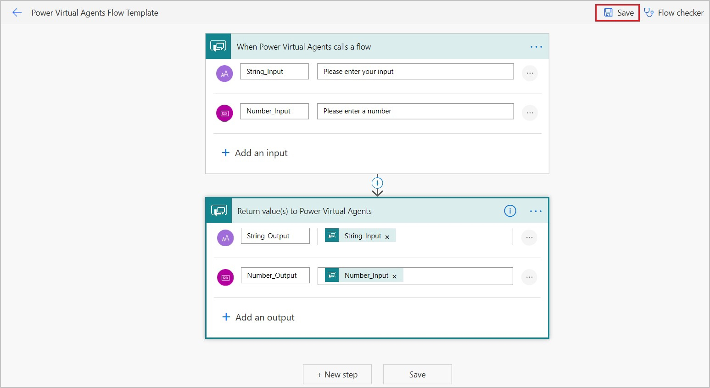

Your flow will be saved to **My flows** tab on the Microsoft Automate portal.

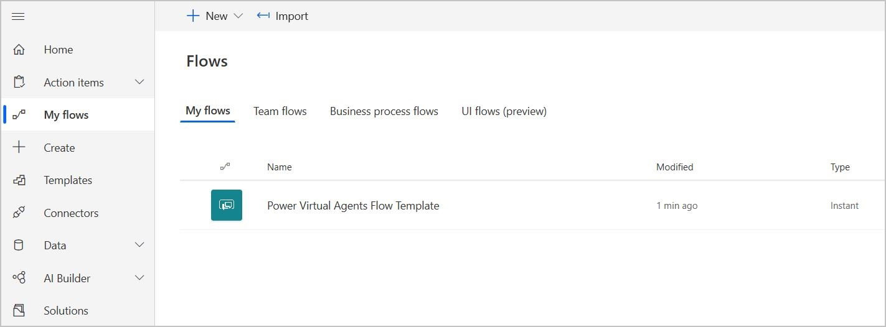

## Move a flow to the Solutions tab on the Microsoft Automate portal

To ensure your flow can be used with a Power Virtual Agent bot, it must be moved from the **My Flows** tab to the **Solutions** tab in the Microsoft Automate portal. 

**Move flow to new or existing solution:**

1. On the Microsoft Automate portal, go to the **Solutions** tab. Here you can see what solutions are already available to you; you can use any of the existing solutions or you can create a new solution for your flows.

1. To create a new solution, select **New solution**.

    

1. Give your new solution a name, select **CDS Default Publisher** in the **Publisher** field, provide a **Version** number, and press **Create**. 

    

1. On the **Solutions** tab, go to the solution you want to use, such as the one you just created. Select **Add existing** to add a flow.

    

1. In the **Add existing flow** screen, select the **Outside of solutions** tab and select your flow. Then press **Add** to add your flow to the solution.

    

This flow will be moved from the **My Flows** tab and into the solution you chose, on the **Solutions** tab. It is now ready to be used in a bot. 

In Power Virtual Agents, you can now see this flow on the list of available actions when you use the **Call an action node** in the authoring canvas.

## Modify a flow on Microsoft Automate portal

You can rename and modify your flow on the Microsoft Automate Portal. For example, the flow you just created using the template can be updated to provide a weather forecast when called from a bot.

**Modify a flow:**

1.  You can open a flow to update and modify either from Power Virtual Agents Dialog, or directly on Microsoft Power Automate portal.

  In Power Virtual Agents, you can open a flow by using the flow's **View flow details** link that shows up on the list of available actions when you use the **Call an action node** in the authoring canvas:

 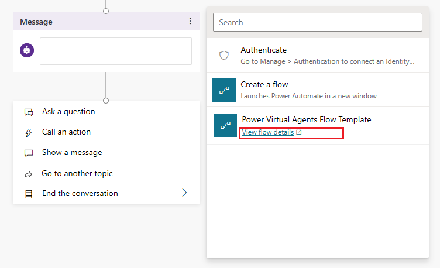
 
  If you want to update a flow that is alreday used in your Dialog, the same **View flow details** link is avlaible directly in the Action node:
 
   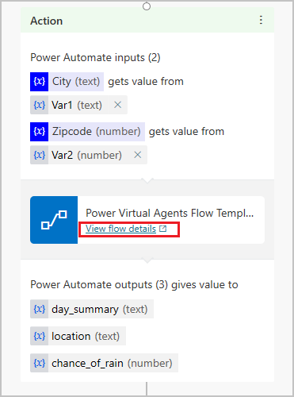
 
  Using the flow's **View flow details** link will launch Power Automate portal in a separate browser tab and open this flow in a Details page where it can be updated using **Edit** option.

  

  If you want to open a flow on the Microsoft Power Automate portal directly, go to the **Solutions** tab and open your flow's solution. Use the flow’s **Edit menu** option to open this flow for editing.

  

    
1.  Rename the flow to **Get weather forecast** and add the following flow input parameters to **POwer Virtual Agents** trigger :

    - City (String)
    - Zipcode (Number)

    

   

1. Choose **Add an action** to create a new action below the **Power Virtual Agents** trigger

    

1. Enter **MSN weather** into the search box and choose the **Get forecast for today** action from the list.

    

1. A new **MSN Weather Connector** is added to the flow. Under Location, select **Add dynamic content**. Select **City** and **Zipcode** from the list. 

    

1. In the response node **Return value(s) to Power Virtual Agents**, add output parameters that you want to return to the bot, and **Save** your flow. 

    - day_summary (String)
    - location (String)
    - chance_of_rain (Number)

This flow is now ready to be used in your bots.

## Call Microsoft Automate flow as an Action from a bot 

You can call a Microsoft Automate flow from a bot topic using the **Call an action** node. You can then pass variables to the flow and receive flow outputs that can be used in a bot conversation.

These instructions use the examples described above to add weather information to a flow.

**Call a flow from within a topic:**

1. In Power Virtual Agents, go to the [**Topics page**](authoring-create-edit-topics.md) for the bot you want to edit.

1. Create a new topic, and name it **Get weather**. 

1. Add the following **Trigger phrases**:

    - will it rain
    - today’s forecast
    - get weather
    - what’s the weather

1. Go the **Authoring canvas** for the new topic.

    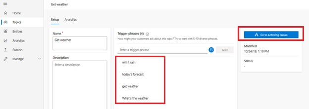

1. By default, a message node will be created. Enter **I can help you with that.** into the node, and then select the plus (**+**) icon underneath it to add a new node. 

    

1. Add two new **Ask a question** nodes to have the bot ask users for the **City (String)** and **Zipcode (Number)** inputs.

    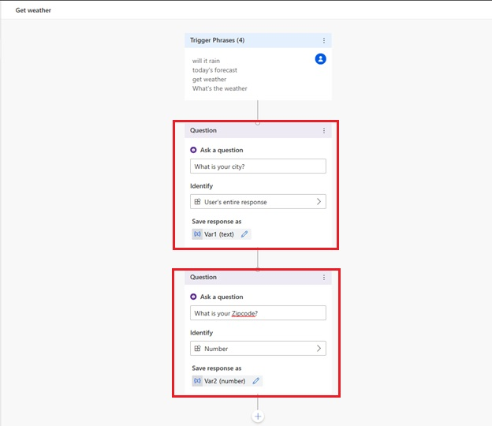

1. Select the plus (**+**) icon underneath the question nodes to add a new node. In the node selection window, select **Call an action**, and then select the flow you created earlier **Get weather forecast**. 

    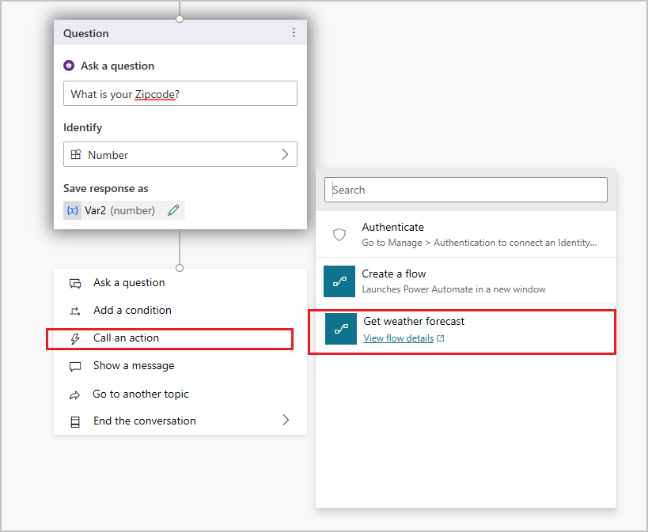

1. Map the flow input blocks to the output variables from the question nodes. **City (text)** gets its value from `Var1 (text)` and **Zipcode (number)** gets its value from `Var2 (number)`.

1. Under the flow's node, and a **Message** node and enter a message that uses the  flow’s outputs. For example:

    **Today's forecast for `(x)location`:`{x}day_summary`. 
    Chance of rain is `{x}chance_of_rain`%**

    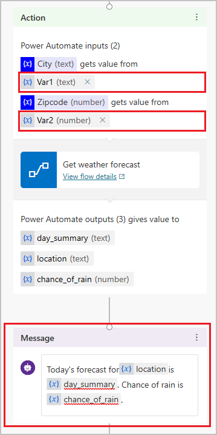

Press **Save** to save your topic. 

## Test your flow and topic

In the **Test chat** pane, start a conversation with the bot by typing in a trigger phrase for the topic that contains the flow.

Enter your city and zipcode at the prompt to get today's weather forecast from the bot

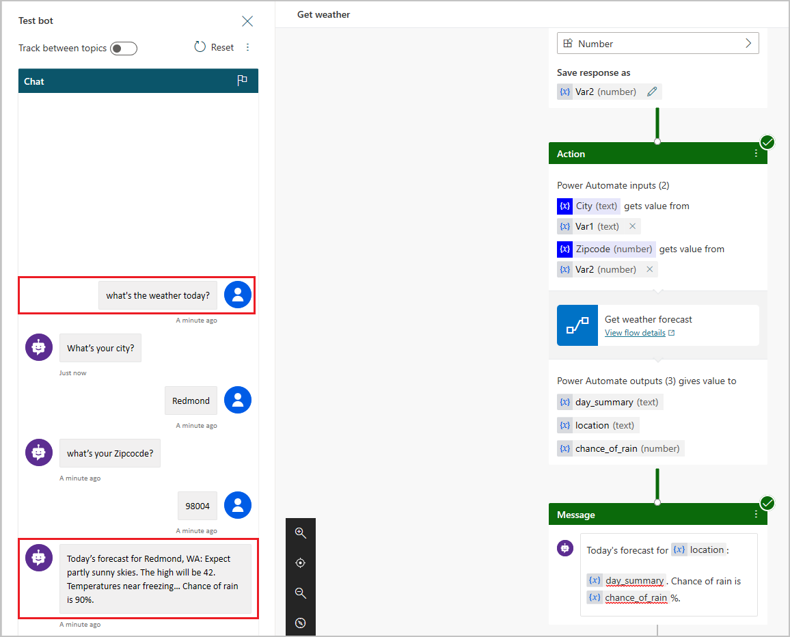

