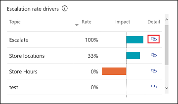

# Analyze topic usage in Power Virtual Agents

[!INCLUDE [cc-beta-prerelease-disclaimer](includes/cc-beta-prerelease-disclaimer.md)]

The topic details page provides a view into the performance of individual topics and how they can be improved.

You can display the topic details page by selecting the **Detail** link in one of the following charts on the [Summary](analytics-summary.md) and [Customer Satisfaction](analytics-CSAT.md) pages:

* [Escalation rate drivers (Summary page)](analytics-summary.md#escalation-rate-drivers-chart)
* [Abandon rate drivers (Summary page)](analytics-summary.md#abandon-rate-drivers-chart)
* [Resolution rate drivers (Summary page)](analytics-summary.md#resolution-rate-drivers-chart)
* [Customer satisfaction drivers (Customer Satisfaction page)](analytics-CSAT.md#customer-satisfaction-drivers-chart)

The topic details page can also be displayed by opening an individual topic from the Topics page and selecting **Analytics** at the top of the page. 

The topic details page includes a variety of charts with graphical views of a topic's key performance indicators. For information about each chart, see:

* [Topic Summary charts](#topic-summary-charts)
* [Impact Summary charts](#impact-summary-charts)
* [Topic Volume by Day chart](#topic-volume-by-day-chart)

## Topic Summary charts

The Topic Summary charts summarize the topic's performance indicators for the specified time period and the percent change over the period.

Description | Details
----------- | -------
Total sessions | The total number of sessions within the specified time period.
Average CSAT | The average CSAT survey score for the specified time period.
Resolution rate | The percentage of engaged sessions that are resolved. A resolved session is an engaged session in which the user receives an end-of-session survey and either does not respond or responds *Yes*.
Escalation rate | The percentage of engaged sessions that are escalated. An escalated session is an engaged session that is escalated to a human agent.
Abandon rate | The percentage of engaged sessions that are abandoned. An abandoned session is an engaged session that is neither resolved nor escalated after one hour from the beginning of the session.

A blue up-and-down indicator below the value indicates the percent change in a positive direction. A red indicator indicates the percent change in a negative direction.

## Impact summary charts

The Impact Summary charts summarize the impact of the topic on key performance indicators for the specified time period.

Description | Details
----------- | -------
CSAT impact | The topic's customer satisfaction impact score. The customer satisfaction impact score is the overall average CSAT survey score including the topic minus the overall average CSAT survey score excluding the topic.
Resolution rate impact | The topic's resolution-rate impact score. The resolution-rate impact score is the overall resolution rate including the topic minus the resolution rate excluding the topic.
Escalation rate impact | The topic's escalation-rate impact score. The escalation-rate impact score is the overall escalation rate including the topic minus the escalation rate excluding the topic.
Abandon rate impact | The topic's abandon-rate impact score. The abandon-rate impact score is the overall abandon rate including the topic minus the abandon rate excluding the topic.

## Topic Volume by Day chart

The Topic Volume by Day chart provides a graphical view of the number of sessions for the topic over the specified time period.
