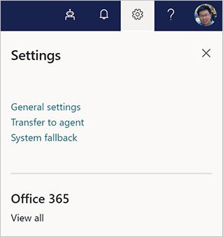
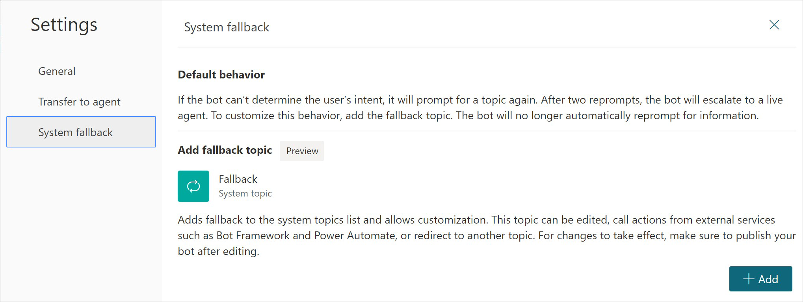

# Configure the system fallback topic in Power Virtual Agents

During a conversation, a Power Virtual Agents bot [triggers the appropriate topic based on the user’s input](authoring-create-edit-topics.md). If the bot can’t determine the user’s intent, it will prompt the user again. After two prompts, the bot will escalate to a live agent through the system **Escalate** topic.

In some scenarios, you may want to customize the bot behavior when no intent is triggered. For example, you may want to build a catch-all topic to capture unrecognized user intents, or use a topic to call back-end systems or route to existing services. 

You do this by adding the system fallback topic. You can also customize the fallback topic similar to most other system topics.

## Add fallback topic
1.	On the top navigation pane, select the **Settings** cog icon, and then select **System fallback**.

    

2.	Select **“+Add”**.

    
 
A system fallback topic is added. The bot will start to route to the system fallback topic when the bot is unable to find an appropriate topic or doesn't understand the user's input. 

A new option will appear on the **Settings** pane under the **System fallback** section: **Go to fallback topic**. You can use this to customize the topic.
 
## Customize system fallback topic
After you add the system fallback topic, you can open it by selecting **Go to fallback topic** on the **Settings** pane. 

You’ll also see the **Fallback** topic listed under **System Topics** in the topic list. 

When you open this topic in the authoring canvas, you’ll see the default fallback topic contains two nodes: a **Message** node that rephrases the user input and an **Escalate** node that redirects to a live agent. 

 
You can customize this topic as with any other [system topic](authoring-create-edit-topics.md). You can also use the *UnrecognizedTriggerPhrase* variable which stores the user input that the bot couldn't understand. For example, you could use the variable as an input and pass it to a [Power Automate flow](advanced-flow.md) or [Bot Framework Skill](advanced-use-skills.md).

>[!Note]
>The system fallback topic doesn’t have a trigger phrase. As with other system topics, its trigger phrases are not customizable.  

## Reset system fallback behavior by deleting the fallback topic
To reset the system fallback behavior and return it to its default behavior, go to **Settings** and then **System Fallback**. In the System fallback section, use the **Delete** button to remove the fallback topic. 

 
>[!WARNING]
>This will remove the fallback topic and any changes you made to it. 

