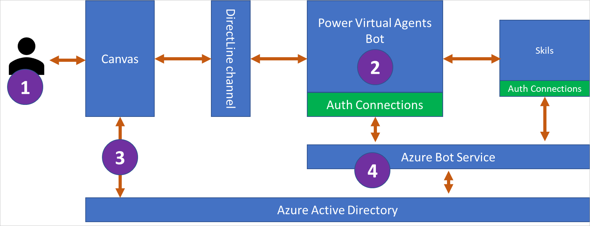
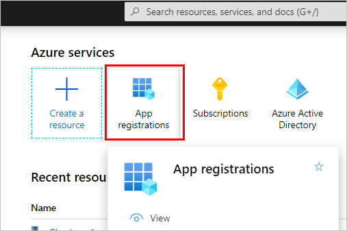
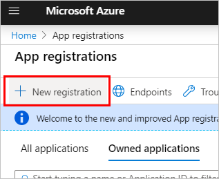
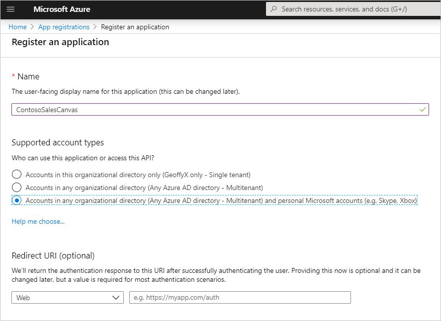
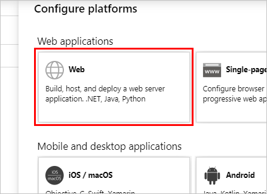
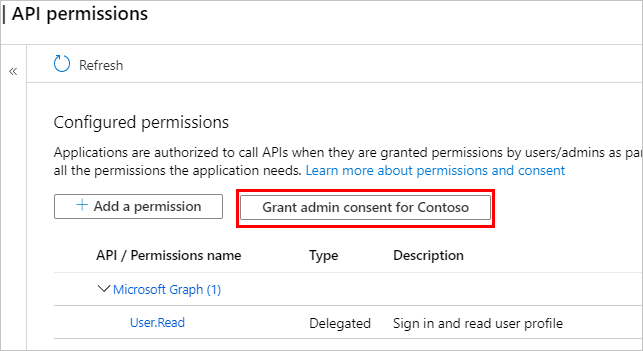
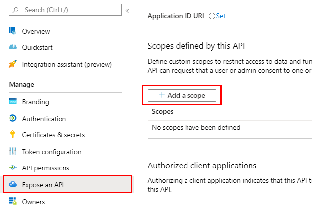
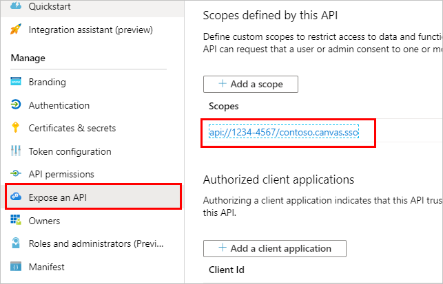
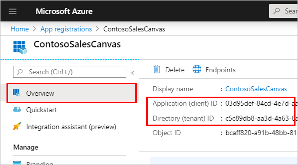
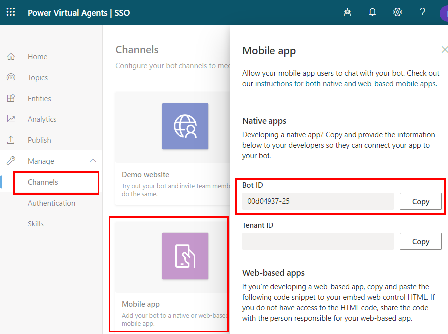

# Configure single sign-on with Azure Active Directory in Power Virtual Agents


Power Virtual Agents supports single sign-on (SSO), which means chatbots can be configured to automatically sign in the user if they're already signed in to the page where the bot is deployed.  

For example, the bot is hosted on the corporate intranet or in an app that the user is already signed in to).


## Prerequisites

- [!INCLUDE [Medical and emergency usage](includes/pva-usage-limitations.md)]
- [Enable end-user authentication with Azure Active Directory](configuration-end-user-authentication.md#use-azure-active-directory-as-your-identity-provider) and [add an authentication topic to your bot](advanced-end-user-authentication.md)
- [Use a custom canvas](customize-default-canvas.md) 


## Technical overview
The following illustration shows how a user is signed in without seeing a login prompt (SSO) in Power Virtual Agents:

  

1. The bot user enters a phrase that [triggers a  sign in topic](advanced-end-user-authentication.md). This topic is designed to sign the user in and use the user's [authenticated token (`AuthToken` variable)](advanced-end-user-authentication.md#authtoken-variable).

2. Power Virtual Agents sends a login prompt to allow the user to sign in with their configured identity provider.

3. The bot's [custom canvas](customize-default-canvas.md) intercepts this sign in prompt and requests an on-behalf-of (OBO) token from Azure Active Directory (Azure AD). The canvas sends the token to the bot.

4. On receipt of the OBO token, the bot exchanges the OBO token for an "access token" and fills in the `AuthToken` variable using this value. The `IsLoggedIn` variable is also set at this time.


## Configure single sign-on

There are four main steps to configuring SSO for Power Virtual Agents:

1. Create an app registration in Azure AD for your custom canvas.

1. Define a custom scope for your bot in the bot's authentication app registration (and create a trust relationship between your canvas and authentication app registrations).

1. Configure authentication in Power Virtual Agents to enable single sign-on.

1. Configure your custom canvas HTML code to enable single sign-on.


### Create an app registration in Azure AD for your custom canvas

To enable single sign-on, you need to register the custom canvas as an app in Azure AD.

This needs to be a separate app registration from the one you [created when you configured authentication with Azure AD](configuration-end-user-authentication.md#use-azure-active-directory-as-your-identity-provider).

You then need to redirect the app registration to point to your custom canvas.

**Create an app registration for the bot's canvas**

1. Sign in to the [Azure portal](https://portal.azure.com).

1. Go to [App registrations](https://portal.azure.com/#blade/Microsoft_AAD_RegisteredApps/ApplicationsListBlade), either by selecting the icon or searching in the top search bar.

  

1. Select **New registration**.

  

1. Enter a name for the registration. It can be helpful to use the name of the bot whose canvas you're registering and include "canvas" to help separate it from the app registration for authentication.  
  For example, if your bot is called "Contoso sales help", you might name the app registration as "ContosoSalesCanvas" or something similar. 

1. Select **Accounts in any organizational directory (Any Azure AD directory - Multitenant) and personal Microsoft accounts (e.g. Skype, Xbox)**.

1. Leave the **Redirect URI** section blank for now, as you'll enter that information in the next steps. Select **Register**.

  


**Add the redirect URL**

1. Once the registration is completed, it will open to the **Overview** page. Go to **Authentication** and then select **Add a platform**.


  

1. On the **configure platforms** blade select **Web**. 

  
 
1. Under **Redirect URIs**  add the full URL to the page where your chat canvas is hosted. Under the **Implicit grant** section, select the **Id Tokens** and **Access Tokens** checkboxes.

1. Select **Configure** to confirm your changes.

  

1. Go to **API Permissions**. Select **Grant admin consent for \<your tenant name\>** and then **Yes**.
  
  >[!IMPORTANT]
  >You must [grant tenant-wide consent](/azure/active-directory/manage-apps/grant-admin-consent) to both of your app registrations or SSO will not work.

  


### Define a custom scope for your bot (create a trust relationship)

You need to define a custom scope by exposing an API for the canvas app registration within the authentication app registration. [Scopes](/azure/active-directory/develop/developer-glossary#scopes) allow you to determine user and admin roles and access rights.

This step creates a trust relationship between the authentication app registration for authentication and the app registration for your custom canvas.

**Define a custom scope for your bot**

1. Open the app registration that you created [when you configured authentication](configuration-end-user-authentication.md#use-azure-active-directory-as-your-identity-provider).

1. Go to **API Permissions** and ensure that the correct permissions are added for your bot. Select **Grant admin consent for \<your tenant name\>** and then **Yes**.
  
  >[!IMPORTANT]
  >To avoid users from having to consent to each application, a Global Administrator, Application Administrator, or a Cloud Application Administrator must [grant tenant-wide consent](/azure/active-directory/manage-apps/grant-admin-consent) to your app registrations.


1. Go to **Expose an API** and select **Add a scope**.

  

1. Enter a name for the scope, along with the display information that should be shown to users when they come to the single sign-on screen. Select **Add scope**.

  

1. Select **Add a client application**. 

1. Enter the **Application (client) ID** from the **Overview** page for the canvas app registration into the **Client ID** field. Select the checkbox for the listed scope that you created. 

1. Select **Add application**.


### Configure authentication in Power Virtual Agents to enable single sign-on
The **Token Exchange URL** in the Power Virtual Agents authentication configuration page is used to exchange the OBO token for the requested access token through the bot framework. 

This calls into Azure AD to preform the actual exchange.

**Add the token exchange URL to your bot's authentication page**

1. Sign in to Power Virtual Agents. 

1. Confirm you have selected the bot for which you want to enable authentication by selecting the bot icon on the top menu and choosing the correct bot. 

1. Select **Manage** on the side navigation pane, and then go to the **Authentication** tab.

   

1. Enter the full scope URI from the **Expose an API** blade for the canvas app registration in the **Token exchange URL** field. This will be in the format of `api://1234-4567/scope.name`.

    

  

1. Select **Save** and then publish the bot content.


### Configure your custom canvas HTML code to enable single sign-on

You need to update the custom canvas page where the bot is located to intercept the login card request and exchange the OBO token.

1. Configure the Microsoft Authentication Library (MSAL) by adding the following code into a \<script\> tag in your \<head\> section.

2. Update `clientId` with the **Application (client) ID** for the canvas app registration. Replace `<Directory ID>` with the **Directory (tenant) ID**. You get these IDs from the **Overview** page for the canvas app registration.

  


  ```HTML
  <head>
   <script>
     var clientApplication;
       (function () {
         var msalConfig = {
             auth: {
               clientId: '<Client ID [CanvasClientId]>',
               authority: 'https://login.microsoftonline.com/<Directory ID>'
             },
             cache: {
               cacheLocation: 'localStorage',
               storeAuthStateInCookie: false
             }
         };
         if (!clientApplication) {
           clientApplication = new Msal.UserAgentApplication(msalConfig);
         }
       } ());
   </script>
  </head>
  ```

3. Insert the following \<script\> in the \<body\> section. This script calls a method to retrieve the `resourceUrl` and exchange your current token for a token requested by the OAuth prompt.

  ```HTML
   <script>
   function getOAuthCardResourceUri(activity) {
     if (activity &&
          activity.attachments &&
          activity.attachments[0] &&
          activity.attachments[0].contentType === 'application/vnd.microsoft.card.oauth' &&
          activity.attachments[0].content.tokenExchangeResource) {
            // asking for token exchange with AAD
            return activity.attachments[0].content.tokenExchangeResource.uri;
      }
   }
  
   function exchangeTokenAsync(resourceUri) {
     let user = clientApplication.getAccount();
      if (user) {
        let requestObj = {
          scopes: [resourceUri]
        };
        return clientApplication.acquireTokenSilent(requestObj)
          .then(function (tokenResponse) {
            return tokenResponse.accessToken;
            })
            .catch(function (error) {
              console.log(error);
            });
            }
            else {
            return Promise.resolve(null);
      }
   }
   </script>
   ```

4. Insert the following \<script\> in the \<body\> section. Within the `main` method, this adds a conditional to your `store`, with your bot's unique identifier.

5. Update `<BOT ID>` with your bot's ID. You get this by going to the **Channels tab** for the bot you are using, and selecting **Mobile app** on the Power Virtual Agents portal.

  
   


  ```HTML
   <script>
  
    (async function main() {
  
          // Add your BOT ID below 
          var BOT_ID = "<BOT ID>";
          var theURL = "https://powerva.microsoft.com/api/botmanagement/v1/directline/directlinetoken?botId=" + BOT_ID;
  		
  	   const { token } = await fetchJSON(theURL);
  	   const directLine = window.WebChat.createDirectLine({ token });
       
            const store = WebChat.createStore({}, ({ dispatch }) => next => action => {
             const { type } = action;
              if (action.type === 'DIRECT_LINE/INCOMING_ACTIVITY') {
                 const activity = action.payload.activity;
                 let resourceUri;
                 if (activity.from && activity.from.role === 'bot' &&
                    (resourceUri = getOAuthCardResourceUri(activity))) {
                    exchangeTokenAsync(resourceUri).then(function (token) {
                     if (token) {
                     directLine.postActivity({
                     type: 'invoke',
                     name: 'signin/tokenExchange',
                     value: {
                       id: activity.attachments[0].content.tokenExchangeResource.id,
                       connectionName: activity.attachments[0].content.connectionName,
                       token
                      },
                     "from":{
                       id:clientApplication.account.account,
                       name:clientApplication.account.userName,
                       role:"user"
                     }
                     }).subscribe(
                 id => {
                 if (id === 'retry') {
                   // bot was not able to handle the invoke, so display the oauthCard
                   return next(action);
                }
             // else: tokenexchange successful and we do not display the oauthCard
             },
             error => {
               // an error occurred to display the oauthCard
               return next(action);
             }
             );
           return;
           }
           else
             return next(action);
           });
           }
           else
             return next(action);
           }
           else
             return next(action);
        });
    })().catch(err => console.error("An error occurred: " + err));
  
  </script>
  ```

#### Full sample code
For reference, you can find the full sample code for a [simple custom canvas index.html file](customize-default-canvas.md#customize-the-default-canvas-simple), with the MSAL and store conditional scripts already [included at our GitHub repo](https://github.com/microsoft/PowerVirtualAgentsSamples/blob/master/BuildYourOwnCanvasSamples/3.single-sign-on/index.html).
