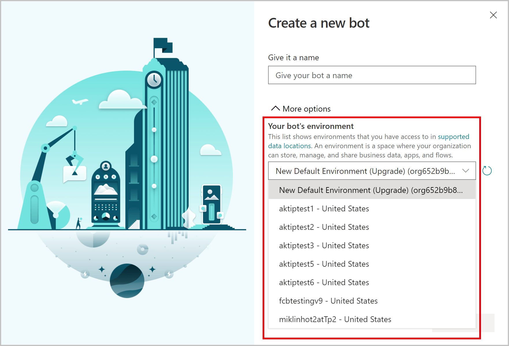

# Environments and Power Virtual Agents

With Power Virtual Agents, you can create bots in different environments and easily switch among them.

An environment is a space to store, manage and share your organization's business data. The bots you create are stored in an environment (apps and flows are also stored in environments). Environments may also have different roles, security requirements and target audiences. Each environment is created in a separate location. Learn more about [supported data locations](https://go.microsoft.com/fwlink/?linkid=2106441).

## How to leverage environments
- You may choose to build all your bots in a single environment
- You might create separate environments that correspond to specific teams or departments in your company, each containing the relevant data and bots for each audience.
- You might also create separate environments for different global branches of your company.

## How to create an environment

1. Go to [https://admin.powerplatform.com](https://admin.powerplatform.com) and sign in using your work or school account.

2. Select **+ New** to open the **New environment** creation experience.

   
  
   - Specify a unique name for the environment
   - Select the environment type
   - Select a region where you want the environment to be created
   - Set Create a new database to Yes
   - Then select **Next**.
   
   
   
   > [!NOTE]
   > The environment needs to be created in a supported region, otherwise you won't be able to use it when creating a bot.
   > Learn more about [supported data locations](https://go.microsoft.com/fwlink/?linkid=2106441).

3. Specify the details of the database **Create database** and click **Save**

## Create a bot in an existing environment
To create a bot in an existing environments, select it from the drop-down when creating a bot.

### Creating a bot in an existing environment to which user doesn't have access
In order to create a bot in an existing environment (let's call it Environemnt A) to which you don't have access, you need to follow the below steps.
1. Ask a system administrator of Environment A to create a bot in the environment (this will install the Power Virtual Agents solutions)
2. The system administrator of Environment A needs to assign a CDS role of "bot author" to you in the environment. Learn how to [assign a role](https://docs.microsoft.com/en-us/power-platform/admin/create-users-assign-online-security-roles#assign-a-security-role-to-a-user)
3. Visit Power Virtual Agents app, select Environment A and create a bot

## Trial environments

Trial environments expire after 30 days. When the environment expires, all the bots in the environment will be deleted and the data associated with it, the flows, and resources you have been using will be lost.

If you have created your own environment and selected Trial as the environment type, you'll receive emails shortly before it expires.  In Power Virtual Agents, you'll see a notification if you have bots created in a trial environment that is going to expire in less than two weeks.

## Converting trial environment to production environment

When using a trial environment and you want to retain the bots longer than 30 days, convert the trial environment to a production environment. [Learn how to convert a trial environment to a production environment](https://go.microsoft.com/fwlink/?linkid=2048531).
