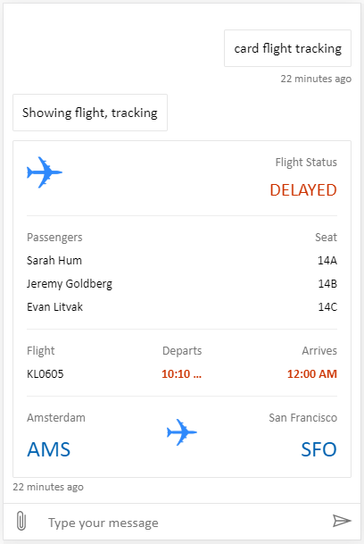
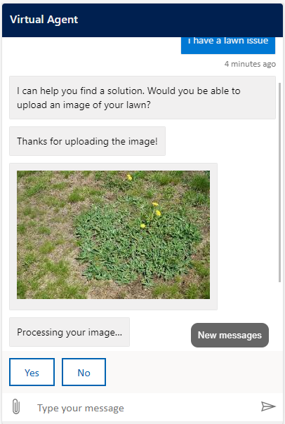

# Customize the look and feel of your bot chat canvas

Power Virtual Agents allows you customize the look and feel of your bot's chat canvas. Power Virtual Agents chat canvas builds on the highly customizable [Azure Bot Framework web chat canvas](https://github.com/microsoft/BotFramework-WebChat). This article explains how to customize your canvas and connect it to a Power Virtual Agents bot.

>[!IMPORTANT]
>When handling personal data, respect user privacy. Follow platform guidelines and post your privacy statement online.

>[!WARNING]
>Creating a custom canvas requires software development. Our guidance here is intended for experienced IT professionals, such as IT admins or developers who have a solid understanding of developer tools, utilities, and IDEs.

## Pick a sample to customize

We recommend starting with one of these samples custom built to work with Power Virtual Agents: 

* [Full bundle](https://github.com/microsoft/PowerVirtualAgentsSamples/tree/master/BuildYourOwnCanvasSamples/1.starter-full-bundle) is a custom canvas capable of showing all rich content from Power Virtual Agents. For example:

  

* [Location and file uploading](https://github.com/microsoft/PowerVirtualAgentsSamples/tree/master/BuildYourOwnCanvasSamples/2.location-and-file-uploading) is a custom canvas capable of getting a user's location and sending it to a bot using Power Virtual Agents. For example:

  

Or you can pick from [other sample web chat canvases](https://github.com/microsoft/BotFramework-WebChat/#samples-list) provided by Azure Bot Framework.

## Retrieve bot ID and tenant ID details

Next, you will need to retrieve your bot details to configure the custom canvas to send and receive messages from your bot.

1. Select **Manage** and then go to the **Channels** tab on the side navigation panel.

1. Select **Demo Website** and copy the bot's URL to your clipboard.

1. Retrieve the `botid` and `bottenantid` from the URL and save it, you will need to reference this later
      -  `BOT_ID=<your bot ID>`  
      -  `BOT_TENANT_ID=<your bot tenant ID>`    

## Update environment files

Next, you will need to update `.env` files from your sample web chat canvas.

### `/web/.env`

```
BOT_ID=21wejwl2-2j34-dse3-12df-1123rgted34
BOT_TENANT_ID=3fde45d-32we-3342-ewer-err3fr32564
```

## Customize canvas using `stylesetOptions`

You can now customize your canvas by updating `styleSetOptions`, which is the supported method of changing existing DOM elements in the canvas. A full list of customizable look and feel properties are shown in [defaultStyleOptions.js](https://github.com/microsoft/BotFramework-WebChat/blob/master/packages/component/src/Styles/defaultStyleOptions.js)

## Host your custom canvas

After you've customized the look and feel of the bot, you need to deploy your custom canvas for your users to use it with your Power Virtual Agents bot.

## Related links

-  [Azure Bot Framework web chat](https://github.com/microsoft/BotFramework-WebChat)
-  [Generating a direct line token](https://docs.microsoft.com/azure/bot-service/rest-api/bot-framework-rest-direct-line-3-0-authentication?view=azure-bot-service-4.0#generate-token)
